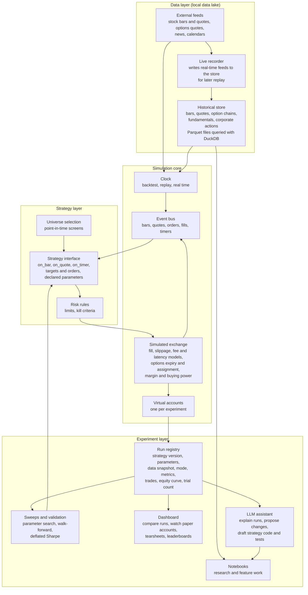

# Designing a trading-bot playground: research and recommendations

Date: 26 September 2026. Companion to [trading-bot-research.md](trading-bot-research.md), [implementation-plan.md](implementation-plan.md) and [bot-performance-evidence.md](bot-performance-evidence.md).

## Summary

**Verdict.** No existing product is the playground you described. Broker paper accounts give real data but one to three accounts, thin fill logic and no time control; QuantConnect has the best engine and data but charges per concurrent paper strategy and cannot replay; the only options time machine (thinkorswim OnDemand) has no API; options backtesters do not paper trade. The missing piece is always the same: a simulator with unlimited virtual accounts, an explicit fill model, correct options lifecycle handling and a clock you control. Build that, and reuse everything else.

**Recommended design.** A local data lake of real market data (free to start), a simulation core with three interchangeable clocks (fast backtest, replay of any past period at chosen speed, forward paper trading on live quotes), a simulated exchange with pessimistic default fill, slippage, fee and options-expiry models, one virtual account per experiment, a run registry that records every attempt including the number of trials, a validation protocol that uses that count, a Streamlit dashboard for comparison and leaderboards, Telegram alerts, and an LLM assistant that can explain and propose but never trade. The simulation core should be your own Python code built to the model checklist in section 6, borrowing LEAN's formulas and NautilusTrader's timing semantics rather than adopting either engine, with NautilusTrader as the fallback if intraday matching proves hard and QuantConnect as the hosted alternative if you would rather not build.

**Cost.** 0 USD a month for stocks (Alpaca free data and paper account, Stooq or Tiingo history), 40 to 80 USD a month once options research needs ThetaData, plus optional LLM usage. No brokerage account is needed for the first phases.

**How to proceed.** Six phases over roughly three to four months of part-time work: skeleton with a daily backtest and registry (one week), comparison and sweeps (two weeks), intraday and replay (two to three weeks), options (three to four weeks), paper trading with external cross-checks (two weeks), then the assistant and hardening. Section 10 has the deliverables and exit criteria; section 11 lists four decisions I need from you, the first being whether you want a web dashboard or notebooks as the main interface.

**Why this is worth the effort.** The evidence document shows that the difference between the few profitable retail systems and the rest is measurement discipline, not cleverness. A playground that records every trial, locks a holdout, and reports deflated statistics is the cheapest way to find out what works before money is involved, and every component of it carries over to the live system if a strategy ever earns that.

## 1. What you asked for, restated as requirements

You want a **playground**: an application where you test a trading bot with fake money on real market data, with no financial consequences, and keep tweaking it across several kinds of strategy. Turning that into requirements:

| Requirement | What it means concretely |
|---|---|
| **No consequences** | No path from the playground to a real-money account. Virtual accounts with virtual cash; any broker connection is to a paper endpoint only, and the code cannot hold live credentials |
| **Real market data** | Real historical and real-time prices for US stocks and options, so that results mean something; fake money, real prices |
| **Continuous tweaking** | Change a parameter or a rule, re-run, compare against previous runs, keep what improved. This needs an experiment registry, not just a backtester |
| **Several strategy families** | Stock selection (which names to trade, from a universe), long-term trend following, data analysis (research notebooks and features), intraday trading, and options and other derivatives, each with its own data and simulation needs |
| **Three ways to run the same strategy** | Fast backtest on history; replay of a past period at chosen speed as if live; forward paper trading on today's market. Same strategy code in all three |
| **Realistic simulation** | Fills, spreads, slippage, commissions, partial fills, option expiration and assignment, margin and buying power, corporate actions, market hours. A playground that fills every order at the mid price teaches the wrong lessons |
| **Fast iteration for one person** | One command to run, a dashboard to compare, parameter sweeps that run unattended, and guard rails against fooling yourself with overfitting |

Two things the playground is not: it is not a live trading system (that is a later, separate step described in the implementation plan), and it is not a game. Its purpose is to produce evidence about strategies before any real money is involved, which, given the evidence document, is where most of the value of this whole project lies.

## 2. Design principles

1. **Realism over convenience.** Every simplification in the simulator (mid-price fills, no fees, ignoring assignment) turns into a loss later. Default to pessimistic models and let you switch them off deliberately.
2. **One strategy interface, three clocks.** Strategy code sees the same data and broker interface whether the clock is historical, replayed or real time. Only the clock and the data source change.
3. **Every run is an experiment.** A run records the strategy version, parameters, data snapshot, mode, metrics, trades and equity curve, and increments a trial counter. Comparing runs is the core workflow.
4. **Point-in-time data only.** Universe membership, fundamentals and corporate actions are stored as of the date they were known, so stock-selection experiments cannot peek at the future.
5. **Fake money, honest measurement.** Report slippage against the mid price, costs as a share of gross profit, and a deflated Sharpe ratio that accounts for how many things you tried.
6. **Safe by construction.** Paper-only credentials, a hard-coded environment flag, separate configuration files, and no live-order code path in the repository.

## 3. What each strategy family needs from the playground

The five families you named have different data, simulation and validation needs. Designing for all of them at once is what makes this a platform rather than a single backtester.

| Family | Typical frequency | Data needed | Simulation features that matter | Validation emphasis |
|---|---|---|---|---|
| **Stock selection** (which names to hold from a universe) | Weekly to monthly rebalancing | Daily bars for thousands of symbols including delisted ones, point-in-time fundamentals and index membership, corporate actions | Rebalancing with realistic turnover costs, dividends and splits, survivorship-free universe | Look-ahead control on universe and fundamentals; turnover and capacity; long history (15+ years) |
| **Long-term trend** | Daily to weekly | Long daily history for a diversified set (equity ETFs or index proxies, sectors, bonds, commodities where available) | Simple fills at next open or close with a cost per switch; position sizing by volatility | Out-of-sample decades, parameter plateaus, behaviour in 2008, 2020 and 2022 |
| **Data analysis** (research features, indicators, machine learning) | Any | Everything above, in a notebook-friendly store | None directly; needs fast loading and feature caching | Strict train, validation and locked test splits; trial counting |
| **Intraday** | Seconds to minutes | Minute bars and, ideally, quotes for a liquid universe; session calendar with early closes; auction opens | Quote-based fills with spread and slippage, partial fills, latency, order-rate limits, realistic market-open behaviour | Cost sensitivity (results at 0, 1 and 2 cents of slippage), walk-forward, regime splits |
| **Options and derivatives** | Daily to intraday | Option chains with bid and ask, implied volatility and Greeks, expirations, corporate-action adjustments; underlying data as above | Spread-based fills per leg or per combo, expiration processing, auto-exercise and assignment, margin for spreads, early-assignment risk around dividends, pin risk | Fill-price sensitivity (mid versus fraction of spread), behaviour in volatility spikes, per-leg cost accounting |

Practical consequence: stock selection and trend can be built on free daily data immediately; intraday stocks on free minute bars; options on daily chains from free or cheap sources first, with intraday options quotes being the one paid item. The build plan in section 10 follows that order.

## 4. Buy or build: what already exists

I surveyed broker paper-trading APIs, hosted quant platforms, charting terminals with replay, and options backtesters against your requirements. The short version: every requirement is met by something, no product meets them all, and the missing piece is always the same one.

### 4.1 Broker paper-trading environments a bot can drive

| Environment | What it simulates | Data behind the fills | Fill model | Parallel accounts | Time control | Cost | Verdict for the playground |
|---|---|---|---|---|---|---|---|
| [Alpaca paper trading](https://docs.alpaca.markets/us/docs/paper-trading) | US stocks, single- and multi-leg options (Level 3 enabled by default) | Real-time; on the free data plan, options quotes come from an "indicative" feed that Alpaca staff describe as randomised, real OPRA quotes need the 99 USD plan | Documented: orders fill when marketable at the national best bid and offer; random partial fills 10% of the time; no liquidity check (an order far larger than displayed size still fills); no market impact, latency, regulatory fees or dividends | 3 paper accounts per user, resettable | None | Free | The best free external paper venue for stocks; a weak reference for options unless you pay for real quotes |
| Alpaca Broker API sandbox ([docs](https://docs.alpaca.markets/us/docs/getting-started-with-broker-api)) | Same engine as Alpaca paper | Sandbox data mirror | Same as paper | Unlimited accounts created by API | None | Free | The only free way to get many broker-backed simulated accounts; built for fintech integration testing, with low unpublished rate limits, so a component rather than a home |
| [Interactive Brokers paper](https://www.interactivebrokers.com/docs/tws-api/doc/notes-limitations/limitations/paper-trading) | Everything the live account can trade, 1 million USD virtual | Delayed unless you share paid live subscriptions (then not usable in both accounts at once) | Top of book only, stops and complex orders simulated, combos limited, no penny increments for options; assignment behaviour undocumented | One paper account per client | None | Free with a funded account | The most realistic margin and permissions model; needs the desktop gateway |
| [Tradier sandbox](https://docs.tradier.com/docs/getting-started) | Stocks and options incl. four-leg orders | Fixed 15-minute delay | Not published | One | None | Free, no brokerage account required for the developer sandbox | Good for wiring and end-of-day options logic; useless for intraday realism |
| [tastytrade sandbox](https://developer.tastytrade.com/sandbox/) | Order schema only | None (market-data routes return errors) | Deterministic rules: market orders fill at 1 USD, limits under 3 USD fill, above 3 USD never fill; resets every 24 hours | One | None | Free | An API certification environment, not a simulator |
| Webull OpenAPI paper trading ([July 2026 release](https://www.prnewswire.com/news-releases/webull-unveils-enhanced-paper-trading-experience-with-professional-grade-and-openapi-multi-asset-simulation-302830191.html)) | Stocks, options, futures, crypto, bonds, event contracts | Real-time via paid OpenAPI data | "Pricing engine designed to better reflect live market conditions"; details unpublished | Unknown | None | Free API; data extra | New; worth a look once documented |
| moomoo OpenAPI simulate | Stocks and options in separate paper accounts, limit orders only for options | Real-time with quote rights | "Matches real market trades"; margin liquidation simulated | One of each | None | Free; data quotas | Regional option |
| Schwab, Public.com | No paper trading via API | | | | | | Excluded |

### 4.2 Hosted quant platforms

| Platform | Backtest | Paper trading | Options | Data included | Parallel experiments | Time control | Cost | Verdict |
|---|---|---|---|---|---|---|---|---|
| [QuantConnect](https://www.quantconnect.com/pricing/) | Yes, the LEAN engine with fill, slippage, fee and option exercise models | Yes, with simulated fills at the bid or ask and no slippage unless you add a model | Backtests yes; cloud paper trading of options became plausible with QuantConnect's own consolidated options feed announced 26 August 2026 (verify) | US equities, AlgoSeek US equity options minute data since 2012, Morningstar fundamentals since 1998 for universe selection | One live node per concurrent paper algorithm | Backtests only, no interactive replay | Free tier has no paper trading; Quant Researcher about 60 USD a month plus about 24 USD a month per live node; the local command-line tool requires a paid tier, the engine itself is open source | The closest single purchase: one code base from backtest to paper, the richest options model, fundamentals for stock selection. Poor fit for "run fifty variants this afternoon" and no replay |
| [Blueshift](https://www.quantinsti.com/blueshift) | Yes, US equities minute data | Via Alpaca | No | US and India equities, forex | Alpaca-limited | No | Free | Stocks-only learning platform |
| [QuantRocket](https://www.quantrocket.com/) | Zipline and Moonshot, survivorship-free minute data since 2007 | Via IBKR or Alpaca | Data yes, backtesting limited | | Broker-limited | Backtests | Pricing gated behind login | Solid equities research stack, options weak |
| [Composer](https://www.composer.trade/) | No-code | "Watch" mode with 1,000 USD virtual | No | | | No | About 40 USD a month | Not programmable |
| [Option Alpha](https://optionalpha.com/pricing) | Options backtester incl. 0DTE | In-app paper account on live data, no broker needed | Yes | | Several bots per plan | No | Free with a connected broker, otherwise about 39 to 99 USD a month | Good no-code options sandbox; no API, so your own bot cannot use it |
| [TradersPost paper broker](https://docs.traderspost.io/docs/learn/platform-concepts/paper-trading) | No | Yes, fills at midpoint or bid/ask | Yes, but contracts never expire and orders fill 24 hours a day | | 8 accounts on paid plans | No | 49 to 299 USD a month | Its own documentation says not to measure strategy performance with it |

### 4.3 Terminals with replay ("time machine")

| Platform | Paper trading | Options | Replay | Programmable by an external bot | Cost |
|---|---|---|---|---|---|
| [thinkorswim paperMoney and OnDemand](https://www.schwab.com/trading/thinkorswim/paper-trading) | Yes, real-time, all options strategies | Yes, full chains, expiration handled | Any date in about ten years of history, with options chains, at chosen speed | No; scripts run only inside the application | Free with a Schwab account, 30-day guest pass |
| [TradingView](https://www.tradingview.com/) | Yes on all plans | No options in paper | Bar replay (daily on free, intraday on paid), paper trading inside replay | Outbound alerts and webhooks only | Free to about 240 USD a month |
| [NinjaTrader](https://ninjatrader.com/trading-platform/trading-simulator/) | Free simulator | No stock options | Market replay from recorded or purchased tick data | Strategies in C# inside the platform | Free software, data about 55 to 150 USD a month |
| Sierra Chart, Quantower, Bookmap | Simulation modes | Weak or none | Yes | In-app only | 19 to 70 USD a month |
| [TradeStation SIM](https://api.tradestation.com/docs/fundamentals/sim-vs-live/) | Full REST API identical to live, instant fills | Yes | No | Yes | Requires a TradeStation account |

thinkorswim OnDemand is the best options time machine that exists, and it is worth using by hand to check what your own replay produces. Nothing with an API replays options data for an external bot; that is precisely the capability the playground has to build.

### 4.4 Options backtesters

| Tool | Mode | Data | API | Cost |
|---|---|---|---|---|
| [Option Omega](https://optionomega.com/) | Backtest and live automation; no paper mode for automations | 1-minute bid and ask since 2013, 0DTE with one-second stop checks | None | About 30 to 300 USD a month |
| [ORATS](https://orats.com/backtester) | Backtest since 2007, intraday since 2020; routing to brokers incl. paper accounts | End-of-day and 1-minute | REST add-ons 99 to 299 USD a month | About 99 USD a month |
| CMLviz Trade Machine, OptionNet Explorer, eDeltaPro, OptionStrat | Backtest and analysis | Multi-year end-of-day or intraday | None | Free to about 130 USD a month |
| [optopsy](https://github.com/michaelchu/optopsy) | Backtest from your own chain files, 38 strategies | Yours | Python library, AGPL-3.0 | Free |

### 4.5 Verdict

- **No existing product is the playground.** Broker simulators have real data but one to three accounts, thin or undocumented fill and assignment logic, and no time control. QuantConnect has the engine and the data but charges per concurrent paper algorithm and has no replay. Replay with options exists only in a desktop application without an API. Options backtesters do not paper trade. TradersPost's paper broker tells you itself not to trust its numbers.
- **The missing piece is always the simulator with time control**: an account ledger and matching engine that consumes real quote streams (live or replayed), applies an explicit fill model, handles the options lifecycle, and supports unlimited virtual accounts. Nobody sells this to individuals.
- **Everything around it can be reused**: Alpaca's documented paper rules as the baseline fill model; Alpaca paper and IBKR paper as calibration targets for your simulator's fills; an open-source engine for the strategy interface and backtesting; ThetaData or Massive for options history; Option Omega or ORATS as a second opinion on options edge cases; thinkorswim OnDemand as a manual reference for replays.
- **If building is off the table**, the pragmatic purchase is QuantConnect Quant Researcher with two live nodes for paper trading (about 110 USD a month) plus a free Alpaca paper account as a second opinion, accepting no replay and at most a couple of concurrent paper experiments.

Verification note: the vendors' own sites were blocked by this environment's proxy. Alpaca's paper-trading rules, QuantConnect's tier and node quotas and paper-brokerage behaviour, TradersPost's paper-trading page and the tastytrade sandbox notes were read from their GitHub-hosted documentation; prices and the remaining product facts come from search-engine summaries of vendor pages and 2026 reviews and should be confirmed before purchase.

## 5. Recommended architecture



### 5.1 The three clocks

The same strategy runs under three clocks; nothing else changes.

| Mode | Time source | Data source | Execution | Purpose |
|---|---|---|---|---|
| **Backtest** | Historical timestamps, as fast as the machine allows | Data lake | Simulated exchange | Research, parameter sweeps, walk-forward tests |
| **Replay** | Historical timestamps advanced at a chosen speed (real time, 10 times, step by step), with pause | Data lake, including recorded live feeds | Simulated exchange | Watching a strategy behave on a specific day (a crash, an earnings gap, a holiday session), debugging intraday logic, demonstrations |
| **Paper** | Wall clock | Real-time feeds | Simulated exchange fed by live quotes, optionally mirrored to an external paper account | Forward test on today's market; the closest thing to live without money |

The replay mode is what turns a backtester into a playground: you can start any past date, run it at ten times speed, pause when something looks wrong, inspect the account, change a parameter and run the same day again.

### 5.2 Simulated exchange

The simulated exchange is where realism lives. It receives orders from the risk layer and produces fills, using the current market data of whichever clock is active. Its models are pluggable and versioned so that a run records exactly which assumptions produced its results. Section 6 lists the models and recommended defaults.

### 5.3 Virtual accounts

Each experiment gets its own account: cash, positions, open orders, margin state, realised and unrealised profit, fees paid, and an event log. Accounts are cheap, so running the same strategy with five parameter sets means five accounts trading side by side on the same data, which is the A/B workflow that "continuous tweaking" needs. Accounts can be reset, cloned or started from a past date.

### 5.4 Strategy interface

A strategy is a Python class that declares its parameters (with types and ranges so the sweep tool can vary them), receives events (bars, quotes, timers, fills, option expirations), and emits target positions or orders through the risk layer. It never talks to data or exchange objects that would let it peek ahead. Universe selection is a separate hook that runs on a schedule with point-in-time data.

### 5.5 Experiment layer

Every run writes to a registry: strategy git commit, parameter values, data snapshot identifier, simulation model versions, mode, start and end, metrics, trade list and equity curve, plus the running count of trials for that strategy family. The dashboard reads the registry to compare runs side by side, show tearsheets, rank a leaderboard, and stream the state of paper accounts. Sweeps and walk-forward validation are scripts over the same registry. Notebooks read the data lake and the registry directly.

### 5.6 LLM assistant

The assistant sits in the experiment layer only. It explains a run in plain language from the registry, proposes parameter or rule changes with reasons, drafts strategy code and unit tests for you to review, summarises news for the research notebooks, and answers questions about the data. It has no connection to the simulated exchange or to any account, so it cannot place orders even in the playground; that separation is deliberate, given the evidence that LLMs are poor traders and good analysts.

## 6. Making the simulation realistic: what to model and the defaults to start with

This section is distilled from reading the source code and documentation of the engines that do this well (QuantConnect LEAN, NautilusTrader, Lumibot, Zipline, Backtrader, Backtesting.py, vectorbt, hftbacktest, Freqtrade) and from the options-fill assumptions published by ORATS and optopsy. The defaults are deliberately pessimistic; every one is a configurable model whose identifier is recorded with each run.

### 6.1 Time, ordering and look-ahead

- **Two timestamps on every datum**: when the event happened and when it became available (NautilusTrader's `ts_event` and `ts_init`). A strategy may only read data whose availability time is at or before the clock (LEAN's "time frontier"). Bars are stamped at the close of their interval and consolidators use half-open intervals, so a bar never exists before it has finished.
- **Three-phase processing per event** (NautilusTrader): first match resting orders against the new market state, then hand the data to strategies, then drain the new orders through the latency model and match them, repeating until nothing is left at that timestamp. Resting orders see the incoming market before new orders do, and cascades (a hedge submitted from a fill callback) settle within the timestamp.
- **Scheduled events** fire from the data clock in backtest and replay and from a real timer in paper mode; events skipped because no data arrived are replayed when data resumes (LEAN's handlers do exactly this).
- **Stale data**: a market order never fills against data older than one bar; at hourly or daily resolution it waits for the next bar and fills at that bar's open (LEAN's rule).
- **Sessions**: an exchange calendar with holidays, early closes and late opens in America/New_York, with market orders allowed only in regular hours unless extended hours are explicitly subscribed. NautilusTrader leaves session logic to the user; LEAN and Zipline ship calendars.
- **Tests in CI**: a look-ahead test that re-runs the strategy on truncated history and diffs signals, and a warm-up test that varies indicator history and checks the last values (both are Freqtrade tools worth copying).

### 6.2 Fills and slippage

| Setting | Daily stock strategies | Intraday minute-bar stock strategies | Options |
|---|---|---|---|
| Decision and execution timing | Decide on the completed day, execute next day at the opening auction (market-on-open) or closing auction (market-on-close), using official auction prints where available | Signals only from completed bars; market orders fill at the next bar's open or, better, at the first quote after arrival plus latency | Quote-driven; package priced at its net mid and all legs filled atomically or not at all |
| Price source | Auction print, else next open | Best bid and offer: buy at the ask, sell at the bid | Bid and ask per leg |
| Slippage default | 5 basis points plus a participation cap of 10% of daily volume; a volume-share impact model for orders above about 1% of average volume | Half the spread plus a one-tick adverse move with probability 0.5 on top-of-book data; cap fills at 2.5 to 10% of bar volume with the remainder carried to the next bar as a partial fill | Buy at bid plus a fraction of the spread, sell at ask minus it: 75% for one leg, 66% for two, 56% for three, 53% for four (ORATS' published assumptions; optopsy reproduces them with 0.25 plus 0.073 per extra leg). Reject when the spread exceeds a maximum or the bid is zero |
| Limit orders | Fill only when the price penetrates the limit, never merely touches it (LEAN), or on touch with a fill probability around 0.5 (NautilusTrader); never better than the bar's open on a gap | Same | Same, on the net price |
| Stop orders | Trigger on the bar's high or low; a gap through the stop fills at the open, not the stop | Same; stop-limit's limit leg fills at the bar close after the trigger | Rare; same rules |
| Latency | Not needed | 250 milliseconds default from decision to arrival, configurable to zero for fast backtests | 500 milliseconds |
| Partial fills | Volume cap | Volume cap with carry-over | Whole package or nothing |

Where a quote is missing, fall back to a model price (Black-Scholes or binomial for options, last trade for stocks), log the fallback in the fill record, and never fill against a zero bid.

### 6.3 Costs

- Stocks: two profiles, "zero commission" and "Interactive Brokers fixed" (0.005 USD per share, 1 USD minimum, capped at 0.5% of trade value), plus optional regulatory sell-side fees.
- Options: 0.65 USD per contract with a 1 USD minimum (or 0.50 USD), exercise and assignment free.
- Short borrow: a fee rate per symbol from a shortable table, with shorts above availability rejected; margin interest daily on debit balances.
- Every run reports costs as a share of gross profit, and the validation protocol re-runs at 1.5 and 2 times these defaults.

### 6.4 Accounts, margin and settlement

- **Cash account**: settled cash only, no shorting, sale proceeds settle T+1 at 06:00 Eastern (LEAN's delayed settlement model).
- **Margin account**: Regulation T approximations, 50% initial and 25% maintenance for longs, 30% for shorts, 4 times intraday buying power for day trades; a margin-call warning when free margin falls to 5% and forced liquidation, losers first, beyond a 10% buffer (LEAN's margin-call model).
- **Options margin**: long options cost their premium; naked short options use the 20% (equity) or 15% (index) of underlying minus out-of-the-money amount, floored at 10%, rule; vertical spreads require the strike width; iron condors and butterflies require the wider wing only; long straddles, calendars and boxes require nothing beyond premium; covered calls and protective puts follow the broker formulas. LEAN's strategy-margin model encodes Interactive Brokers' published rules and is the reference implementation to port.
- **Multi-currency**: a cash book per currency with conversion rates, so an EUR base account can hold USD instruments and report profit in both.

### 6.5 The options lifecycle

1. Expiration is processed after the last data of the expiry timestamp using the underlying's close; open orders on the contract are cancelled; new orders are rejected.
2. Auto-exercise when intrinsic value is at least 0.01 USD (the OCC threshold, as in LEAN); physical delivery of shares at the strike with zero fee; cash settlement at intrinsic value for index options.
3. Long-exercise capital check: if the account cannot carry the delivered shares, cash-settle the intrinsic value instead (Lumibot's behaviour) or reject and warn.
4. Early assignment of short legs: LEAN's heuristic (within 4 days of expiry, at least 5% in the money, and exercising beats closing after fees, checked hourly) or Lumibot's (one day to expiry, extrinsic value at or below 0.05 USD), plus a rule none of the engines has: assign short calls the session before an ex-dividend date when extrinsic value is below the dividend.
5. Pin risk: contracts within a few cents of the strike at expiry are assigned or exercised probabilistically, or the playground forces the user to close them; no engine models this deterministically well.
6. Corporate actions: options contracts adjusted by the OCC (non-standard deliverables) are tracked in a contract master; LEAN simply liquidates option positions when the underlying splits, which is an acceptable first version.
7. Greeks and implied volatility: from vendor data as of the prior close where available, otherwise computed with Black-Scholes or a binomial tree (vollib or QuantLib), recorded at entry and exit.
8. Symbology: OCC 21-character identifiers plus activation and expiration timestamps per contract.

### 6.6 Corporate actions and price normalisation

Simulate on raw prices and apply events explicitly: splits adjust position quantity, average price and open orders, with cash in lieu of fractional shares; cash dividends are credited on the pay date (debited for shorts); symbol changes cancel and resubmit open orders; delistings issue a warning on the last trading day and then liquidate at the last price. Use adjusted prices only for indicators and history, never for fills or option strikes. Adjustment factors apply from the trading day before the effective date (as in LEAN's factor files); Zipline's SQLite adjustment tables (splits, mergers, dividends with ex, record and pay dates) are a good schema to copy.

### 6.7 Security master and point-in-time storage

For stock-selection experiments the playground needs: a security master keyed by a permanent identifier with dated ticker maps and first and last trade dates (so reused tickers resolve by date, as LEAN's identifiers and Zipline's as-of symbol lookup do); daily as-of universe snapshots built from raw data (constituents, closing-auction price, dollar volume); point-in-time fundamentals keyed by the date they became available, never by fiscal period end; a corporate-action table; an option contract master; and Greeks snapshots dated as of the prior close. Without a survivorship-free source, universes built from today's listings will overstate results, as the evidence document quantifies.

### 6.8 What to record per fill

Decision time and decision price; order identifiers, type, time in force, limit and stop prices; submit time and simulated arrival time; fill times, prices and quantities including partials; bid, ask, mid, spread, last trade and bar volume at submit and at fill; slippage against the mid and against the decision price; which model draws applied; fees split into commission, regulatory and borrow; queue position and liquidity consumed where modelled; reject and cancel reasons; holding time, maximum adverse and favourable excursion, realised profit by FIFO lot; corporate-action adjustments applied; and for options, legs, net mid, the leg-count fill fraction, Greeks and implied volatility at entry and exit, and exercise or assignment events. This record is what makes paper-versus-backtest comparison and fill-model calibration possible.

### 6.9 How the open-source engines compare

| Engine (language, licence) | Clock modes | Fills and slippage | Options exercise and assignment | Greeks | Universe selection | Corporate actions | Multi-currency |
|---|---|---|---|---|---|---|---|
| **LEAN** (C# engine, Python strategies, Apache-2.0) | Backtest; paper trading is live data through the backtest fill path; replay via a custom data queue handler in C# | Bid/ask-aware equity fills, stale-data guard, auction prints for MOO and MOC, all-or-nothing combos, no partial fills; constant, volume-share and market-impact slippage; 36 broker fee models | Auto-exercise at 0.01 USD, physical and cash settlement, assignment heuristic, delisting liquidation, strategy-aware margin | QuantLib and indicator models, implied volatility, precomputed end-of-day chain Greeks | Fundamentals-based with a survivorship-free security master (QuantConnect data licence) | Full: factor and map files, dividends, splits, symbol changes, delistings | Yes |
| **NautilusTrader** (Rust core, Python API, LGPL-3.0) | Backtest, **sandbox** (live data with simulated execution), live; one kernel and clock abstraction | L1, L2 and L3 matching, bars turned into open-high-low-close ticks, trade-driven fills, queue position, liquidity consumption, latency model, probabilistic fill and slippage models, partial fills | Expiry settlement only; no assignment or early-exercise model, no strategy margin | Black-Scholes calculator, implied volatility, portfolio Greeks | None | None for equities | Yes |
| **Lumibot** (Python, GPL-3.0) | Backtest broker driving a calendar clock; same strategy on live brokers | Range and gap fills on bars, quote fills, net-mid multi-leg fills with absolute slippage, spread gating, audit trail; no volume caps or partial fills | Expiry settlement incl. cash-settled index options, opt-in early assignment | From data | None | None | No |
| **Zipline-reloaded** (Python, Apache-2.0) | Backtest only, next-bar fills | Volume-share and basis-point slippage with volume-capped partial fills; per-share and per-dollar commissions | None | None | Pipeline with as-of asset lookup and auto-close | SQLite adjustments applied as of date | No |
| **Backtrader, Backtesting.py, vectorbt** (Python) | Backtest only | Next-open fills, percentage or fixed slippage, spread and commission; vectorbt adds fractional fees and rejection probability | None | None | None | None | No |
| **hftbacktest** (Rust and Python, MIT) | Tick replay with feed and order latency; live bot in Rust | L2 and L3 queue-position models, partial-fill exchange, no market impact | None | None | None | None | No |
| **Freqtrade** (Python, GPL-3.0, crypto only) | Backtest, dry run (live data with order-book fills), live; look-ahead and warm-up analysis tools | Order-book walk with a 5% slippage cap, limit converted to market when crossed by 1% | Not applicable | Not applicable | Pair lists | Not applicable | No |

What to borrow from each: LEAN's model formulas (fills, margin, exercise, assignment, settlement, corporate actions) as the reference for correctness; NautilusTrader's timestamp semantics, three-phase loop, fill and latency models, and its sandbox idea (live data into the backtest matching engine) as the design for the clocks; Zipline's adjustment tables and as-of asset lookup for point-in-time data; Freqtrade's look-ahead and warm-up tests and its dry-run fill cap; ORATS and optopsy's leg-count spread fractions for options; hftbacktest's queue and latency models only if tick data ever enters the picture; quantstats and pyfolio for reporting.

Verification note: engine behaviour above was read directly from the projects' source files and documentation on GitHub (the exact files are listed in the appendix). ORATS' fill fractions and Regulation T percentages come from search summaries and general knowledge and should be checked before they are used as defaults.

## 7. The experiment layer: how "continuous tweaking" stays honest

The simulator produces numbers; the experiment layer decides whether to believe them. This is where a playground differs from a backtester, and it is mostly bookkeeping done consistently.

### 7.1 Every run is a record

Each run, whether a backtest, a replay, a paper session or one trial of a parameter sweep, writes one row and a folder of artifacts:

| Recorded | Why |
|---|---|
| Strategy name, semantic version, git commit, whether the working tree was dirty, hash of the diff | Reproduce exactly what ran |
| Resolved parameters and their hash, configuration hash | Compare runs by what actually differed |
| Data snapshot identifier (a manifest of the exact files and their hashes, or a DuckLake snapshot) | Results change when data is revised; know which data produced which result |
| Mode (backtest, replay, paper, shadow), engine and version, random seed | Same strategy, different clocks |
| Fill, slippage, fee and scenario model identifiers | The assumptions are part of the result |
| Metrics: return, Sharpe, Sortino, Calmar, max drawdown, turnover, exposure, trade count, win rate, profit factor, probabilistic and deflated Sharpe, walk-forward efficiency | The leaderboard columns |
| Artifacts: trades, orders, fills and equity curve as Parquet, the HTML tearsheet, the config | Deep dives and comparisons |
| **Experiment id and trial number** | Every re-run with different parameters, every sweep trial and every walk-forward fit increments the counter, so the deflated Sharpe ratio uses the real number of attempts |
| Holdout-touched flag | The locked test period may be scored once per experiment |

Storage: a single SQLite file for the registry plus Parquet artifacts queried with DuckDB. That is enough for one person, needs no server, and every notebook and the dashboard read it directly. MLflow can be added later for its user interface if wanted; the SaaS trackers are unnecessary here.

### 7.2 Parameters declared once

A strategy declares its parameters as a typed model with bounds, step and an "optimise" flag. That single declaration drives the command-line overrides, the parameter form in the dashboard, the Optuna search space and the parameter columns in the registry. Freqtrade (typed parameter classes with search spaces), Lumibot (a parameters dictionary) and LEAN (parameters read from configuration) all do a version of this; a pydantic model gives the same result with validation.

### 7.3 Validation protocol

This protocol turns the anti-overfitting evidence from the companion documents into steps. Numbers in brackets are starting points to tune.

1. **Pre-register** each experiment in a short file: hypothesis, universe, horizon, cost assumptions, primary metric, trial budget [300 trials], promotion gates. Create the experiment id; the trial counter starts here.
2. **Lock a holdout**: the most recent 12 to 18 months plus two or three named stress windows (March 2020, first half of 2022, August 2024). Hash the files. All reads go through one module that logs access and allows one scored evaluation per experiment.
3. **Data hygiene** on the development set: point-in-time check for fundamentals and universe membership, corporate-action adjustments, timestamp semantics, gap and duplicate audit. Record the snapshot identifier.
4. **Bias checks on the code**: a look-ahead test that recomputes signals on truncated history and diffs them; a warm-up test that varies the indicator warm-up length and asserts the last values barely change (both patterns come from Freqtrade's lookahead-analysis and recursive-analysis tools); unit tests on synthetic series where the strategy must not react to future bars.
5. **Baselines and nulls**: buy-and-hold or equal weight, random entries with matched holding periods, signal permutation within regimes, giving an empirical p-value for the primary metric.
6. **In-sample search** on the development set only, with Optuna's default multivariate sampler, three-decimal parameter precision, early stopping, and at least two random seeds. Every trial lands in the registry.
7. **Walk-forward**: anchored and rolling windows [24 months train, 6 months test, 6-month step], purging the label horizon and embargoing 1 to 2% of the sample after each test block. Report per-window results, walk-forward efficiency (out-of-sample over in-sample) and parameter stability; prefer plateaus to spikes.
8. **Combinatorial purged cross-validation** [6 to 10 groups, 2 test groups, giving 15 to 45 paths] for the distribution of out-of-sample Sharpe ratios; probability of backtest overfitting over the whole trial matrix; deflated Sharpe ratio using the effective number of independent trials, skew, kurtosis and sample length; minimum track record length at the target confidence.
9. **Robustness**: costs times 1.5 and times 2, one bar of extra latency, parameter neighbourhood of plus or minus one step, universe perturbation (drop the top five contributors, random 80% subsets), scenario injection (crash day, halt, gap, spread times 3), regime splits.
10. **Gates**, pre-registered: deflated Sharpe at or above 0.95; probability of overfitting at or below 0.2; the fifth-percentile path Sharpe above zero and the median path at least half of in-sample; walk-forward efficiency at or above 0.5; p-value against nulls at or below 0.05; the top five trades at most 35% of profit; still positive at double costs; enough trades for the minimum track record.
11. **One holdout evaluation** of the frozen configuration. The result is final. Fail means shelving the strategy family or starting a new pre-registration whose holdout is data accrued since.
12. **Replay, then paper, then shadow**: replay the last 6 to 12 months through the live code path at high speed to test the code, paper trade for one to two months with a synchronised backtest twin and a tracking-error alarm, compare simulated fills against live quotes, and apply pre-registered kill criteria (for example, drawdown beyond the 95th percentile of the bootstrapped backtest distribution stops the run). Write the post-mortem back to the registry.

Maintained open-source implementations for steps 7 and 8: `purgedcv` (MIT, young but active, implements purged and combinatorial cross-validation, deflated and probabilistic Sharpe, probability of overfitting and minimum track record length), `skfolio` (BSD-3, walk-forward and combinatorial purged cross-validation at portfolio level), and vectorbt's deflated Sharpe function. The older `pypbo` is dormant and `mlfinlab` is paid.

### 7.4 Data plan, free first

| Data | Source to start | Cost | Upgrade when |
|---|---|---|---|
| Daily bars, US stocks and ETFs, 20+ years | Stooq bulk files or Tiingo free tier for long history; Alpaca free for 2016 onwards | 0 USD | You need a survivorship-free universe with delisted names for stock-selection research (Sharadar or Norgate, tens of USD a month) |
| Minute bars, US stocks, 2016 onwards | Alpaca free historical data (consolidated feed for data older than 15 minutes) | 0 USD | Never for research; for paper trading you may want the 99 USD consolidated real-time feed instead of the free IEX-only feed |
| Real-time stock quotes for paper mode | Alpaca free IEX feed (30 symbols on the free WebSocket) | 0 USD | The universe grows beyond 30 symbols or you need consolidated quotes |
| Point-in-time fundamentals and index membership | SEC EDGAR filings (free) with as-of dates recorded on ingestion; a hosted platform's fundamentals if you use one | 0 USD | Stock-selection research becomes a focus (Sharadar fundamentals) |
| Daily option chains with Greeks | Alpha Vantage historical options (back to 2008, 25 requests a day free), Tradier sandbox chains (delayed, free), the DoltHub options database for bulk history | 0 USD | Options research starts in earnest: ThetaData Value at 40 USD a month |
| Intraday option quotes | None free | 80 USD a month (ThetaData Standard) | Intraday options strategies begin |
| Corporate actions and calendars | Alpaca corporate actions endpoint; exchange calendar library for sessions and early closes | 0 USD | |
| News for the assistant | Alpaca news API (free with account) | 0 USD | |

Recording rule: every real-time feed the playground consumes in paper mode is written to the data lake as it arrives, so that any paper-trading day can later be replayed exactly.

### 7.5 Data lake design and sizing

- **Format**: Parquet with zstd compression, partitioned by data type, symbol and date, queried with DuckDB or Polars. Engine-typed data (bars, quotes, trades, option Greeks) can live in NautilusTrader's Parquet data catalog if that engine is used; DuckLake or a manifest of file hashes provides snapshot identifiers for the registry. ArcticDB (Man Group) is a good alternative for versioned DataFrames; its licence allows personal use and converts to Apache after two years per release.
- **Record raw, derive later**: live feeds are written as append-only raw messages with receive timestamps (JSON lines, or Databento's DBN format where applicable) and also as derived Parquet, so replays never lose fidelity.
- **Point in time**: fundamentals carry two time axes, the period they describe and the date they became known (filing date), plus a revision identifier; universes are stored as membership intervals. Queries ask "as known on date X". Where point-in-time data is unavailable, lag fundamentals conservatively.
- **Sizes** (estimates): 100 US stocks at one-minute resolution for ten years is about 98 million rows, roughly 1 to 2.5 GB in Parquet; even 1,000 symbols fit in 10 to 25 GB. One year of full SPX option chains at one-minute resolution is about two billion quote rows, roughly 100 to 150 GB with Greeks (Cboe's own one-minute SPX product is about 145 GB compressed per year); filtering to 45 days to expiry and strikes within 15% of spot cuts that by four to eight times, and a 0DTE-only subset is 1 to 2 GB a year. Recording live consolidated quotes for 100 liquid stocks is 0.1 to 1 GB a day compressed. A 2 to 4 TB drive covers several years of everything above; tick-level options data (terabytes a day) is out of scope for one person.

### 7.6 Dashboard, reports and alerts

- **Dashboard**: Streamlit is the fastest to build for one user; pages for the run list with filters, side-by-side comparison of any two runs (equity and drawdown overlays plus a parameter diff), a leaderboard per strategy family ranked by deflated Sharpe with the trial count visible, paper-account status, and alerts. Optuna's own dashboard covers sweep visualisation (history, parallel coordinates, importance) so it need not be rebuilt. FreqUI's backtesting tab, which runs backtests, lists historic results and compares them, is the closest existing model of this workflow.
- **Reports**: quantstats HTML tearsheets (60 plus metrics, benchmark overlay, Monte Carlo) and pyfolio-reloaded's position, transaction and round-trip tear sheets, generated per run and stored as artifacts. LEAN's report is a good checklist of elements: rolling Sharpe and beta, exposure, leverage, turnover, capacity estimate, crisis windows, probabilistic Sharpe, parameters.
- **Alerts**: Telegram through python-telegram-bot or Apprise, copying Freqtrade's message taxonomy (entry, fill, exit, protection triggered, warning, status, startup), each switchable, plus commands for status, profit, pause and stop of paper runs.

### 7.7 Playground mechanics that make iteration fast

- **One command, three modes**: `run <strategy> --mode backtest|replay|paper --from --to --speed`, where the mode changes only the data source and execution client.
- **Time machine**: the replay clock advances recorded quotes and bars through the live code path at a chosen pace (as fast as possible, real time, 60 times), with pause, single step and the ability to fork account state at a timestamp and run the rest of the day again with a different parameter.
- **Scenario injection**: transformers on the replay feed for a price shock with decay, a spread multiplier, a halt (no quotes for N minutes, then a gap), a gap open, stale data and latency, and cost multipliers; plus execution-side stress through the fill models. Complement with historical crisis windows and block-bootstrapped synthetic days, remembering that a bootstrap never draws a loss worse than the worst historical one.
- **A/B accounts**: the same strategy class runs with several parameter sets as separate instances on the same data stream, each with its own virtual account; the dashboard shows champion against challengers.
- **Shadow mode**: for each decision, record the decision time, expected price, hypothetical order, simulated fill and the live national best bid and offer within a window; report modelled versus realised slippage, fill probability and missed fills. This is how the fill model gets calibrated against reality, including against the external paper accounts.
- **Kill criteria**: drawdown thresholds derived from the simulated drawdown distribution rather than round numbers, a slippage budget, reject and stale-data rates, and an infrastructure switch (feed lost for 30 seconds flattens the virtual account) so paper runs exercise the same safety logic a live system would.

### 7.8 LLM assistant, safely

Useful patterns with real evidence behind them: explain a run from registry rows and trade statistics; propose parameter or logic changes as a configuration diff that you approve and that counts toward the trial budget; generate strategy code plus unit tests in a sandbox that must pass the look-ahead and warm-up tests and static rules (no network, no broker imports); answer questions with read-only SQL over the registry. Guardrails: a separate process with no market-data write access and no order tool, an allowlist of read-only tools, every action logged to the registry, human approval for anything that changes a configuration. Cost control: cache the stable system context, route routine summaries to a cheaper model tier and reserve the top model for code generation, run nightly explanation jobs through the batch API at half price, and set daily token budgets. One caution specific to this domain: an LLM's training data covers past markets, so any strategy it proposes for a historical period may encode knowledge of what happened; treat LLM-suggested rules as hypotheses to be validated on data after the model's training cutoff.

### 7.9 Recommended stack

| Layer | Choice (version, licence, September 2026) | Alternatives |
|---|---|---|
| Language | Python 3.12 | Required by the ThetaData client and NautilusTrader |
| Run registry | SQLite plus Parquet artifacts, DuckDB 1.5 (MIT) and Polars for queries | MLflow 3.16 (Apache-2.0) for its UI; skip SaaS trackers |
| Configuration | pydantic-settings (MIT) for typed parameters; Hydra 1.3.7 or OmegaConf for sweeps and overrides | |
| Parameter search | Optuna 5.0 (MIT) with SQLite storage and optuna-dashboard | Ray Tune only if a cluster ever appears |
| Validation statistics | purgedcv 0.1.6 (MIT), skfolio 1.3 (BSD-3), vectorbt's deflated Sharpe | pypbo (dormant), mlfinlab (paid) |
| Data lake | Parquet plus DuckDB, DuckLake snapshots; NautilusTrader ParquetDataCatalog for engine data | ArcticDB (BSL, personal use fine); server databases not needed for one user |
| Data clients | alpaca-py 0.44, thetadata 1.0, databento 0.87 | |
| Reports | quantstats 0.0.81 (Apache) or quantstats-lumi, pyfolio-reloaded 0.9.9 | |
| Dashboard | Streamlit 1.64 (Apache-2.0) | Panel, Dash; Grafana only for infrastructure monitoring |
| Alerts | python-telegram-bot 22 (LGPL) or Apprise (BSD-2) | |
| Vectorised sweeps | vectorbt 1.1 (Apache-2.0 with Commons Clause) for fast stock-selection and trend parameter grids | |

### 7.10 Repository layout

```
playground/
  configs/            strategy, data, run-mode and validation settings
  strategies/         base class with typed parameters; selection/ trend/ intraday/ options/; tests/
  engine/             clock modes, simulated exchange, fill and scenario models, engine adapters
  data/               ingest/ (downloaders, live recorders), lake/ (Parquet, gitignored), qa/ (nightly checks), manifests/
  registry/           SQLite schema and API; artifacts/<run_id>/
  experiments/        one folder per pre-registered experiment: hypothesis, sweep database, notebook, results
  validation/         lookahead, warm-up, walk-forward, combinatorial CV, deflated Sharpe, nulls, robustness, gates, lockbox
  reports/            tearsheets, comparison, leaderboard
  dashboard/          Streamlit pages
  paper/              replay clock, virtual accounts, shadow comparator, kill switch, alerts
  llm/                read-only tools, prompts, cost ledger, sandboxed code generation
  scripts/            run, validate, record, report, compare
```

## 8. Making "no consequences" a property of the system, not a promise

- **No live credentials anywhere in the playground.** The configuration schema only has fields for paper endpoints and read-only data keys. A live API key has nowhere to go.
- **Broker adapters are paper-only.** The only external broker adapters compiled into the playground point at paper endpoints (for example Alpaca's paper URL) and refuse to start if the base URL is not on an allowlist.
- **Virtual accounts are the default venue.** Most experiments never touch an external account at all: the playground's own simulated exchange fills orders from real quotes. External paper accounts are a cross-check, not the engine.
- **Data keys are separate from trading keys.** Market data subscriptions (Alpaca data, ThetaData) are read-only by nature.
- **Loud labelling.** Every dashboard page, log line and report carries the mode (backtest, replay, paper) and the account name; the word "live" never appears in the playground's vocabulary.
- **Later graduation is a separate project.** When a strategy earns the right to real money, it moves to the live system described in the implementation plan, with its own repository, credentials and approval gate. Nothing in the playground can be flipped to live by changing a flag.

## 9. Recommendation

**Build a thin simulation kernel of your own and reuse everything around it.** The one thing no product sells to an individual is a simulator with unlimited virtual accounts, an explicit and calibratable fill model, correct options lifecycle handling and a controllable clock. Everything else, data clients, strategy runtime, statistics, tearsheets, dashboards, exists as maintained open source or free services.

**Engine choice: write the simulation core in Python, to the checklist in section 6, and borrow rather than adopt.** I looked hard at adopting an engine instead. QuantConnect's LEAN is the most complete simulator that exists in open source (bid/ask fills, auction prints, option exercise and assignment, strategy-aware margin, corporate actions, survivorship-free universes, multi-currency), but it is a C# engine driven through Docker, its local tooling wants a paid tier, its universe and options data are licensed, replay would mean writing a C# data handler, and each parallel account is another engine instance. NautilusTrader has the best clock and matching design and a sandbox mode that is exactly "live data through the simulator", but it is a moving Rust core at a 2.0 release candidate with a steep learning curve, and it lacks precisely the pieces you need for options and stock selection (assignment, option margin, equity corporate actions, universes), which you would build anyway. Lumibot is the quickest Python route to an options paper trader but its fills are simplistic and it has no margin or corporate-action model.

For a playground whose defining features are unlimited virtual accounts, a replay clock with pause, step and fork, scenario injection and calibratable fill models, a bar- and quote-level simulation core of your own is a few thousand lines of Python, and the correctness risk is contained by copying LEAN's formulas and NautilusTrader's timestamp and ordering semantics, by the look-ahead and warm-up tests, and by calibrating against external paper accounts. Two decision gates keep this honest: if at the end of phase 1 you find the platform code more interesting than the strategies, or phase 2's intraday matching turns out harder than expected, switch the core to NautilusTrader (its sandbox gives you paper mode) and keep everything else; and if you would rather not build at all, QuantConnect is the hosted alternative described below. This changes the earlier implementation plan's Lumibot-first recommendation for the research phase only: Lumibot or NautilusTrader remain the candidates for the eventual live system, and the playground's strategy interface should stay thin so that porting a validated strategy to either is mechanical.

**Concretely, the first version is:**

1. A Python package with the strategy interface, the three clocks, the simulated exchange (fill, slippage, fee models; options lifecycle in phase 3), virtual accounts and the run registry.
2. Free data: Alpaca historical bars and free real-time stock quotes, long daily history from Stooq or Tiingo, daily option chains from free sources, all landing in a Parquet data lake with manifests.
3. Optuna for sweeps, purgedcv and skfolio for validation statistics, quantstats for tearsheets, Streamlit for the dashboard, Telegram for alerts.
4. External paper accounts (Alpaca paper for stocks and multi-leg options, an IBKR paper account later) used only to calibrate your simulator's fills, never as the primary venue.
5. An LLM assistant in the experiment layer, with no path to orders.

**Cost to run**: 0 USD a month until options research starts (then 40 to 80 USD a month for ThetaData), a small VPS or your own machine, and LLM usage you control. No brokerage account is required for phases 0 to 2; the Alpaca paper account needs a free sign-up only.

**What to accept**: realism is a model, not the truth. The fill model will be wrong in the tails no matter how carefully it is built; shadow mode and the external paper accounts are there to measure how wrong, and the validation protocol is there to stop a slightly optimistic simulator from producing a confidently wrong strategy.

**When to consider the hosted alternative instead**: if after phase 1 you find you would rather write strategies than platform code, QuantConnect's Quant Researcher tier with two paper nodes covers backtesting, fundamentals-based stock selection and a couple of long-running paper strategies for about 110 USD a month, at the cost of no replay and limited parallelism. The strategy code written against a clean interface ports either way.

## 10. Build plan

Each phase ends with something you can use. Estimates assume a few evenings a week.

| Phase | Weeks | Deliverables | Done when |
|---|---|---|---|
| **0. Skeleton** | 1 | Repository layout from section 7.10; Parquet data lake with free daily bars for a few hundred US stocks and ETFs; strategy interface with typed parameters; simulated exchange with next-open fills, a per-switch cost model and a fee model; one virtual account; run registry with trial counter; command-line runner; quantstats tearsheet; one moving-average trend strategy | A backtest runs end to end, its run appears in the registry with metrics, and the tearsheet opens |
| **1. Compare and sweep** | 2 | Streamlit dashboard with run list, two-run comparison and leaderboard; Optuna sweeps writing every trial to the registry; walk-forward runner; deflated Sharpe and probability of overfitting via purgedcv; look-ahead and warm-up tests; a stock-selection strategy on a point-in-time universe with as-of membership | You change a parameter, re-run and see the comparison; a sweep runs unattended overnight and the leaderboard ranks by deflated Sharpe with trial counts visible |
| **2. Intraday and replay** | 2 to 3 | Minute bars for a liquid universe from Alpaca; exchange calendar with early closes in America/New_York; quote-based fill and slippage models with partial fills and latency; the replay clock with speed, pause, step and fork; a live recorder for free real-time stock quotes writing raw and Parquet; one intraday strategy; scenario transformers (shock, spread multiplier, halt, gap) | A past trading day replays at ten times speed with the dashboard following; the same strategy runs in backtest, replay and paper with identical code; cost sensitivity at 0, 1 and 2 cents per share is reported automatically |
| **3. Options** | 3 to 4 | Daily option chains in the data lake with contract identifiers and corporate-action adjustments; per-leg and combo fill models at a configurable fraction of the spread; expiration processing with auto-exercise at 0.01 USD in the money and assignment of short legs; early-assignment heuristics around dividends; margin and buying power for spreads and cash-secured puts; Greeks from vendor data or a pricing model when quotes are missing; a put-write or covered-call strategy and a vertical-spread strategy; ThetaData subscription when intraday options begin | Options strategies run in all three modes, expiration is handled correctly in tests, and every options run reports the fill assumption it used |
| **4. Paper trading and calibration** | 2 | Paper mode on real-time feeds for stocks (and options once quotes are available); optional mirroring of orders to an Alpaca paper account; shadow-mode comparison of simulated fills against live quotes and external paper fills; Telegram alerts and daily reports; kill criteria from the simulated drawdown distribution | Two strategies run forward for a month unattended; the slippage model has been adjusted from shadow-mode measurements at least once |
| **5. Assistant and hardening** | ongoing | LLM assistant for run explanations, parameter proposals as config diffs, and drafted strategies with tests; nightly data quality checks; replay-based regression tests; documentation | You use the playground weekly without touching its internals, and a new strategy idea goes from notebook to validated run in an evening |

Order rationale: daily stock strategies need only free data and the simplest fill model, so they prove the registry and the workflow first; intraday adds the replay clock and quote-based realism; options add the lifecycle logic and the first paid data; paper trading last, because its value is measuring the simulator, which needs the rest in place.

## 11. Decisions I need from you

Answered on 26 September 2026 in a four-round interview; the decision record and the resulting specification are in [playground-spec.md](playground-spec.md), section 0. The questions are kept below for reference.

1. **Interface.** A web dashboard you open in a browser (recommended: it makes comparing runs and watching paper trading easy), notebooks only, or a command-line tool with reports? [Assumed: web dashboard plus notebooks.]
2. **Self-hosted or hosted engine.** Build the playground around a self-hosted open-source engine on your own machine or VPS (full control, free data first), or lean on a hosted quant platform for backtesting and paper trading and keep your own code to strategies and analysis (less to build, monthly fee, their data)? [Assumed: self-hosted, with the hosted option kept as a comparison.]
3. **Intraday realism budget.** Minute bars are free for stocks; realistic intraday options simulation needs paid quote data (about 80 USD a month). Start stocks-only for intraday and add options data later, or budget the data from the start? [Assumed: stocks-only intraday first; options on daily data first, intraday options when the data subscription starts.]
4. **How much of your time.** The phased plan assumes a few evenings a week. If you can spend more, phases compress; if less, I would start with the hosted-engine variant.

## Appendix: sources

### Existing platforms (section 4)

- Alpaca: [paper trading rules (GitHub mirror of the docs)](https://github.com/alpacahq/alpaca-docs/blob/master/content/trading/paper-trading.md), [paper trading docs](https://docs.alpaca.markets/us/docs/paper-trading), [multi-leg options in paper](https://docs.alpaca.markets/changelog/multi-leg-level-3-options-trading-in-paper), [Broker API getting started](https://docs.alpaca.markets/us/docs/getting-started-with-broker-api), [Broker API rate limits](https://docs.alpaca.markets/us/docs/broker-api-rate-limits), [forum thread on options paper pricing](https://forum.alpaca.markets/t/paper-trading-options-pricing/17795), [feature request for more paper accounts](https://forum.alpaca.markets/t/feature-request-more-paper-trading-accounts/18125)
- Interactive Brokers: [paper trading limitations](https://www.interactivebrokers.com/docs/tws-api/doc/notes-limitations/limitations/paper-trading), [about paper trading accounts](https://www.ibkrguides.com/clientportal/aboutpapertradingaccounts.htm)
- Tradier: [getting started](https://docs.tradier.com/docs/getting-started), [FAQ](https://docs.tradier.com/docs/faq), [rate limiting](https://docs.tradier.com/docs/rate-limiting)
- tastytrade: [sandbox](https://developer.tastytrade.com/sandbox/), [tastytrade MCP README](https://github.com/tastytrade/tastytrade-mcp)
- Webull: [paper trading announcement, July 2026](https://www.prnewswire.com/news-releases/webull-unveils-enhanced-paper-trading-experience-with-professional-grade-and-openapi-multi-asset-simulation-302830191.html), [OpenAPI docs](https://developer.webull.com/apis/docs/)
- moomoo: [trade FAQ](https://openapi.moomoo.com/moomoo-api-doc/en/qa/trade.html), [options paper rules](https://www.moomoo.com/us/support/topic3_888)
- QuantConnect: [pricing](https://www.quantconnect.com/pricing/), [documentation repository](https://github.com/QuantConnect/Documentation) (tier features, node quotas, paper trading brokerage pages), [paper trading brokerage](https://www.quantconnect.com/docs/v2/cloud-platform/live-trading/brokerages/quantconnect-paper-trading), [options data feed announcement, August 2026](https://www.quantconnect.com/announcements/21283/equity-and-index-options-datafeed/), [AlgoSeek options dataset](https://www.quantconnect.com/data/algoseek-us-equity-options), [Morningstar fundamentals](https://www.quantconnect.com/data/morning-star-us-fundamentals)
- Other platforms: [Blueshift](https://www.quantinsti.com/blueshift), [QuantRocket](https://www.quantrocket.com/), [Composer](https://www.composer.trade/), [Option Alpha pricing](https://optionalpha.com/pricing), [TradersPost paper trading (GitHub mirror)](https://github.com/TradersPost/docs/blob/main/learn/platform-concepts/paper-trading.md), [Trade Ideas simulator](https://www.trade-ideas.com/ti-papertrading/), [TrendSpider pricing](https://trendspider.com/pricing/)
- Terminals: [TradingView bar replay](https://www.tradingview.com/support/solutions/43000474024-how-do-i-turn-bar-replay-on/), [thinkorswim paper trading](https://www.schwab.com/trading/thinkorswim/paper-trading), [NinjaTrader simulator](https://ninjatrader.com/trading-platform/trading-simulator/), [Sierra Chart packages](https://www.sierrachart.com/index.php?page=doc%2FPackages.php), [Quantower pricing](https://www.quantower.com/pricing), [TradeStation SIM versus live](https://api.tradestation.com/docs/fundamentals/sim-vs-live/), [Bookmap features](https://bookmap.com/en/features)
- Options tools: [Option Omega](https://optionomega.com/), [ORATS backtester](https://orats.com/backtester), [CMLviz Trade Machine](https://www.cmlviz.com/option-back-tester), [OptionStrat](https://optionstrat.com/features), [eDeltaPro pricing](https://www.edeltapro.com/pricing), [optopsy](https://github.com/michaelchu/optopsy)
- Learning simulators: [Investopedia simulator wrapper (unofficial)](https://github.com/dchrostowski/investopedia_simulator_api), [Wall Street Survivor](https://www.wallstreetsurvivor.com/)

### Experiment layer (section 7)

- Freqtrade docs: [hyperopt](https://raw.githubusercontent.com/freqtrade/freqtrade/develop/docs/hyperopt.md), [backtesting](https://raw.githubusercontent.com/freqtrade/freqtrade/develop/docs/backtesting.md), [lookahead analysis](https://raw.githubusercontent.com/freqtrade/freqtrade/develop/docs/lookahead-analysis.md), [recursive analysis](https://raw.githubusercontent.com/freqtrade/freqtrade/develop/docs/recursive-analysis.md), [strategy parameters](https://raw.githubusercontent.com/freqtrade/freqtrade/develop/docs/strategy-advanced.md), [Telegram](https://raw.githubusercontent.com/freqtrade/freqtrade/develop/docs/telegram-usage.md), [FreqUI](https://github.com/freqtrade/frequi), [backtest result storage source](https://raw.githubusercontent.com/freqtrade/freqtrade/develop/freqtrade/optimize/optimize_reports/bt_storage.py)
- LEAN: [launcher configuration](https://raw.githubusercontent.com/QuantConnect/Lean/master/Launcher/config.json), [optimizer configuration](https://github.com/QuantConnect/Lean/tree/master/Optimizer.Launcher), [report elements](https://github.com/QuantConnect/Lean/tree/master/Report/ReportElements), [lean-cli README](https://github.com/QuantConnect/lean-cli)
- Validation statistics: [purgedcv](https://github.com/eslazarev/purged-cross-validation), [purgedcv pyOpenSci submission](https://github.com/pyOpenSci/software-submission/issues/348), [skfolio](https://github.com/skfolio/skfolio), [pypbo](https://github.com/esvhd/pypbo), [Bailey and López de Prado, deflated Sharpe ratio](https://papers.ssrn.com/sol3/papers.cfm?abstract_id=2460551), [Bailey, Borwein, López de Prado and Zhu, probability of backtest overfitting](https://papers.ssrn.com/sol3/papers.cfm?abstract_id=2326253), [Arian, Norouzi and Seco (2024) on CPCV versus walk-forward](https://www.sciencedirect.com/science/article/abs/pii/S0950705124011110), [vectorbt releases](https://github.com/polakowo/vectorbt/releases)
- Search and configuration: [Optuna 5.0 release](https://github.com/optuna/optuna/releases/tag/v5.0.0), [optuna-dashboard](https://github.com/optuna/optuna-dashboard), [Hydra releases](https://github.com/facebookresearch/hydra/releases)
- Data lake and replay: [NautilusTrader data catalog](https://github.com/nautechsystems/nautilus_trader/blob/develop/docs/concepts/data/catalog.md), [NautilusTrader backtest APIs and runs](https://github.com/nautechsystems/nautilus_trader/blob/develop/docs/concepts/backtesting/apis-and-runs.md), [NautilusTrader fill models](https://github.com/nautechsystems/nautilus_trader/blob/develop/docs/concepts/backtesting/fill-models.md), [Databento DBN](https://github.com/databento/dbn), [databento-python](https://github.com/databento/databento-python), [ArcticDB](https://github.com/man-group/ArcticDB) and [its licence](https://raw.githubusercontent.com/man-group/ArcticDB/master/LICENSE.txt), [DuckLake 1.0](https://duckdb.org/2026/04/13/ducklake-10), [Cboe one-minute options intervals product](https://datashop.cboe.com/options-intervals-subscription), [ThetaData streaming docs](https://docs.thetadata.us/Streaming/Getting-Started.html), [hftbacktest](https://github.com/nkaz001/hftbacktest)
- Point-in-time data: [point-in-time fundamentals explainer](https://dev.to/tradevodata/point-in-time-fundamentals-data-what-it-is-why-it-matters-and-how-to-choose-a70), [S&P on point-in-time versus lagged fundamentals](https://www.spglobal.com/content/dam/spglobal/mi/en/documents/general/sp-capitaliq-quantamental-point-in-time-vs-lagged-fundamentals.pdf), [historical index constituents with Norgate](https://concretumgroup.com/historical-constituents-of-an-equity-index-in-python-norgate-data/)
- Reports and dashboards: [quantstats](https://github.com/ranaroussi/quantstats), [pyfolio-reloaded](https://github.com/stefan-jansen/pyfolio-reloaded), [Streamlit versus Dash](https://www.usedatabrain.com/blog/streamlit-vs-dash), [BacktestBase (TradingView report comparison)](https://www.backtestbase.com/)
- Playground mechanics: [paper versus live analysis](https://markrbest.github.io/paper-vs-live/), [kill switch engineering](https://stratzy.in/blog/algo-kill-switch-engineering-how-smart-traders-protect-capital-in-volatile-markets/), [a quant's approach to drawdown](https://robotwealth.com/a-quants-approach-to-drawdown/), [backtest robustness and stress tests](https://backtrex.com/en/blog/backtesting-robustness-stress-test-trading-strategy), [432-variant live simulator example](https://github.com/sulllllyyyyyyy-del/trading-model-simulator)
- LLM in research: [Lumibot agents](https://lumibot.lumiwealth.com/agents.html), [TradingAgents](https://github.com/TauricResearch/TradingAgents), [ai-hedge-fund](https://github.com/virattt/ai-hedge-fund), [Look-Ahead-Bench](https://arxiv.org/pdf/2601.13770), [QuantConnect Mia](https://www.quantconnect.com/docs/v2/ai-assistance/mia-chatbot)

### Simulation realism (section 6)

- LEAN source: [launcher configuration and environments](https://raw.githubusercontent.com/QuantConnect/Lean/master/Launcher/config.json), [algorithm manager (event ordering)](https://raw.githubusercontent.com/QuantConnect/Lean/master/Engine/AlgorithmManager.cs), [paper brokerage](https://raw.githubusercontent.com/QuantConnect/Lean/master/Brokerages/Paper/PaperBrokerage.cs), [equity fill model](https://raw.githubusercontent.com/QuantConnect/Lean/master/Common/Orders/Fills/EquityFillModel.cs), [fill models directory](https://github.com/QuantConnect/Lean/tree/master/Common/Orders/Fills), [volume-share slippage](https://raw.githubusercontent.com/QuantConnect/Lean/master/Common/Orders/Slippage/VolumeShareSlippageModel.cs), [market-impact slippage](https://raw.githubusercontent.com/QuantConnect/Lean/master/Common/Orders/Slippage/MarketImpactSlippageModel.cs), [Interactive Brokers fee model](https://raw.githubusercontent.com/QuantConnect/Lean/master/Common/Orders/Fees/InteractiveBrokersFeeModel.cs), [default exercise model](https://raw.githubusercontent.com/QuantConnect/Lean/master/Common/Orders/OptionExercise/DefaultExerciseModel.cs), [default option assignment model](https://raw.githubusercontent.com/QuantConnect/Lean/master/Common/Securities/Option/DefaultOptionAssignmentModel.cs), [option margin model](https://raw.githubusercontent.com/QuantConnect/Lean/master/Common/Securities/Option/OptionMarginModel.cs), [option strategy margin model](https://raw.githubusercontent.com/QuantConnect/Lean/master/Common/Securities/Option/OptionStrategyPositionGroupBuyingPowerModel.cs), [option price models](https://raw.githubusercontent.com/QuantConnect/Lean/master/Common/Securities/Option/OptionPriceModels.cs), [option strategies](https://raw.githubusercontent.com/QuantConnect/Lean/master/Common/Securities/Option/OptionStrategies.cs), [cash buying power model](https://raw.githubusercontent.com/QuantConnect/Lean/master/Common/Securities/CashBuyingPowerModel.cs), [pattern day trading margin model](https://raw.githubusercontent.com/QuantConnect/Lean/master/Common/Securities/PatternDayTradingMarginModel.cs), [margin call model](https://raw.githubusercontent.com/QuantConnect/Lean/master/Common/Securities/DefaultMarginCallModel.cs), [delayed settlement model](https://raw.githubusercontent.com/QuantConnect/Lean/master/Common/Securities/DelayedSettlementModel.cs), [portfolio manager (dividends and splits)](https://raw.githubusercontent.com/QuantConnect/Lean/master/Common/Securities/SecurityPortfolioManager.cs), [exchange hours](https://raw.githubusercontent.com/QuantConnect/Lean/master/Common/Securities/SecurityExchangeHours.cs), [corporate factor provider](https://raw.githubusercontent.com/QuantConnect/Lean/master/Common/Data/Auxiliary/CorporateFactorProvider.cs), [security identifier](https://raw.githubusercontent.com/QuantConnect/Lean/master/Common/SecurityIdentifier.cs), [statistics builder](https://raw.githubusercontent.com/QuantConnect/Lean/master/Common/Statistics/StatisticsBuilder.cs), [trade record](https://raw.githubusercontent.com/QuantConnect/Lean/master/Common/Statistics/Trade.cs); LEAN documentation repository sections on reality modelling, time modelling, corporate actions, universes and paper trading: [QuantConnect/Documentation](https://github.com/QuantConnect/Documentation)
- NautilusTrader: [architecture](https://raw.githubusercontent.com/nautechsystems/nautilus_trader/develop/docs/concepts/architecture.md), [execution flow](https://raw.githubusercontent.com/nautechsystems/nautilus_trader/develop/docs/concepts/backtesting/execution-flow.md), [bar execution](https://raw.githubusercontent.com/nautechsystems/nautilus_trader/develop/docs/concepts/backtesting/bar-execution.md), [fill models](https://raw.githubusercontent.com/nautechsystems/nautilus_trader/develop/docs/concepts/backtesting/fill-models.md), [fill prices and matching](https://raw.githubusercontent.com/nautechsystems/nautilus_trader/develop/docs/concepts/backtesting/fill-prices-and-matching.md), [accounts and margin](https://raw.githubusercontent.com/nautechsystems/nautilus_trader/develop/docs/concepts/backtesting/accounts-and-margin.md), [data concepts](https://raw.githubusercontent.com/nautechsystems/nautilus_trader/develop/docs/concepts/data/index.md), [options](https://raw.githubusercontent.com/nautechsystems/nautilus_trader/develop/docs/concepts/options.md), [Greeks](https://raw.githubusercontent.com/nautechsystems/nautilus_trader/develop/docs/concepts/greeks.md), [sandbox adapter source](https://raw.githubusercontent.com/nautechsystems/nautilus_trader/develop/crates/adapters/sandbox/src/lib.rs), [fill, fee and latency model source](https://github.com/nautechsystems/nautilus_trader/tree/develop/crates/execution/src/models)
- Lumibot: [backtesting broker](https://raw.githubusercontent.com/Lumiwealth/lumibot/dev/lumibot/backtesting/backtesting_broker.py), [smart limit](https://raw.githubusercontent.com/Lumiwealth/lumibot/dev/lumibot/entities/smart_limit.py), [trading fee](https://raw.githubusercontent.com/Lumiwealth/lumibot/dev/lumibot/entities/trading_fee.py), [trading slippage](https://raw.githubusercontent.com/Lumiwealth/lumibot/dev/lumibot/entities/trading_slippage.py)
- Zipline-reloaded: [trade simulation clock](https://raw.githubusercontent.com/stefan-jansen/zipline-reloaded/main/src/zipline/gens/tradesimulation.py), [slippage](https://raw.githubusercontent.com/stefan-jansen/zipline-reloaded/main/src/zipline/finance/slippage.py), [commission](https://raw.githubusercontent.com/stefan-jansen/zipline-reloaded/main/src/zipline/finance/commission.py), [adjustments](https://raw.githubusercontent.com/stefan-jansen/zipline-reloaded/main/src/zipline/data/adjustments.py), [asset finder](https://raw.githubusercontent.com/stefan-jansen/zipline-reloaded/main/src/zipline/assets/assets.py)
- Others: [Backtrader broker](https://raw.githubusercontent.com/mementum/backtrader/master/backtrader/brokers/bbroker.py), [Backtesting.py](https://raw.githubusercontent.com/kernc/backtesting.py/master/backtesting/backtesting.py), [vectorbt portfolio](https://raw.githubusercontent.com/polakowo/vectorbt/master/vectorbt/portfolio/base.py), [hftbacktest order fill docs](https://raw.githubusercontent.com/nkaz001/hftbacktest/master/docs/order_fill.rst), [Freqtrade backtesting assumptions](https://raw.githubusercontent.com/freqtrade/freqtrade/develop/docs/backtesting.md), [Freqtrade exchange dry-run fills](https://raw.githubusercontent.com/freqtrade/freqtrade/develop/freqtrade/exchange/exchange.py), [optopsy parameters](https://raw.githubusercontent.com/michaelchu/optopsy/master/docs/parameters.md), [options portfolio backtester README](https://raw.githubusercontent.com/lambdaclass/options_portfolio_backtester/master/README.md), [ORATS backtesting methodology](https://orats.com/university/backtesting-methodology), [quantstats statistics](https://raw.githubusercontent.com/ranaroussi/quantstats/main/quantstats/stats.py), [pyfolio-reloaded tear sheets](https://raw.githubusercontent.com/stefan-jansen/pyfolio-reloaded/main/src/pyfolio/tears.py), [empyrical-reloaded statistics](https://raw.githubusercontent.com/stefan-jansen/empyrical-reloaded/main/src/empyrical/stats.py)
