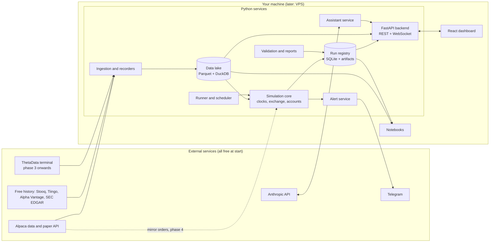

# Trading-bot playground: principal design specification

Version 0.1, 26 September 2026. Companion to [playground-design.md](playground-design.md) (research and rationale), [bot-performance-evidence.md](bot-performance-evidence.md) and [implementation-plan.md](implementation-plan.md). Wireframes: [wireframes/README.md](wireframes/README.md) (source) and the Claude Design canvas at https://claude.ai/artifact/NkeAGz5uqV72dV7dUChFQF.

This document is the build contract: what the system is, how it is decomposed, what each part must do, how the parts talk to each other, what it costs, and in what order it is built. Where the research document explains why, this one says what.

## 0. Decision record

Decisions taken in the interview on 26 September 2026. Each is a default the build follows until you change it.

| Topic | Decision | Consequence in the spec |
|---|---|---|
| Interface | Web dashboard (custom React app on a FastAPI backend) plus notebooks | Backend API from phase 0; UI screens phased (section 9) |
| Hosting | Your own macOS machine for phases 0 to 3, a small VPS for paper mode in phase 4 | Everything runs from one `docker compose` or plain Python on macOS; Linux parity kept for the VPS |
| Data budget | 0 USD to start; ThetaData when intraday options begin | Free sources only in phases 0 to 2 (section 4.4) |
| Time | 5 to 10 hours a week | Estimates in section 9 assume 7 hours; the UI is phased so the core is never blocked on it |
| First families | Daily trend and stock selection | Daily bars, next-open fills and point-in-time universes are phase 0 and 1 |
| Options scope | Single legs plus defined-risk spreads (verticals, covered calls, cash-secured puts) | Combo fills, spread margin, expiry and assignment in phase 3; condors and calendars later |
| Universe | S&P 500 constituents | About 500 names; membership stored as of date; about 1 GB of minute data per year |
| Explanations | Tooltips on every metric, first-run tour and page explainers, plain-language summaries, contextual warnings | Explanation content is a first-class data model (section 5.3) |
| Language | English | One content set |
| Assistant | Full research assistant, 50 to 100 USD a month budget | Assistant service in section 3.8 with a hard monthly cap |
| Alerts | Telegram | Alert service in section 3.9 |
| Replay | Speed control and pause in phase 2 | Step and fork deferred; the clock design allows them later |
| Fill calibration | Alpaca paper account | Mirror adapter in phase 4 |
| Machine | macOS laptop or desktop | Docker Desktop optional in phases 0 to 3; required for the VPS |
| Seed experiments | SPY 10-month moving average versus buy-and-hold, and monthly momentum top 20 of the S&P 500 | Both ship as examples in phase 0 and 1 |
| Parallelism | Up to 5 virtual accounts in one process | Account manager sized for 5; more via extra processes |

## 1. Scope

**Goal.** A single-user application that runs trading strategies on real US market data with virtual money in three modes (backtest, replay, paper), records every run as an experiment, and helps you decide, with statistics and explanations, whether a strategy is worth pursuing.

**In scope.** US stocks and ETFs at daily and minute resolution; US equity and index options at daily resolution first, intraday later; the S&P 500 universe with point-in-time membership; a simulated exchange with explicit fill, cost, margin and options-lifecycle models; up to five virtual accounts per session; a run registry with trial counting and a validation protocol; a web dashboard with explanations; a Telegram alert channel; an LLM research assistant kept away from execution; export of validated strategies through a thin interface.

**Out of scope.** Real-money trading in any form; tick-level or order-book simulation; futures and crypto; multi-user access; mobile apps.

**Success criteria for version 1.** You can, in one evening, write a strategy against the strategy interface, backtest it on the S&P 500 with realistic costs, run a parameter sweep overnight, read a validation report with deflated statistics and plain-language warnings, replay a chosen day at 10 times speed, and run the strategy forward in paper mode with Telegram alerts, without editing anything outside the strategy file and its configuration.

## 2. System overview



Everything is a Python package in one repository plus a React app. In phases 0 to 3 it runs as processes on your Mac; the same code runs on a Linux VPS in Docker in phase 4.

## 3. Component design

### 3.1 Data layer

**Responsibilities.** Download and store historical data, record live feeds, maintain the security master and point-in-time tables, snapshot datasets for reproducibility, and run quality checks.

**Data lake layout** (Parquet, zstd, Hive-partitioned; queried by DuckDB and Polars):

```
data/lake/
  bars/daily/symbol=AAPL/year=2024/part.parquet
  bars/minute/symbol=AAPL/date=2024-03-15/part.parquet
  quotes/minute_nbbo/symbol=.../date=.../part.parquet          (phase 2, recorded)
  options/chains_daily/underlying=SPY/date=2024-03-15/part.parquet
  options/quotes_minute/underlying=SPX/date=.../part.parquet   (phase 3+, ThetaData)
  fundamentals/pit/symbol=.../part.parquet                     (period_end, known_at, revision, fields)
  universe/membership/index=SPX500/part.parquet                (symbol, start, end, source)
  corporate_actions/part.parquet                               (symbol, type, ex_date, pay_date, ratio, cash)
  security_master/part.parquet                                 (perm_id, ticker, start, end, exchange, delist_date)
  recordings/{alpaca,theta}/date=.../raw.jsonl.zst             (append-only raw messages with receive time)
data/manifests/<snapshot_id>.json                              (file list, hashes, vendor, as-of date)
```

**Ingestion jobs** (Python modules invoked by the runner's scheduler or manually): daily bars (Stooq or Tiingo bulk, Alpaca), minute bars (Alpaca, backfilled per symbol and month), daily option chains (Alpha Vantage, Tradier sandbox, later ThetaData), fundamentals (SEC EDGAR company facts with filing dates as `known_at`), index membership (a maintained free constituents history where available, otherwise current membership flagged as not point-in-time), corporate actions (Alpaca corporate-actions endpoint), calendar (exchange calendar library).

**Recorders.** Long-running processes that subscribe to a live feed and append raw messages with receive timestamps, flushing every few seconds, then derive Parquet bars and quotes nightly. Replay reads the raw recordings.

**Snapshots.** A manifest lists the exact files and hashes a run used; the registry stores the manifest identifier. Rebuilding a snapshot from the manifest must be possible as long as the files exist.

**Quality checks** (nightly, results shown on the Data page): gaps and duplicates per symbol and day, split and dividend consistency against price jumps, point-in-time violations (`known_at` earlier than filing date), stale recordings, coverage per dataset.

### 3.2 Simulation core

**Clock.** One interface, three implementations.

```python
class Clock(Protocol):
    def now(self) -> datetime: ...
    def schedule(self, when: datetime, callback, *, name: str) -> Handle: ...
    def advance(self) -> Iterable[Event]: ...   # yields the next batch of events at the same timestamp
```

- `BacktestClock` iterates the data lake as fast as possible.
- `ReplayClock` iterates recordings or bars and paces them by wall clock times a speed factor (1x to 60x), with `pause()` and `resume()` (phase 2). Its state is a cursor, which is what would make `step()` and `fork()` possible later.
- `LiveClock` uses wall time and subscribes to live feeds.

**Event bus.** In-process, typed events: `Bar`, `Quote`, `Trade`, `ChainSnapshot`, `CorporateAction`, `Timer`, `OrderSubmitted`, `OrderAccepted`, `OrderFilled`, `OrderCancelled`, `OrderRejected`, `PositionChanged`, `Expiry`, `Assignment`, `Alert`. Every event carries `ts_event` and `ts_init`; consumers only see events with `ts_init` at or before `clock.now()`. Ordering is a stable sort on `(ts_init, sequence)`.

**Processing per timestamp** (NautilusTrader's three phases): match resting orders against new data; dispatch data and timers to strategies; drain newly submitted commands through the latency model and match, repeating until none remain.

**Simulated exchange.**

```python
class SimulatedExchange:
    def submit(self, order: Order) -> None
    def cancel(self, order_id: str) -> None
    def on_market_data(self, event: Bar | Quote | Trade) -> list[Fill]
    def on_timestamp_end(self, ts: datetime) -> None      # expirations, settlement, margin checks
```

Order types in version 1: market, limit, stop, stop-limit, market-on-open, market-on-close; combo market and combo limit for options packages (phase 3). Time in force: day and good-till-cancelled. Models are strategy pattern objects with a `model_id` and `version`, recorded per run:

| Model | Version 1 default | Configurable alternatives |
|---|---|---|
| Fill (stocks, daily) | Next-open fill for market orders; auction print when available | Close-of-day (documented as optimistic) |
| Fill (stocks, minute) | Buy at ask, sell at bid from quotes; if only bars, next bar open; limit fills on penetration; stops on high/low with gap handling | Touch fill with probability 0.5 |
| Slippage | Daily: 5 basis points plus 10% of daily volume participation cap; minute: half spread plus one-tick adverse move with probability 0.5, 5% of bar volume cap with carry-over | Constant, volume-share, market-impact (Almgren) |
| Latency | 0 in backtest by default, 250 ms for stocks and 500 ms for options in replay and paper | Any constant |
| Fees | Zero-commission profile and Interactive Brokers fixed profile (0.005 USD per share, 1 USD minimum, 0.5% cap; options 0.65 USD per contract, 1 USD minimum) | Custom |
| Options fill | Net mid plus spread fraction by leg count: 75%, 66%, 56%, 53%; whole package or nothing; reject on zero bid or spread above maximum | Mid fill (documented as optimistic) |
| Stale data | Market orders never fill on data older than one bar | |

**Accounts.** `Account` holds cash by currency, positions with lots (FIFO), open orders, margin state, realised and unrealised profit, fees by category, and an append-only event log. Account types: cash (settled cash, T+1, no shorting) and margin (Regulation T approximations: 50% initial, 25% maintenance long, 30% short, 4 times intraday; margin-call warning at 5% free margin, forced liquidation losers-first beyond a 10% buffer). `AccountManager` runs up to five accounts against one event stream, each with its own strategy instance and parameters.

**Options lifecycle** (phase 3). Contract master with OCC identifiers, activation and expiration timestamps and adjustment flags; expiry processed after the last event of the expiry day using the underlying close; auto-exercise at 0.01 USD intrinsic; physical delivery at strike for equity options, cash settlement for index options; long-exercise capital check with cash-settle fallback; early assignment heuristics (within 4 days and 5% in the money with exercise beating close, or extrinsic below 0.05 USD with one day left) plus the ex-dividend rule for short calls; margin: long options at premium, verticals at strike width, covered calls and cash-secured puts per broker formulas; liquidation of option positions on underlying splits.

**Corporate actions.** Applied on raw prices: splits adjust quantities, average prices and open orders with cash in lieu; dividends credited on pay date (debited for shorts); symbol changes cancel and resubmit open orders; delistings warn on the last day and liquidate at the last price. Adjusted series are served separately for indicators.

**Calendar.** Exchange calendar for NYSE sessions, holidays, early closes and late opens in America/New_York; all internal timestamps in UTC.

### 3.3 Strategy API

```python
class Params(BaseModel):                 # pydantic; bounds and steps drive sweeps, forms and the registry
    fast: int = Field(20, ge=5, le=100, json_schema_extra={"step": 5, "optimize": True})

class Strategy(ABC):
    params_model: type[Params]
    universe: UniverseSpec               # static list, index membership as-of, or a screen
    schedule: ScheduleSpec               # e.g. daily at close, every bar, monthly first session
    def on_start(self, ctx: Context) -> None: ...
    def select_universe(self, ctx: Context, as_of: date) -> list[str]: ...      # point-in-time data only
    def on_bar(self, ctx: Context, bars: BarBatch) -> None: ...
    def on_quote(self, ctx: Context, quote: Quote) -> None: ...
    def on_timer(self, ctx: Context, name: str) -> None: ...
    def on_fill(self, ctx: Context, fill: Fill) -> None: ...
    def on_expiry(self, ctx: Context, event: Expiry | Assignment) -> None: ...
```

`Context` exposes `now`, `history(symbol, field, lookback)` (only data available at `now`), `positions`, `account`, `target(symbol, quantity)`, `order(...)`, `chain(underlying, as_of)`, `log`, and `note(text)` for the plain-language trail. Strategies never receive the exchange or the data lake directly. The same class runs in all three modes and can be exported: a thin adapter maps `on_bar`, `target` and `order` to Lumibot or NautilusTrader when a strategy graduates to the live system.

### 3.4 Risk layer

Every `target` and `order` passes a `RiskPolicy` before the exchange: symbol allowlist (the universe), maximum position as a share of equity, maximum gross exposure, maximum orders per minute, maximum daily loss with halt-and-flatten, options approval level and defined-risk-only flag, and kill criteria for paper runs (drawdown beyond the bootstrapped 95th percentile, slippage budget, stale-data and reject rates, feed loss for 30 seconds). Rejections are events, shown in the run and, in paper mode, sent to Telegram.

### 3.5 Experiment layer

**Registry.** SQLite database `registry/runs.sqlite` with tables `experiments`, `runs`, `metrics`, `trials`, `datasets`, `gates`, `alerts`, `assistant_actions`; artifacts under `registry/artifacts/<run_id>/` as Parquet (`trades`, `orders`, `fills`, `equity`, `positions_daily`) plus `config.yaml`, `git.diff`, `report.html`, `summary.md`. Schema in section 5.1.

**Runner.** `pg run <strategy> --mode backtest|replay|paper --from --to --speed --accounts <n> --params k=v` creates the run record first, executes, streams progress events to the API, and finalises metrics and artifacts. `pg sweep` wraps Optuna with SQLite storage and writes each trial as a run. `pg validate <experiment>` executes the protocol steps (look-ahead, warm-up, nulls, walk-forward, combinatorial cross-validation, deflated Sharpe, robustness, gates) and writes `gates`. `pg lockbox eval` performs the single holdout evaluation. `pg record` runs a recorder. `pg report` and `pg compare` regenerate artifacts.

**Scheduler.** APScheduler inside the backend for nightly data QA, recorder supervision, paper-session start and stop around the US session (15:30 to 22:00 Berlin time, calendar-aware), and assistant batch jobs.

### 3.6 Backend API (FastAPI)

Local-only by default (binds to localhost; on the VPS behind a reverse proxy with a token). Resources:

| Method and path | Purpose |
|---|---|
| `GET /experiments`, `POST /experiments`, `GET /experiments/{id}` | List, pre-register and inspect experiments (hypothesis, trial budget, lockbox status) |
| `GET /runs?experiment=&mode=&strategy=`, `GET /runs/{id}`, `GET /runs/{id}/equity`, `/trades`, `/fills`, `/report` | Run list and details; large arrays paginated or downsampled |
| `POST /runs` | Start a run (backtest or replay) with strategy, parameters, data snapshot, models |
| `POST /runs/{id}/cancel` | Stop a running job |
| `GET /compare?runs=a,b` | Aligned equity and drawdown series, metric deltas, parameter diff |
| `GET /leaderboard?experiment=` | Ranked by deflated Sharpe with trial counts and gate status |
| `POST /sweeps`, `GET /sweeps/{id}` | Start and monitor a sweep |
| `POST /replay`, `POST /replay/{id}/pause`, `/resume`, `/speed` | Time machine control |
| `GET /paper/accounts`, `POST /paper/accounts/{id}/pause`, `/flatten` | Paper session control and kill switch |
| `GET /data/coverage`, `GET /data/quality`, `GET /data/snapshots` | Data page |
| `GET /strategies`, `GET /strategies/{name}/params` | Discover strategies and their parameter schemas for forms |
| `GET /explain/metrics`, `GET /explain/pages/{page}`, `GET /explain/warnings` | Explanation content (section 5.3) |
| `POST /assistant/ask`, `POST /assistant/explain-run/{id}`, `GET /assistant/budget` | Assistant |
| `WS /events` | Run progress, replay ticks, paper fills, alerts |

### 3.7 Frontend (React)

Vite, TypeScript, React, TanStack Query for data, a WebSocket client for events, Tailwind CSS with a small component library (buttons, cards, tables, tooltips, drawers), Plotly.js for analysis charts and TradingView lightweight-charts for price and replay charts. Screens and their phase:

| Screen | Purpose | Phase |
|---|---|---|
| Home | Status at a glance: paper accounts, recent runs, alerts, data health, "what to do next" | 1 |
| Experiments | Pre-registrations with trial budget bars and lockbox status | 1 |
| Runs | Filterable run list; start a run from a strategy and parameter form | 1 |
| Run detail | Equity and drawdown, metrics with tooltips, plain-language summary, warnings, trades and fills, fill assumptions, artifacts | 1 |
| Compare | Two runs side by side: overlays, metric deltas, parameter diff, summary of the difference | 1 |
| Sweep | Trials over time, parameter importance, leaderboard with trial counts, deflated statistics | 1 |
| Validation report | Gate table with pass and fail, walk-forward windows, path distribution, robustness grid | 2 |
| Replay | Date picker, speed and pause, price chart following the clock, account panel, decision log | 2 |
| Paper | Live accounts, positions, orders, kill switch, Telegram status, shadow-fill comparison | 4 |
| Data | Coverage heatmap, quality checks, snapshots, recorder status | 1 (basic), 2 (full) |
| Strategies | Strategy catalogue, parameter schema, bias-test status | 1 |
| Assistant | Chat with your own results, explain-run, proposal review with approve and reject, budget meter | 5 |

**Explanation system** (all screens): every metric label renders from the explanation registry with a tooltip (short definition, formula, what good and bad look like, caveat) and a "learn more" drawer; every page has an "Explain this page" panel; a first-run tour walks through Home, Runs, Run detail and Compare; result summaries are generated from templates over the metrics and gates (deterministic) and optionally polished by the assistant; warnings are rules evaluated on the run (section 5.3) and shown inline where the affected number is. An "Expert mode" toggle hides the explanatory chrome.

### 3.8 Assistant service

A separate process with read-only tools over the registry and the data lake (SQL with a read-only connection, run summaries, glossary, documentation) and a write tool limited to proposals (configuration diffs stored for approval). No access to the exchange, accounts or credentials. Uses the official Anthropic Python SDK; the default model for reasoning tasks is Claude Opus 5 (`claude-opus-5`) with adaptive thinking; nightly digests and bulk summaries go through the batch API at half price; the stable system context and schemas are prompt-cached. A ledger records tokens and cost per call; a hard monthly cap (default 80 USD) disables the service until the next month, with a warning at 60 USD. Every proposal that you approve increments the experiment's trial counter.

### 3.9 Alert service

Telegram bot with a per-event switch (fill, daily summary, risk rejection, kill-switch trip, data problem, paper session start and stop, assistant digest) and commands `/status`, `/positions`, `/pause <account>`, `/resume <account>`, `/flatten <account>`, `/mute`. Alerts are also stored in the registry and shown on Home.

## 4. Data model

### 4.1 Registry (SQLite)

```
experiments(id, slug, hypothesis, family, prereg_path, trial_budget, trials_used, lockbox_manifest, lockbox_used_at, created_at)
runs(run_id, experiment_id, trial_no, mode, strategy, strategy_version, git_sha, git_dirty, diff_hash,
     params_json, params_hash, config_hash, engine_version, seed, data_snapshot_id, universe_id,
     start_ts, end_ts, fill_model, slippage_model, fee_model, latency_model, scenario_id,
     parent_run_id, status, started_at, finished_at, holdout_touched, notes, tags)
metrics(run_id, name, value)
trials(experiment_id, sweep_id, optuna_trial_number, run_id)
datasets(snapshot_id, manifest_path, vendor, as_of, sha256, created_at)
gates(run_id, gate, passed, value, threshold, evaluated_at)
alerts(id, ts, severity, source, account_id, message, delivered)
assistant_actions(id, ts, model, tokens_in, tokens_out, cost_usd, tool, target, approved_by, approved_at)
paper_accounts(id, run_id, strategy, params_hash, started_at, status, last_heartbeat)
```

Metrics stored per run: total and annualised return, volatility, Sharpe, Sortino, Calmar, max drawdown and duration, exposure, turnover, trade count, win rate, profit factor, expectancy, average slippage versus mid, fees as share of gross profit, probabilistic Sharpe, deflated Sharpe, probability of overfitting, walk-forward efficiency, and for paper runs tracking error versus the backtest twin.

### 4.2 Data lake schemas

Bars: `ts_close (UTC), open, high, low, close, volume, vwap, trade_count, source`. Quotes: `ts (UTC), bid, bid_size, ask, ask_size, source`. Option chains (daily): `as_of, underlying, occ_symbol, expiry, strike, right, bid, ask, last, volume, open_interest, iv, delta, gamma, theta, vega, source`. Fundamentals: `perm_id, period_end, known_at, revision, field, value, source`. Membership: `index, perm_id, start, end, source, point_in_time (bool)`. Corporate actions: `perm_id, type, ex_date, pay_date, ratio, cash_amount, new_ticker, source`. Security master: `perm_id, ticker, start, end, name, exchange, delist_date, delist_price`.

### 4.3 Explanation content model

Stored as YAML in the repository, served by the API, versioned with the code.

```yaml
# explanations/metrics.yaml
sharpe:
  label: Sharpe ratio
  short: Return per unit of risk. Above 1 is good for a backtest; live results are usually lower.
  formula: (annualised return - risk-free rate) / annualised volatility
  good_range: [0.5, 2.0]
  caveats: [Inflated by few trades, by data snooping and by smooth-looking daily data.]
  see_also: [deflated_sharpe, sortino]
# explanations/pages.yaml
run_detail:
  title: What you are looking at
  body: This page shows one run of one strategy with one set of parameters ...
  steps: [Start with the summary paragraph, then check the warnings, then the equity curve ...]
# explanations/warnings.yaml
few_trades:
  when: metrics.n_trades < 30
  severity: warn
  message: Only {n_trades} trades. Statistics on so few trades are unreliable.
  remedy: Extend the period, widen the universe, or treat this run as a smoke test.
high_trial_count:
  when: experiment.trials_used > 100 and metrics.deflated_sharpe < 0.95
  severity: warn
  message: This experiment has tried {trials_used} configurations; the deflated Sharpe ratio says the best result could be luck.
holdout_used:
  when: run.holdout_touched
  severity: info
  message: This run used the locked holdout period. It is the final evaluation for this experiment.
```

## 5. Key flows

1. **Backtest.** UI form or CLI collects strategy, parameters, period, snapshot, models; API creates the run row (status `queued`) and enqueues the job; the runner executes with `BacktestClock`, streaming progress over the WebSocket; on completion it writes metrics, artifacts, the template summary and warnings, then emits `run.finished`; the UI opens the run detail.
2. **Sweep.** Optuna study with SQLite storage; each trial is a run with `trial_no` incremented; the leaderboard recomputes deflated Sharpe from the experiment's trial count; the sweep page shows the study.
3. **Validation.** `pg validate` runs the protocol modules in order, writes `gates`, renders the validation report; the run detail shows the gate badges.
4. **Replay.** UI picks a date and speed; the API starts a replay job with `ReplayClock`; ticks, fills and account state stream over the WebSocket; pause and resume are API calls; on completion it is stored as a run with `mode=replay`.
5. **Paper session.** Scheduler starts the session before the US open with `LiveClock`, the live recorder, up to five accounts and the risk policy; fills and alerts stream to the UI and Telegram; the session stops after the close and writes a daily report; restart recovers state from the account event log.
6. **Compare.** API aligns two runs' equity curves on a common calendar, computes metric deltas and the parameter diff, and renders a summary paragraph of the difference.
7. **Assistant explain.** The UI posts a run identifier; the assistant service reads the run's metrics, gates, warnings and a sample of trades through its read-only tools and returns a plain-language explanation with references to the glossary; cost is logged.

## 6. Realism configuration

The defaults in section 3.2 are the `realism: default` profile. Two more profiles ship: `optimistic` (mid fills, no slippage, zero fees) to show how much a rosy backtest overstates, and `harsh` (double slippage, 1.5 times fees, one extra bar of latency) for the robustness step. Profiles are YAML under `configs/realism/` and are recorded per run.

## 7. Non-functional requirements

- **Determinism.** Same inputs and seed produce identical fills and metrics; stable event ordering; all random draws from a seeded generator recorded in the run.
- **Performance targets** (on a recent laptop): daily backtest of 500 symbols over 20 years under 60 seconds; minute backtest of 100 symbols over one year under 10 minutes; sweep of 300 daily trials overnight; dashboard pages under one second on cached data. Vectorised pre-computation of indicators keeps the event loop light.
- **Reliability.** Paper sessions resume from the account event log after a crash; recorders reconnect with backoff; the scheduler is idempotent.
- **Safety.** No live credentials accepted by the configuration schema; broker adapters allow only paper endpoints; the word "live" does not appear in the UI; a red "simulation" badge on every page.
- **Observability.** Structured JSON logs per run, a heartbeat per paper account, alert on silence.
- **Privacy.** Everything local; the only outbound calls are to data vendors, Telegram and the Anthropic API.

## 8. Technology stack

| Area | Choice |
|---|---|
| Language | Python 3.12 |
| Core libraries | pydantic 2, Polars, DuckDB, pyarrow, exchange-calendars, numpy, pandas where libraries require it |
| Data clients | alpaca-py, thetadata (phase 3), requests for free endpoints |
| Search and validation | Optuna 5, purgedcv, skfolio, vectorbt for vectorised sweeps |
| Reports | quantstats, pyfolio-reloaded |
| Backend | FastAPI, uvicorn, SQLAlchemy over SQLite, APScheduler, websockets |
| Frontend | Vite, React, TypeScript, TanStack Query, Tailwind CSS, Plotly.js, lightweight-charts |
| Assistant | Anthropic Python SDK |
| Alerts | python-telegram-bot |
| Packaging and ops | uv for Python environments, Docker Compose for the VPS, GitHub Actions for tests and nightly data QA |

## 9. Development plan with the phased UI

Estimates in hours of focused work; at 7 hours a week, divide by 7 for weeks.

| Phase | Core and data | Backend API | React UI | Hours | Cumulative weeks |
|---|---|---|---|---|---|
| 0. Skeleton | Data lake with daily bars, strategy API, simulated exchange (daily), one account, registry, CLI runner, SPY moving-average seed | Read-only runs and run detail endpoints | None yet (CLI and tearsheet) | 20 to 25 | 3 to 4 |
| 1. Compare and sweep | Optuna sweeps, walk-forward, deflated Sharpe, look-ahead and warm-up tests, point-in-time universe, momentum seed | Full runs, compare, leaderboard, strategies, explanations | App shell, Home, Runs, Run detail, Compare, Sweep, Strategies, Data (basic), tooltips, page explainers, tour | 60 to 80 | 12 to 15 |
| 2. Intraday and replay | Minute bars, calendar, quote-based fills, replay clock, recorder, scenario transformers, intraday seed | Replay control, events stream, data quality | Replay screen with price chart, Validation report, Data (full) | 45 to 60 | 19 to 24 |
| 3. Options | Chains, contract master, combo fills, expiry and assignment, spread margin, Greeks, put-write and vertical seeds; ThetaData ingestion | Chain and Greeks endpoints | Options views in Run detail and Replay, chain viewer | 50 to 70 | 26 to 34 |
| 4. Paper and calibration | Live clock, paper sessions, Alpaca mirror, shadow comparison, kill criteria, Docker Compose, VPS | Paper control endpoints, Telegram | Paper screen | 30 to 40 | 30 to 40 |
| 5. Assistant and hardening | Assistant service with tools, budget ledger, nightly digests; regression tests on recordings; docs | Assistant endpoints | Assistant screen, proposal review | 30 to 40 | 34 to 46 |

Total: roughly 235 to 315 hours, or 8 to 11 months at 7 hours a week. The custom React app accounts for about 90 to 120 of those hours; a Streamlit dashboard would have been about a third of that, which is the trade-off you chose for better explanations and layout. Two ways to shorten: build the UI screens in the order listed and stop when they are good enough, or spend a few more hours a week in phases 1 and 2.

## 10. Cost model

**Running costs by phase** (monthly, USD; EUR roughly the same at recent rates)

| Item | Phases 0 to 2 | Phase 3 (options) | Phase 4 (paper on VPS) | Phase 5 (assistant) |
|---|---|---|---|---|
| Market data | 0 (Alpaca free, Stooq or Tiingo, Alpha Vantage, EDGAR) | 40 (ThetaData Value) or 80 (Standard) when intraday options start | same | same |
| Hosting | 0 (your Mac) | 0 | 5 to 10 (small VPS) | same |
| Alpaca paper account | 0 | 0 | 0 | 0 |
| Telegram | 0 | 0 | 0 | 0 |
| LLM assistant | 0 (not built yet) | 0 | 0 | 50 to 100 (your chosen budget, hard cap in software) |
| **Total per month** | **0** | **40 to 80** | **45 to 90** | **95 to 190** |

**Optional upgrades**: Alpaca Algo Trader Plus, 99 a month, for consolidated real-time stock quotes in paper mode instead of the free IEX-only feed; a survivorship-free universe and fundamentals source (Sharadar or Norgate, tens of USD a month, prices to confirm) when stock-selection research becomes the focus; a 2 TB external SSD, about 100 to 150 EUR once, if minute data and recordings outgrow the laptop.

**First-year total**: about 600 to 1,300 USD if options data starts around month 6 and the assistant around month 9, before optional upgrades; the same year on the hosted alternative (QuantConnect Quant Researcher with two paper nodes) would be about 1,300 USD with less to build but no replay and limited parallel experiments.

**Your time**: 235 to 315 hours (section 9). This is the dominant cost and the reason the UI is phased.

## 11. Testing strategy

- Unit tests for the exchange (every order type against synthetic bars and quotes, gaps, stale data, partial fills), accounts (lots, margin, settlement), options lifecycle (expiry cases, assignment heuristics), corporate actions.
- Property tests for the risk policy (limits can never be exceeded regardless of order sequence) and for determinism (same seed, same result).
- Bias tests for every strategy (look-ahead re-run, warm-up invariance) run in CI.
- Golden tests: the SPY moving-average seed's out-of-sample results must match published figures within tolerance, as a check on the simulator's daily semantics.
- Replay regression: recorded sessions replayed in CI must reproduce stored fills.
- Frontend: component tests for the explanation system (every metric has an entry; no orphan tooltips) and an end-to-end smoke test of the run and compare flow.

## 12. Risks and mitigations

| Risk | Mitigation |
|---|---|
| Scope creep in the UI eats the time budget | Screens phased; core usable from the CLI at every phase |
| Simulator optimism produces confidently wrong strategies | Pessimistic defaults, `optimistic` profile shown for contrast, shadow comparison against Alpaca paper in phase 4 |
| Free data quality (missing delistings, revised fundamentals) | Data quality page, point-in-time flags, and an upgrade path to a survivorship-free source |
| Look-ahead bugs in strategies or the core | Bias tests in CI, `ts_init` discipline, golden tests |
| Assistant costs or leakage | Hard monthly cap, read-only tools, training-cutoff caveat on proposals |
| Laptop sleep interrupts paper sessions | Phase 4 moves paper mode to the VPS; until then paper runs are best-effort |

## 13. Open items

- Which free source of historical S&P 500 membership is acceptable, or whether to buy one before stock-selection research starts.
- Whether Plotly.js alone is enough or lightweight-charts is needed from phase 2 for replay.
- Exact kill-criteria thresholds, to be derived from the first backtests' drawdown distributions.
