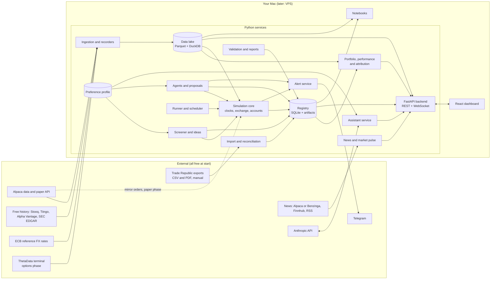

# Trading-bot playground: principal design specification

Version 0.2, 26 September 2026. Companion to [playground-design.md](playground-design.md) (research and rationale), [bot-performance-evidence.md](bot-performance-evidence.md) and [implementation-plan.md](implementation-plan.md). Wireframes: [wireframes/README.md](wireframes/README.md) (source) and the Claude Design canvas at https://claude.ai/artifact/NkeAGz5uqV72dV7dUChFQF.

This document is the build contract: what the system is, how it is decomposed, what each part must do, how the parts talk to each other, what it costs, and in what order it is built. Where the research document explains why, this one says what.

**What changed in 0.2 (portfolio-first reframe).** Version 0.1 described a research lab for strategy experiments; its Home page opened on a list of runs. After reviewing the wireframes you asked for something different at the front door: your real portfolio (imported from Trade Republic), its performance against a benchmark, live news filtered to what you hold, an explanation of why the portfolio performed as it did, what-if scenarios ("add this stock instead of that one") compared on one chart, agents that run those scenarios forward with fake money and draft real trade proposals for your approval, an ideas page that sweeps the market against your preferences, and an assistant that learns what you like. Nothing in the 0.1 simulation core is thrown away: a scenario is a run, an idea's test is a run, an agent's rule went through validation. The research screens now live behind an "Advanced" menu. Sections 0 (second table), 1, 2, 3.6, 3.7, 3.10 to 3.15, 4.4, 5, 9, 10, 12 and 13 changed; the simulation core (3.2 to 3.5) and the validation protocol are unchanged.

## 0. Decision record

Decisions taken in the interview on 26 September 2026. Each is a default the build follows until you change it.

| Topic | Decision | Consequence in the spec |
|---|---|---|
| Interface | Web dashboard (custom React app on a FastAPI backend) plus notebooks | Backend API from phase 0; UI screens phased (section 9) |
| Hosting | Your own macOS machine for phases 0 to 3, a small VPS for paper mode in phase 4 | Everything runs from one `docker compose` or plain Python on macOS; Linux parity kept for the VPS |
| Data budget | 0 USD to start; ThetaData when intraday options begin | Free sources only in phases 0 to 2 (section 4.4) |
| Time | 5 to 10 hours a week | Estimates in section 9 assume 7 hours; the UI is phased so the core is never blocked on it |
| First families | Daily trend and stock selection | Daily bars, next-open fills and point-in-time universes are phase 0 and 1 |
| Options scope | Single legs plus defined-risk spreads (verticals, covered calls, cash-secured puts) | Combo fills, spread margin, expiry and assignment in phase 3; condors and calendars later |
| Universe | S&P 500 constituents | About 500 names; membership stored as of date; about 1 GB of minute data per year |
| Explanations | Tooltips on every metric, first-run tour and page explainers, plain-language summaries, contextual warnings | Explanation content is a first-class data model (section 5.3) |
| Language | English | One content set |
| Assistant | Full research assistant, 50 to 100 USD a month budget | Assistant service in section 3.8 with a hard monthly cap |
| Alerts | Telegram | Alert service in section 3.9 |
| Replay | Speed control and pause in phase 2 | Step and fork deferred; the clock design allows them later |
| Fill calibration | Alpaca paper account | Mirror adapter in phase 4 |
| Machine | macOS laptop or desktop | Docker Desktop optional in phases 0 to 3; required for the VPS |
| Seed experiments | SPY 10-month moving average versus buy-and-hold, and monthly momentum top 20 of the S&P 500 | Both ship as examples in phase 0 and 1 |
| Parallelism | Up to 5 virtual accounts in one process | Account manager sized for 5; more via extra processes |

**Reframe decisions (interview rounds 5 and 6, same day).**

| Topic | Decision | Consequence in the spec |
|---|---|---|
| Real portfolio | Imported from Trade Republic exports (CSV and PDF); no broker API, read-only | Import service (3.10); ISIN is the instrument key; the app never holds broker credentials |
| Horizon | Long-term core plus a bounded tactical sleeve (default 15%) | Two sleeves with separate metrics, limits, agents and proposals (3.14, 4.4) |
| Markets | US stocks and ETFs plus the European and German names you hold; reporting in EUR | Instrument master maps ISIN to a US ticker or a European listing; ECB FX table; currency effect in attribution (3.11) |
| Agent role | Manages virtual scenario portfolios and drafts real trade proposals for your approval; the app never executes | Proposal object with approve, edit, reject; execution is manual at the broker, then re-imported and reconciled (3.14) |
| News | English, US-centric feeds (Alpaca or Benzinga, Finnhub) filtered to holdings and watchlist | News service (3.12); free tiers only; European names covered where the feeds have them |
| Recommendations | Two tiers: screen-backed (with a scenario test attached) and assistant opinion, clearly labelled | Recommendation object with a mandatory tier and evidence links (3.13) |
| Preferences | Risk tolerance and drawdown comfort, sectors and themes and exclusions, position and concentration limits, feedback on ideas and proposals | Preference profile (3.15) read by screens, scenarios, agents and the assistant; changes learned from feedback are proposed and confirmed, never applied silently |
| Benchmarks | MSCI World in EUR plus S&P 500 | Benchmark series in the lake; both shown on Home, Portfolio and Compare |
| Everyday navigation | Home, Portfolio, Scenarios, Market, Ideas, Agents, Assistant; research tools under "Advanced" | Screen table in 3.7; wireframes rows 1 to 3 versus row A |

## 1. Scope

**Goal.** A single-user application that keeps a read-only copy of your real portfolio, shows how it performs against a benchmark and why, lets you test what-if changes and rules on real market history with fake money, runs agents that continue those what-ifs forward and draft trade proposals for your approval, sweeps the market for ideas that fit your stated preferences, and explains all of it in plain language. Underneath, it is the same simulation and validation engine as version 0.1, so any claim ("this would have beaten the index") can be checked for luck before you act on it.

**In scope.** Import and reconciliation of Trade Republic transaction exports; a real portfolio with lots, FIFO cost basis and EUR reporting; performance against MSCI World (EUR) and the S&P 500 with attribution (market, allocation, selection, currency, fees) and a written explanation; scenarios (edits plus a rule) simulated over history and compared with the real portfolio; agents that run scenarios forward with virtual money and draft proposals for the core and the tactical sleeve; a market page (indices, sectors, risk gauges, weekly note) and a news feed filtered to holdings and watchlist; a screener over the S&P 500 and the DAX and EURO STOXX names you hold, producing two tiers of ideas; a preference profile that learns from your feedback with your confirmation; the 0.1 research lab (runs, sweeps, validation, replay, paper accounts, options) behind an Advanced menu; a Telegram alert channel; an LLM assistant with read tools and a hard budget; US stocks, ETFs and options plus daily data for the European names you hold.

**Explicitly not.** High-frequency or intraday trading as a goal (intraday replay remains an advanced tool); placing, routing or automating any real order; connecting to Trade Republic by API or scraping; investment advice in the regulatory sense: every recommendation is labelled as a screen result or an opinion and carries its evidence.

**Out of scope.** Real-money trading in any form; tick-level or order-book simulation; futures and crypto; multi-user access; mobile apps; tax filing (the tax effect of a proposal is estimated, not declared).

**Success criteria for version 1.** You can import your Trade Republic exports and see, within a minute, your portfolio value in EUR, its return against MSCI World and the S&P 500 over one, three and five years, which holdings helped and hurt, and a written explanation of why. You can build a scenario ("replace SAP with Schneider Electric in 2021, rebalance yearly") and compare its curve and risk with your real portfolio, with hindsight and concentration warnings where they apply. You can start an agent on that scenario and, weeks later, see how it did against you. A weekly proposal arrives on Telegram with trades, reasons, evidence and the tax effect, and approving it never places an order. The ideas page shows what passed your screens and what the assistant merely thinks, and rating ideas changes future screens only after you confirm. The original success criterion (strategy, sweep, validation, replay, paper in one evening) still holds behind the Advanced menu.

## 2. System overview



Everything is a Python package in one repository plus a React app. It runs as processes on your Mac; the same code runs on a Linux VPS in Docker when agents need to run unattended (phase P4). No component holds broker credentials: the only path from the app to your broker is you, reading a proposal and typing orders into Trade Republic.

## 3. Component design

### 3.1 Data layer

**Responsibilities.** Download and store historical data, record live feeds, maintain the security master and point-in-time tables, snapshot datasets for reproducibility, and run quality checks.

**Data lake layout** (Parquet, zstd, Hive-partitioned; queried by DuckDB and Polars):

```
data/lake/
  bars/daily/symbol=AAPL/year=2024/part.parquet
  bars/minute/symbol=AAPL/date=2024-03-15/part.parquet
  quotes/minute_nbbo/symbol=.../date=.../part.parquet          (phase 2, recorded)
  options/chains_daily/underlying=SPY/date=2024-03-15/part.parquet
  options/quotes_minute/underlying=SPX/date=.../part.parquet   (phase 3+, ThetaData)
  fundamentals/pit/symbol=.../part.parquet                     (period_end, known_at, revision, fields)
  universe/membership/index=SPX500/part.parquet                (symbol, start, end, source)
  corporate_actions/part.parquet                               (symbol, type, ex_date, pay_date, ratio, cash)
  security_master/part.parquet                                 (perm_id, ticker, start, end, exchange, delist_date)
  recordings/{alpaca,theta}/date=.../raw.jsonl.zst             (append-only raw messages with receive time)
data/manifests/<snapshot_id>.json                              (file list, hashes, vendor, as-of date)
```

**Ingestion jobs** (Python modules invoked by the runner's scheduler or manually): daily bars (Stooq or Tiingo bulk, Alpaca), minute bars (Alpaca, backfilled per symbol and month), daily option chains (Alpha Vantage, Tradier sandbox, later ThetaData), fundamentals (SEC EDGAR company facts with filing dates as `known_at`), index membership (a maintained free constituents history where available, otherwise current membership flagged as not point-in-time), corporate actions (Alpaca corporate-actions endpoint), calendar (exchange calendar library).

**Recorders.** Long-running processes that subscribe to a live feed and append raw messages with receive timestamps, flushing every few seconds, then derive Parquet bars and quotes nightly. Replay reads the raw recordings.

**Snapshots.** A manifest lists the exact files and hashes a run used; the registry stores the manifest identifier. Rebuilding a snapshot from the manifest must be possible as long as the files exist.

**Quality checks** (nightly, results shown on the Data page): gaps and duplicates per symbol and day, split and dividend consistency against price jumps, point-in-time violations (`known_at` earlier than filing date), stale recordings, coverage per dataset.

### 3.2 Simulation core

**Clock.** One interface, three implementations.

```python
class Clock(Protocol):
    def now(self) -> datetime: ...
    def schedule(self, when: datetime, callback, *, name: str) -> Handle: ...
    def advance(self) -> Iterable[Event]: ...   # yields the next batch of events at the same timestamp
```

- `BacktestClock` iterates the data lake as fast as possible.
- `ReplayClock` iterates recordings or bars and paces them by wall clock times a speed factor (1x to 60x), with `pause()` and `resume()` (phase 2). Its state is a cursor, which is what would make `step()` and `fork()` possible later.
- `LiveClock` uses wall time and subscribes to live feeds.

**Event bus.** In-process, typed events: `Bar`, `Quote`, `Trade`, `ChainSnapshot`, `CorporateAction`, `Timer`, `OrderSubmitted`, `OrderAccepted`, `OrderFilled`, `OrderCancelled`, `OrderRejected`, `PositionChanged`, `Expiry`, `Assignment`, `Alert`. Every event carries `ts_event` and `ts_init`; consumers only see events with `ts_init` at or before `clock.now()`. Ordering is a stable sort on `(ts_init, sequence)`.

**Processing per timestamp** (NautilusTrader's three phases): match resting orders against new data; dispatch data and timers to strategies; drain newly submitted commands through the latency model and match, repeating until none remain.

**Simulated exchange.**

```python
class SimulatedExchange:
    def submit(self, order: Order) -> None
    def cancel(self, order_id: str) -> None
    def on_market_data(self, event: Bar | Quote | Trade) -> list[Fill]
    def on_timestamp_end(self, ts: datetime) -> None      # expirations, settlement, margin checks
```

Order types in version 1: market, limit, stop, stop-limit, market-on-open, market-on-close; combo market and combo limit for options packages (phase 3). Time in force: day and good-till-cancelled. Models are strategy pattern objects with a `model_id` and `version`, recorded per run:

| Model | Version 1 default | Configurable alternatives |
|---|---|---|
| Fill (stocks, daily) | Next-open fill for market orders; auction print when available | Close-of-day (documented as optimistic) |
| Fill (stocks, minute) | Buy at ask, sell at bid from quotes; if only bars, next bar open; limit fills on penetration; stops on high/low with gap handling | Touch fill with probability 0.5 |
| Slippage | Daily: 5 basis points plus 10% of daily volume participation cap; minute: half spread plus one-tick adverse move with probability 0.5, 5% of bar volume cap with carry-over | Constant, volume-share, market-impact (Almgren) |
| Latency | 0 in backtest by default, 250 ms for stocks and 500 ms for options in replay and paper | Any constant |
| Fees | Zero-commission profile and Interactive Brokers fixed profile (0.005 USD per share, 1 USD minimum, 0.5% cap; options 0.65 USD per contract, 1 USD minimum) | Custom |
| Options fill | Net mid plus spread fraction by leg count: 75%, 66%, 56%, 53%; whole package or nothing; reject on zero bid or spread above maximum | Mid fill (documented as optimistic) |
| Stale data | Market orders never fill on data older than one bar | |

**Accounts.** `Account` holds cash by currency, positions with lots (FIFO), open orders, margin state, realised and unrealised profit, fees by category, and an append-only event log. Account types: cash (settled cash, T+1, no shorting) and margin (Regulation T approximations: 50% initial, 25% maintenance long, 30% short, 4 times intraday; margin-call warning at 5% free margin, forced liquidation losers-first beyond a 10% buffer). `AccountManager` runs up to five accounts against one event stream, each with its own strategy instance and parameters.

**Options lifecycle** (phase 3). Contract master with OCC identifiers, activation and expiration timestamps and adjustment flags; expiry processed after the last event of the expiry day using the underlying close; auto-exercise at 0.01 USD intrinsic; physical delivery at strike for equity options, cash settlement for index options; long-exercise capital check with cash-settle fallback; early assignment heuristics (within 4 days and 5% in the money with exercise beating close, or extrinsic below 0.05 USD with one day left) plus the ex-dividend rule for short calls; margin: long options at premium, verticals at strike width, covered calls and cash-secured puts per broker formulas; liquidation of option positions on underlying splits.

**Corporate actions.** Applied on raw prices: splits adjust quantities, average prices and open orders with cash in lieu; dividends credited on pay date (debited for shorts); symbol changes cancel and resubmit open orders; delistings warn on the last day and liquidate at the last price. Adjusted series are served separately for indicators.

**Calendar.** Exchange calendar for NYSE sessions, holidays, early closes and late opens in America/New_York; all internal timestamps in UTC.

### 3.3 Strategy API

```python
class Params(BaseModel):                 # pydantic; bounds and steps drive sweeps, forms and the registry
    fast: int = Field(20, ge=5, le=100, json_schema_extra={"step": 5, "optimize": True})

class Strategy(ABC):
    params_model: type[Params]
    universe: UniverseSpec               # static list, index membership as-of, or a screen
    schedule: ScheduleSpec               # e.g. daily at close, every bar, monthly first session
    def on_start(self, ctx: Context) -> None: ...
    def select_universe(self, ctx: Context, as_of: date) -> list[str]: ...      # point-in-time data only
    def on_bar(self, ctx: Context, bars: BarBatch) -> None: ...
    def on_quote(self, ctx: Context, quote: Quote) -> None: ...
    def on_timer(self, ctx: Context, name: str) -> None: ...
    def on_fill(self, ctx: Context, fill: Fill) -> None: ...
    def on_expiry(self, ctx: Context, event: Expiry | Assignment) -> None: ...
```

`Context` exposes `now`, `history(symbol, field, lookback)` (only data available at `now`), `positions`, `account`, `target(symbol, quantity)`, `order(...)`, `chain(underlying, as_of)`, `log`, and `note(text)` for the plain-language trail. Strategies never receive the exchange or the data lake directly. The same class runs in all three modes and can be exported: a thin adapter maps `on_bar`, `target` and `order` to Lumibot or NautilusTrader when a strategy graduates to the live system.

### 3.4 Risk layer

Every `target` and `order` passes a `RiskPolicy` before the exchange: symbol allowlist (the universe), maximum position as a share of equity, maximum gross exposure, maximum orders per minute, maximum daily loss with halt-and-flatten, options approval level and defined-risk-only flag, and kill criteria for paper runs (drawdown beyond the bootstrapped 95th percentile, slippage budget, stale-data and reject rates, feed loss for 30 seconds). Rejections are events, shown in the run and, in paper mode, sent to Telegram.

### 3.5 Experiment layer

**Registry.** SQLite database `registry/runs.sqlite` with tables `experiments`, `runs`, `metrics`, `trials`, `datasets`, `gates`, `alerts`, `assistant_actions`; artifacts under `registry/artifacts/<run_id>/` as Parquet (`trades`, `orders`, `fills`, `equity`, `positions_daily`) plus `config.yaml`, `git.diff`, `report.html`, `summary.md`. Schema in section 5.1.

**Runner.** `pg run <strategy> --mode backtest|replay|paper --from --to --speed --accounts <n> --params k=v` creates the run record first, executes, streams progress events to the API, and finalises metrics and artifacts. `pg sweep` wraps Optuna with SQLite storage and writes each trial as a run. `pg validate <experiment>` executes the protocol steps (look-ahead, warm-up, nulls, walk-forward, combinatorial cross-validation, deflated Sharpe, robustness, gates) and writes `gates`. `pg lockbox eval` performs the single holdout evaluation. `pg record` runs a recorder. `pg report` and `pg compare` regenerate artifacts.

**Scheduler.** APScheduler inside the backend for nightly data QA, recorder supervision, paper-session start and stop around the US session (15:30 to 22:00 Berlin time, calendar-aware), and assistant batch jobs.

### 3.6 Backend API (FastAPI)

Local-only by default (binds to localhost; on the VPS behind a reverse proxy with a token). Resources:

| Method and path | Purpose |
|---|---|
| `GET /experiments`, `POST /experiments`, `GET /experiments/{id}` | List, pre-register and inspect experiments (hypothesis, trial budget, lockbox status) |
| `GET /runs?experiment=&mode=&strategy=`, `GET /runs/{id}`, `GET /runs/{id}/equity`, `/trades`, `/fills`, `/report` | Run list and details; large arrays paginated or downsampled |
| `POST /runs` | Start a run (backtest or replay) with strategy, parameters, data snapshot, models |
| `POST /runs/{id}/cancel` | Stop a running job |
| `GET /compare?runs=a,b` | Aligned equity and drawdown series, metric deltas, parameter diff |
| `GET /leaderboard?experiment=` | Ranked by deflated Sharpe with trial counts and gate status |
| `POST /sweeps`, `GET /sweeps/{id}` | Start and monitor a sweep |
| `POST /replay`, `POST /replay/{id}/pause`, `/resume`, `/speed` | Time machine control |
| `GET /paper/accounts`, `POST /paper/accounts/{id}/pause`, `/flatten` | Paper session control and kill switch |
| `GET /data/coverage`, `GET /data/quality`, `GET /data/snapshots` | Data page |
| `GET /strategies`, `GET /strategies/{name}/params` | Discover strategies and their parameter schemas for forms |
| `GET /explain/metrics`, `GET /explain/pages/{page}`, `GET /explain/warnings` | Explanation content (section 5.3) |
| `POST /assistant/ask`, `POST /assistant/explain-run/{id}`, `GET /assistant/budget` | Assistant |
| `POST /portfolio/imports`, `GET /portfolio/imports/{id}` | Upload Trade Republic exports; parse, show the reconciliation diff, accept |
| `GET /portfolio`, `/portfolio/holdings`, `/portfolio/transactions`, `/portfolio/value?from=&to=` | Real portfolio state and EUR value series |
| `GET /portfolio/performance?period=&benchmark=`, `GET /portfolio/attribution?period=` | Return against benchmarks; Brinson-style decomposition with currency and fees; narrative |
| `GET /portfolio/risk` | Weights against the preference limits; concentration and sleeve checks |
| `GET /scenarios`, `POST /scenarios`, `GET /scenarios/{id}`, `POST /scenarios/{id}/run` | What-if definitions; a run creates a `mode=scenario` run |
| `GET /scenarios/compare?ids=a,b,c&benchmark=` | Aligned curves, metrics, warnings and the "why" narrative |
| `GET /agents`, `POST /agents`, `POST /agents/{id}/pause`, `/resume` | Agent policies on the real portfolio (proposal mode) and on scenarios (virtual mode) |
| `GET /proposals?status=`, `GET /proposals/{id}`, `POST /proposals/{id}/approve`, `/edit`, `/reject` | Proposal review; approve records a decision and never sends an order |
| `GET /market/pulse`, `GET /market/sectors`, `GET /market/note` | Indices, gauges, sector returns, the weekly written note |
| `GET /news?scope=holdings,watchlist&since=` | Filtered, deduplicated headlines with the one-line relevance |
| `GET /screens`, `POST /screens/{id}/run`, `GET /ideas?tier=`, `POST /ideas/{id}/feedback` | Market sweep, two-tier ideas, thumbs feedback |
| `GET /preferences`, `PUT /preferences`, `GET /preferences/suggestions`, `POST /preferences/suggestions/{id}/accept` | Preference profile; learned changes wait for confirmation |
| `WS /events` | Run progress, replay ticks, paper fills, alerts, new proposals, import finished |

### 3.7 Frontend (React)

Vite, TypeScript, React, TanStack Query for data, a WebSocket client for events, Tailwind CSS with a small component library (buttons, cards, tables, tooltips, drawers), Plotly.js for analysis charts and TradingView lightweight-charts for price and replay charts. Screens and their phase:

| Screen | Purpose | Phase |
|---|---|---|
| Home | Portfolio value and today's change against the benchmark, market pulse, proposals awaiting approval, live news filtered to holdings, what to do next, alerts | P1 |
| Portfolio | Value and performance against MSCI World EUR and S&P 500, helpers and detractors, holdings with sleeve tags, risk against your own limits, recommendations | P1 |
| Why did it perform | Plain-language attribution, waterfall (selection, allocation, currency, fees, other), by holding and by sector, the events behind it | P1 |
| Scenarios: build | New scenario from the real portfolio: edits, rule, period, costs; checks against the preference profile; weights before and after | P2 |
| Scenarios: compare | Overlay curves with benchmark, side-by-side metrics, "why S1 beat S2" narrative, hindsight and concentration warnings, promote to agent or proposal | P2 |
| Market | Index tiles, risk gauges with plain meaning, sector heatmap with your weights, weekly note with sources, watchlist | P3 |
| Ideas | Filters from the preference profile, tier 1 screen-backed table with a scenario test per idea, tier 2 opinion cards, thumbs feedback, run a sweep | P3 |
| Agents | Core, tactical and scenario agents; proposal review with trades, reasons, evidence, risk check, cost and tax estimate; approve, edit, reject; "what if you had followed" | P4 |
| Assistant | Chat with citations over your portfolio, runs and news; preference profile; learned-from-feedback suggestions; budget meter | P5 |
| Advanced: Runs, Run detail, Compare, Sweep, Validation, Data, Replay, Paper | The 0.1 research lab, unchanged in purpose, reached from the Advanced menu with a sub-navigation row | Runs and Run detail P2; the rest as in the 0.1 plan, folded into P2 to P6 |
| Help | First-run tour (Home, Portfolio and why, Scenarios, Market and ideas, Agents, Assistant), "Explain this page" panel, glossary, expert mode | P1 (tour grows with each phase) |

**Explanation system** (all screens): every metric label renders from the explanation registry with a tooltip (short definition, formula, what good and bad look like, caveat) and a "learn more" drawer; every page has an "Explain this page" panel; a first-run tour walks through Home, Portfolio and why, Scenarios, Market and ideas, Agents and Assistant (the advanced tour from 0.1 stays available under Advanced); result summaries are generated from templates over the metrics and gates (deterministic) and optionally polished by the assistant; warnings are rules evaluated on the run (section 5.3) and shown inline where the affected number is. An "Expert mode" toggle hides the explanatory chrome.

### 3.8 Assistant service

A separate process with read-only tools over the registry and the data lake (SQL with a read-only connection, run summaries, glossary, documentation) and a write tool limited to proposals (configuration diffs stored for approval). No access to the exchange, accounts or credentials. Uses the official Anthropic Python SDK; the default model for reasoning tasks is Claude Opus 5 (`claude-opus-5`) with adaptive thinking; nightly digests and bulk summaries go through the batch API at half price; the stable system context and schemas are prompt-cached. A ledger records tokens and cost per call; a hard monthly cap (default 80 USD) disables the service until the next month, with a warning at 60 USD. Every proposal that you approve increments the experiment's trial counter.

### 3.9 Alert service

Telegram bot with a per-event switch (fill, daily summary, risk rejection, kill-switch trip, data problem, paper session start and stop, assistant digest) and commands `/status`, `/positions`, `/pause <account>`, `/resume <account>`, `/flatten <account>`, `/mute`. Alerts are also stored in the registry and shown on Home.

### 3.10 Portfolio import and reconciliation

**Inputs.** Trade Republic transaction CSV exports and PDF documents (order confirmations, dividend notes, account statements). One parser per document type; each yields transactions with ISIN, timestamp, type (buy, sell, dividend, fee, deposit, withdrawal, split, tax), quantity, price, currency, FX rate and fees. Unknown layouts land in a review queue with the extracted text shown next to the fields. Duplicates are detected by a content hash so re-uploading a file is safe.

**Reconciliation.** Holdings are rebuilt from transactions with FIFO lots (German tax rules). The result is shown against the holdings you confirm (typed in or from a statement) as a diff before it is accepted. The app reminds you when the last import is older than 30 days and after every approved proposal.

**Instrument master.** ISIN is the key. Each instrument maps to a data source: a US ticker on the free US feeds, or a European listing on Stooq or Tiingo for German and other European names; the mapping is stored and editable. Sector and country come from the same source or are entered once.

**Privacy.** Export files never leave the machine. Outbound requests carry tickers and dates only.

### 3.11 Performance and attribution

Daily EUR value series from holdings, close prices and ECB reference rates, with deposits and withdrawals removed by a time-weighted return, and a money-weighted return shown next to it. Benchmarks: MSCI World in EUR (via a tracking ETF series) and the S&P 500 (in USD and in EUR). Attribution is a Brinson-style decomposition against the benchmark's sector weights: allocation (your sector weights), selection (your stocks against their sectors), currency (EUR value of foreign holdings), fees and taxes, and an interaction term reported as "other". Each period's attribution is rendered as a waterfall, a by-holding and by-sector table, and a template narrative (deterministic, from the numbers) that the assistant may polish, with links to the news items dated inside the period. Periods: 1Y, 3Y, 5Y, since start, and any custom range.

### 3.12 News and market pulse

A poller collects headlines from the Alpaca news API (Benzinga content) and Finnhub company news on their free tiers, plus RSS for the European names those feeds miss, every 15 minutes during market hours. Items are deduplicated, tagged with instruments (by ticker and ISIN mapping) and sectors, and filtered to holdings and watchlist by default. A one-line "why it matters" per item is a template over the tag (holding weight, sector, recent move) and is optionally rewritten by the assistant in the nightly batch. The market pulse is a daily snapshot: index levels, sector returns, breadth (share of S&P 500 above the 200-day average), VIX, the US 10-year yield, credit spreads and EUR/USD, each with a plain-language state and a link to what that gauge has and has not predicted historically. The weekly note is written by the assistant on Friday after the close from the pulse, the week's news and your holdings, labelled as opinion, with sources.

### 3.13 Screener and ideas

A screen is a set of factor filters (quality, momentum, value, dividend growth) over a universe (S&P 500 plus the DAX and EURO STOXX names you hold or watch), run on daily data with the point-in-time universe from the lake. Fundamentals come from SEC EDGAR for US names and from the free Tiingo or Alpha Vantage endpoints for the rest, with a data-quality flag when a field is missing. Ideas come in two tiers and the tier is mandatory:

- **Tier 1, screen-backed.** The instrument passed a named screen, and the app attached a scenario run that adds it at a default weight (5%) to your real portfolio five years back, costs included. The idea card shows why it passed, the scenario result, and a fit check against your limits and under-held sectors.
- **Tier 2, assistant opinion.** Produced by the assistant from news, filings and the market pulse, with a confidence label (low, medium), the sources it read, and the same fit check. Never presented as a screen result.

Every idea can become a scenario in one click and has thumbs feedback. Feedback is stored with the idea's features so the preference profile can learn from it (3.15).

### 3.14 Agents and proposals

An agent is a policy (universe, screen, sizing, rebalance cadence, exit rules, risk limits) attached either to a scenario (virtual mode: it trades fake money forward from a start date, using the paper clock and the simulated exchange) or to a sleeve of the real portfolio (proposal mode: it drafts trades). Two real-portfolio agents ship: the core agent (monthly; rebalance to target weights when drift exceeds a threshold) and the tactical sleeve agent (weekly; trend filter plus momentum on a bounded share of the portfolio). A policy can be attached to the real portfolio only after passing the validation protocol in the advanced lab.

A **proposal** is a list of trades with, per trade, the reason in words, links to the evidence (rule state, idea card, scenario test), the risk check against the preference limits on the combined portfolio, the estimated fees and spreads, and the estimated German tax effect (realised gain or loss under FIFO at 26.375%, loss offsets shown). It is delivered to Home, the Agents page and Telegram, and expires after seven days. You approve, edit or reject with a reason. **Approve records a decision and shows the orders to type into Trade Republic; the app has no path to the broker.** After the next import the app matches executed transactions to the proposal and reports the result. Every proposal is also run as a virtual scenario so the "what if you had followed" table can show, for rejected and edited proposals, the difference between the proposal and what you did.

### 3.15 Preference profile

A single editable document: maximum drawdown you accept, single-position limit, sector limit, tactical sleeve size, exclusions (sectors, themes, instruments), themes you favour, preferred listings, default trade size, benchmarks. Screens, scenario checks, agent risk rules and the assistant all read it. Learning is two-step: a nightly job looks at your feedback (idea ratings, proposal decisions and edits, scenario choices) for consistent patterns and writes a **suggestion** ("you rejected 6 of 6 ideas above 50 times earnings; add a filter?"); nothing changes until you accept the suggestion on the Assistant page. Every accepted change is logged with its evidence, so you can see how the profile drifted and undo it.

## 4. Data model

### 4.1 Registry (SQLite)

```
experiments(id, slug, hypothesis, family, prereg_path, trial_budget, trials_used, lockbox_manifest, lockbox_used_at, created_at)
runs(run_id, experiment_id, trial_no, mode, strategy, strategy_version, git_sha, git_dirty, diff_hash,
     params_json, params_hash, config_hash, engine_version, seed, data_snapshot_id, universe_id,
     start_ts, end_ts, fill_model, slippage_model, fee_model, latency_model, scenario_id,
     parent_run_id, status, started_at, finished_at, holdout_touched, notes, tags)
metrics(run_id, name, value)
trials(experiment_id, sweep_id, optuna_trial_number, run_id)
datasets(snapshot_id, manifest_path, vendor, as_of, sha256, created_at)
gates(run_id, gate, passed, value, threshold, evaluated_at)
alerts(id, ts, severity, source, account_id, message, delivered)
assistant_actions(id, ts, model, tokens_in, tokens_out, cost_usd, tool, target, approved_by, approved_at)
paper_accounts(id, run_id, strategy, params_hash, started_at, status, last_heartbeat)
```

Metrics stored per run: total and annualised return, volatility, Sharpe, Sortino, Calmar, max drawdown and duration, exposure, turnover, trade count, win rate, profit factor, expectancy, average slippage versus mid, fees as share of gross profit, probabilistic Sharpe, deflated Sharpe, probability of overfitting, walk-forward efficiency, and for paper runs tracking error versus the backtest twin.

### 4.2 Data lake schemas

Bars: `ts_close (UTC), open, high, low, close, volume, vwap, trade_count, source`. Quotes: `ts (UTC), bid, bid_size, ask, ask_size, source`. Option chains (daily): `as_of, underlying, occ_symbol, expiry, strike, right, bid, ask, last, volume, open_interest, iv, delta, gamma, theta, vega, source`. Fundamentals: `perm_id, period_end, known_at, revision, field, value, source`. Membership: `index, perm_id, start, end, source, point_in_time (bool)`. Corporate actions: `perm_id, type, ex_date, pay_date, ratio, cash_amount, new_ticker, source`. Security master: `perm_id, ticker, start, end, name, exchange, delist_date, delist_price`.

### 4.3 Explanation content model

Stored as YAML in the repository, served by the API, versioned with the code.

```yaml
# explanations/metrics.yaml
sharpe:
  label: Sharpe ratio
  short: Return per unit of risk. Above 1 is good for a backtest; live results are usually lower.
  formula: (annualised return - risk-free rate) / annualised volatility
  good_range: [0.5, 2.0]
  caveats: [Inflated by few trades, by data snooping and by smooth-looking daily data.]
  see_also: [deflated_sharpe, sortino]
# explanations/pages.yaml
run_detail:
  title: What you are looking at
  body: This page shows one run of one strategy with one set of parameters ...
  steps: [Start with the summary paragraph, then check the warnings, then the equity curve ...]
# explanations/warnings.yaml
few_trades:
  when: metrics.n_trades < 30
  severity: warn
  message: Only {n_trades} trades. Statistics on so few trades are unreliable.
  remedy: Extend the period, widen the universe, or treat this run as a smoke test.
high_trial_count:
  when: experiment.trials_used > 100 and metrics.deflated_sharpe < 0.95
  severity: warn
  message: This experiment has tried {trials_used} configurations; the deflated Sharpe ratio says the best result could be luck.
holdout_used:
  when: run.holdout_touched
  severity: info
  message: This run used the locked holdout period. It is the final evaluation for this experiment.
```

### 4.4 Portfolio, scenario and agent tables (new in 0.2)

```
instruments(id, isin, name, type, country, sector, industry, currency, exchange, data_source, data_symbol)
portfolios(id, name, kind, base_currency, source, last_import_at, created_at)          -- kind: real, virtual
imports(id, portfolio_id, file_hash, doc_type, parsed_at, status, review_notes)
transactions(id, portfolio_id, import_id, ts, type, instrument_id, quantity, price, currency, fx_rate, fees, tax, source_ref, content_hash)
lots(id, portfolio_id, instrument_id, opened_ts, quantity_open, cost_eur)              -- FIFO
holdings_snapshots(portfolio_id, as_of, instrument_id, quantity, value_eur, sleeve)
benchmarks(id, name, currency, data_symbol)
attribution(run_id | portfolio_id, period_from, period_to, benchmark_id, allocation, selection, currency, fees, other, total, by_holding_json, by_sector_json, narrative)
scenarios(id, name, base_portfolio_id, as_of, edits_json, policy_json, sleeve, start_date, end_date, realism_profile, run_id, created_at)
agents(id, name, mode, target (portfolio_id | scenario_id), sleeve, policy_json, validation_id, cadence, status, started_at)
proposals(id, agent_id, ts, trades_json, risk_check_json, cost_estimate_json, tax_estimate_json, status, decided_at, decision_note, expires_at, shadow_run_id, executed_match_json)
screens(id, name, universe, rules_json, last_run_at)
ideas(id, ts, instrument_id, tier, screen_id, scenario_run_id, thesis, risks, evidence_json, confidence, fit_json, status)
idea_feedback(idea_id, ts, rating, note, features_json)
news_items(id, ts, source, headline, url, instruments_json, sectors_json, relevance, why_it_matters, content_hash)
market_pulse(date, indices_json, sectors_json, breadth, vix, us10y, credit_spread, eurusd, note_md, note_sources_json)
preferences(version, ts, profile_json, changed_by, evidence_json)
preference_suggestions(id, ts, suggestion_json, evidence_json, status)
```

Scenarios reuse `runs` with `mode=scenario`; scenario agents reuse `runs` with `mode=paper` and a virtual account; proposals in shadow reuse `mode=scenario`. The explanation registry (4.3) gains entries for attribution, contribution, benchmark, drawdown, hindsight bias, proposal, scenario, sleeve and trend filter, and new warnings: `hindsight_named_stock` (a scenario names specific instruments chosen after their results were known), `limit_breach` (a scenario or proposal exceeds a preference limit), `short_window` (a comparison covers fewer than two market cycles), `single_position_explains` (one holding accounts for most of the difference).

## 5. Key flows

1. **Backtest.** UI form or CLI collects strategy, parameters, period, snapshot, models; API creates the run row (status `queued`) and enqueues the job; the runner executes with `BacktestClock`, streaming progress over the WebSocket; on completion it writes metrics, artifacts, the template summary and warnings, then emits `run.finished`; the UI opens the run detail.
2. **Sweep.** Optuna study with SQLite storage; each trial is a run with `trial_no` incremented; the leaderboard recomputes deflated Sharpe from the experiment's trial count; the sweep page shows the study.
3. **Validation.** `pg validate` runs the protocol modules in order, writes `gates`, renders the validation report; the run detail shows the gate badges.
4. **Replay.** UI picks a date and speed; the API starts a replay job with `ReplayClock`; ticks, fills and account state stream over the WebSocket; pause and resume are API calls; on completion it is stored as a run with `mode=replay`.
5. **Paper session.** Scheduler starts the session before the US open with `LiveClock`, the live recorder, up to five accounts and the risk policy; fills and alerts stream to the UI and Telegram; the session stops after the close and writes a daily report; restart recovers state from the account event log.
6. **Compare.** API aligns two runs' equity curves on a common calendar, computes metric deltas and the parameter diff, and renders a summary paragraph of the difference.
7. **Assistant explain.** The UI posts a run identifier; the assistant service reads the run's metrics, gates, warnings and a sample of trades through its read-only tools and returns a plain-language explanation with references to the glossary; cost is logged.
8. **Import.** You upload exports; parsers produce transactions; the API returns the reconciliation diff; you accept; lots, holdings and the EUR value series are rebuilt; attribution for the standard periods is recomputed; open proposals are matched against the new transactions.
9. **Why did it perform.** The Portfolio page requests attribution for a period and benchmark; the service computes the decomposition, renders the waterfall data and the template narrative, attaches news items dated in the period for the top contributors, and the assistant optionally polishes the text within budget.
10. **Scenario.** The builder posts edits and a rule; the preference checks run first and any breach is shown before the run; the API creates a `mode=scenario` run on the real portfolio's history; compare aligns the scenario, the real portfolio and the benchmark, computes metrics, evaluates the new warnings, and generates the "why S1 beat S2" narrative from the attribution difference.
11. **Agent cycle.** On its cadence the agent evaluates its policy on the latest data; in virtual mode it places orders in the simulated exchange for its scenario account; in proposal mode it builds a proposal with the risk check, cost and tax estimates, stores it, starts its shadow scenario, and alerts Home and Telegram; your decision is recorded; the next import matches executions.
12. **Sweep for ideas.** Nightly, the screens run over the universe; new passes become tier 1 ideas with a scenario test queued; the assistant's batch job reads the week's news and filings for holdings, watchlist and sector movers and writes tier 2 cards; both wait on the Ideas page; ratings are stored and the preference job looks for patterns to suggest.

## 6. Realism configuration

The defaults in section 3.2 are the `realism: default` profile. Two more profiles ship: `optimistic` (mid fills, no slippage, zero fees) to show how much a rosy backtest overstates, and `harsh` (double slippage, 1.5 times fees, one extra bar of latency) for the robustness step. Profiles are YAML under `configs/realism/` and are recorded per run.

## 7. Non-functional requirements

- **Determinism.** Same inputs and seed produce identical fills and metrics; stable event ordering; all random draws from a seeded generator recorded in the run.
- **Performance targets** (on a recent laptop): daily backtest of 500 symbols over 20 years under 60 seconds; minute backtest of 100 symbols over one year under 10 minutes; sweep of 300 daily trials overnight; dashboard pages under one second on cached data. Vectorised pre-computation of indicators keeps the event loop light.
- **Reliability.** Paper sessions resume from the account event log after a crash; recorders reconnect with backoff; the scheduler is idempotent.
- **Safety.** No live credentials accepted by the configuration schema; broker adapters allow only paper endpoints; the word "live" does not appear in the UI except for live news; a red "NO REAL ORDERS" badge on every page; the proposal approve action is worded as your decision, never as an order.
- **Observability.** Structured JSON logs per run, a heartbeat per paper account, alert on silence.
- **Privacy.** Everything local, including your broker exports; the only outbound calls are to data and news vendors (tickers and dates), Telegram (alert text you configure) and the Anthropic API (the question and the numbers needed to answer it, never the export files).

## 8. Technology stack

| Area | Choice |
|---|---|
| Language | Python 3.12 |
| Core libraries | pydantic 2, Polars, DuckDB, pyarrow, exchange-calendars, numpy, pandas where libraries require it |
| Data clients | alpaca-py (bars and news), finnhub-python, feedparser for RSS, thetadata (options phase), requests for free endpoints and ECB rates |
| Import | pandas for CSV, pdfplumber for PDF statements, rapidfuzz for instrument-name matching |
| Search and validation | Optuna 5, purgedcv, skfolio, vectorbt for vectorised sweeps |
| Reports | quantstats, pyfolio-reloaded |
| Backend | FastAPI, uvicorn, SQLAlchemy over SQLite, APScheduler, websockets |
| Frontend | Vite, React, TypeScript, TanStack Query, Tailwind CSS, Plotly.js, lightweight-charts |
| Assistant | Anthropic Python SDK |
| Alerts | python-telegram-bot |
| Packaging and ops | uv for Python environments, Docker Compose for the VPS, GitHub Actions for tests and nightly data QA |

## 9. Development plan with the phased UI

Estimates in hours of focused work; at 7 hours a week, divide by 7 for weeks. The plan is reordered so that the first thing you can use is your own portfolio, not a strategy lab. The 0.1 phases are folded in where their engine is needed.

| Phase | What you get | Core and data | Backend and UI | Hours | Cumulative weeks |
|---|---|---|---|---|---|
| P0. Import and value | Your portfolio in EUR, correct holdings, a value chart | Instrument master, Trade Republic CSV and PDF parsers, FIFO lots, reconciliation, daily prices and ECB FX for your names, MSCI World and S&P 500 series | Import endpoint and diff; CLI first, then a minimal import page | 25 to 35 | 4 to 5 |
| P1. Performance, why, news, Home | The everyday app: Home, Portfolio, Why did it perform, help system | Time- and money-weighted returns, Brinson attribution with currency, template narratives, news poller and filtering, market pulse | Home, Portfolio, Why pages; explanation registry, tooltips, page explainers, first tour | 55 to 70 | 12 to 15 |
| P2. Scenarios | Build and compare what-ifs against your portfolio | The 0.1 phase 0 and 1 engine: daily simulated exchange, one account, run registry, strategy API, preference checks, scenario transformer, compare and narrative, new warnings, seed rules (buy and hold, rebalance, 10-month trend filter, momentum) | Scenario builder and compare; Advanced: Runs and Run detail | 55 to 70 | 20 to 25 |
| P3. Market and ideas | Sector view, gauges, weekly note, screener, two-tier ideas, feedback | Point-in-time universe, fundamentals ingestion, screens, idea scenario tests, sweeps and deflated statistics (0.1 phase 1), nightly jobs | Market and Ideas pages; Advanced: Compare, Sweep, Validation, Data | 50 to 65 | 27 to 34 |
| P4. Agents and proposals | Agents on scenarios with fake money; weekly and monthly proposals with tax estimate; Telegram; VPS | Paper clock, virtual accounts (0.1 phase 4 without the Alpaca mirror), agent scheduler, proposal builder, shadow scenarios, execution matching, Docker Compose | Agents page, proposal review, alerts | 45 to 60 | 34 to 43 |
| P5. Assistant and preferences | Cited chat, weekly note polished, tier 2 ideas, learned suggestions, budget cap | Assistant service with read tools, batch jobs, preference learning job | Assistant page, preference profile, suggestions | 35 to 45 | 39 to 49 |
| P6. Advanced lab completion (optional) | Intraday replay, options, Alpaca fill calibration | 0.1 phases 2, 3 and the mirror part of 4 | Replay, Paper, options views | 90 to 120 | 52 to 66 |

Total for P0 to P5: roughly 265 to 345 hours, or 9 to 12 months at 7 hours a week; about 30 hours more than the 0.1 plan because import, attribution, news, screener and proposals are new work while the intraday and options engine moved to an optional P6 (another 90 to 120 hours). The React app is about 110 to 140 of the P0 to P5 hours. P0 alone (a month) already gives you something Trade Republic does not: a benchmark-relative view of your own portfolio in EUR with correct cost basis.

## 10. Cost model

**Running costs by phase** (monthly, USD; EUR roughly the same at recent rates)

| Item | P0 to P3 (portfolio, scenarios, market, ideas) | P4 (agents on a VPS) | P5 (assistant) | P6 (options, intraday) |
|---|---|---|---|---|
| Market data, US | 0 (Alpaca free bars, Stooq or Tiingo, Alpha Vantage, EDGAR) | 0 | 0 | 40 (ThetaData Value) or 80 (Standard) for intraday options |
| Market data, European names you hold | 0 (Stooq or Tiingo daily; quality flagged) | 0 | 0 | 0 |
| News | 0 (Alpaca news free tier, Finnhub free tier, RSS) | 0 | 0 | 0 |
| FX and benchmarks | 0 (ECB rates, ETF series) | 0 | 0 | 0 |
| Hosting | 0 (your Mac) | 5 to 10 (small VPS so agents run unattended) | same | same |
| Telegram | 0 | 0 | 0 | 0 |
| LLM assistant | 0 (not built yet; template narratives only) | 0 | 50 to 100 (your budget; hard cap in software; weekly note, tier 2 ideas, chat) | same |
| **Total per month** | **0** | **5 to 10** | **55 to 110** | **95 to 190** |

**Optional upgrades**: a fundamentals and point-in-time membership source with European coverage (Sharadar for US, or EOD Historical Data at about 20 to 80 USD a month, prices to confirm) when the screener becomes the focus; Alpaca Algo Trader Plus, 99 a month, only if you later want real-time quotes for the advanced paper tools; a 2 TB external SSD, about 100 to 150 EUR once, if minute data and recordings outgrow the laptop.

**First-year total**: about 350 to 800 USD if the VPS starts around month 8 and the assistant around month 10, before optional upgrades; lower than the 0.1 estimate because the options data subscription moved to the optional P6. The assistant is the only recurring cost that matters, and its cap is yours to set.

**Your time**: 265 to 345 hours for P0 to P5 (section 9). This is the dominant cost and the reason the UI is phased.

## 11. Testing strategy

- Unit tests for the exchange (every order type against synthetic bars and quotes, gaps, stale data, partial fills), accounts (lots, margin, settlement), options lifecycle (expiry cases, assignment heuristics), corporate actions.
- Property tests for the risk policy (limits can never be exceeded regardless of order sequence) and for determinism (same seed, same result).
- Bias tests for every strategy (look-ahead re-run, warm-up invariance) run in CI.
- Golden tests: the SPY moving-average seed's out-of-sample results must match published figures within tolerance, as a check on the simulator's daily semantics.
- Replay regression: recorded sessions replayed in CI must reproduce stored fills.
- Frontend: component tests for the explanation system (every metric has an entry; no orphan tooltips) and an end-to-end smoke test of the run and compare flow.

## 12. Risks and mitigations

| Risk | Mitigation |
|---|---|
| Scope creep in the UI eats the time budget | Screens phased; core usable from the CLI at every phase |
| Simulator optimism produces confidently wrong strategies | Pessimistic defaults, `optimistic` profile shown for contrast, shadow comparison against Alpaca paper in phase 4 |
| Free data quality (missing delistings, revised fundamentals) | Data quality page, point-in-time flags, and an upgrade path to a survivorship-free source |
| Look-ahead bugs in strategies or the core | Bias tests in CI, `ts_init` discipline, golden tests |
| Assistant costs or leakage | Hard monthly cap, read-only tools, training-cutoff caveat on proposals |
| Laptop sleep interrupts paper sessions | Phase 4 moves paper mode to the VPS; until then paper runs are best-effort |
| Trade Republic changes its export format | Parsers are per document type with golden-file tests; unknown layouts go to a review queue instead of failing silently |
| Wrong cost basis or missing corporate action corrupts performance | Reconciliation diff before accept; lot-level view; corporate actions from the price source flagged for review |
| Hindsight in scenarios produces false confidence | `hindsight_named_stock` warning on every scenario naming instruments; scenario agents run forward; validation gate before any policy reaches the real portfolio |
| Proposals nudge you into over-trading | Cadence limits (weekly tactical, monthly core), the tax estimate on every proposal, the "what if you had followed" record kept honest in both directions |
| Preference learning drifts silently | Two-step learning: suggestions with evidence, applied only on confirmation, logged and reversible |
| European names poorly covered by free US-centric feeds | Data-quality flags per instrument; RSS fallback for news; optional paid source listed in section 10 |

## 13. Open items

- Which free source of historical S&P 500 membership is acceptable, or whether to buy one before stock-selection research starts.
- Whether Plotly.js alone is enough or lightweight-charts is needed from phase 2 for replay.
- Exact kill-criteria thresholds, to be derived from the first backtests' drawdown distributions.
- Which Trade Republic export formats you actually have (CSV from the app, PDF statements, or both); the P0 parsers are written against samples you provide.
- Benchmark series for MSCI World in EUR: a tracking ETF (iShares Core MSCI World, EUR) or the index from a free source with the FX conversion done in the app.
- Whether the tactical sleeve is 15% or another size, and whether options ideas belong in it at all before P6.
- The exact free-tier limits of Alpaca news and Finnhub at build time, and whether RSS is enough for the German names.
