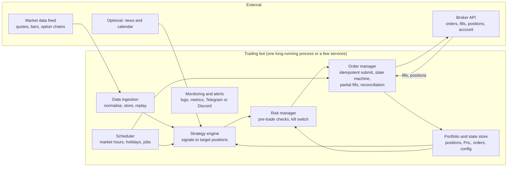

# Building an automated stock and options trading bot: research and recommendations

Date: 25 September 2026. Status: research complete, no code written yet. The scope questions in section 9 have been answered; the resulting decisions are in [implementation-plan.md](implementation-plan.md).

This document answers three questions: how an automated trading app works and what it takes to build one, which brokerage APIs, open-source frameworks and data sources exist today and which to pick, and what needs deciding before implementation starts. It is written for a developer, assumes nothing about trading background, and states its assumptions where the answer depends on your situation.

**Contents**

- Executive summary
- 1. How an automated trading app works
- 2. Brokerage APIs
- 3. Open-source frameworks and building blocks
- 4. Market data
- 5. Rules, risks and realistic expectations
- 6. Reference architecture
- 7. Core interfaces in code
- 8. Suggested roadmap
- 9. Questions to answer before implementation
- 10. Three candidate stacks and my recommendation
- Appendix: sources

Verification note that applies throughout: the research was done on 25 September 2026 with web search and direct reads of GitHub and PyPI. This environment's outbound proxy blocked the websites of most brokers and data vendors, so facts about them come from search-engine snippets of their official pages and from recent third-party reviews. Prices, commissions and country lists change often; confirm them on the vendor's site before committing money.

## Executive summary

**What you asked.** How to build an app that automatically trades stocks and options, whether existing open-source software can be used, and what needs clarifying before building.

**Short answer.** Yes, this is buildable by one person, and most of it should be assembled rather than written from scratch:

1. **Broker with an API.** Alpaca is the best starting point (hosted, free paper trading, $0 commissions, official Python SDK, options up to Level 3 including multi-leg). tastytrade and Tradier are the strongest options-focused alternatives, and Interactive Brokers is the choice if you live outside the countries Alpaca and the others accept or want the most instruments. Robinhood has no supported stock API and its terms forbid bots.
2. **Open-source framework.** Lumibot (Python) gets a strategy from backtest to live on Alpaca, IBKR, Tradier or Schwab with the least effort and supports options chains, Greeks and multi-leg orders. QuantConnect LEAN has the most complete options model but a steeper curve and paid tooling. NautilusTrader is production-grade but IBKR-only. Backtrader is unmaintained. Freqtrade and the other famous bots are crypto-only.
3. **Data.** Stock data is free to cheap. Options data is the expensive part: budget about 80 USD per month (ThetaData) for historical chains when you reach options backtesting, and 99 USD per month (Alpaca Algo Trader Plus) or a Tradier/tastytrade account for real-time options quotes in live trading.
4. **What you still build.** Risk limits and a kill switch, an order manager that survives restarts, reconciliation with the broker, alerting, and deployment on an always-on machine. This is where hobby bots fail, more than in the strategy.
5. **Rules that shape the design.** The 25,000 USD pattern-day-trader minimum was retired in June 2026 in favour of intraday margin monitoring, but brokers may phase the change in until October 2027 and will reject orders that create an intraday margin deficit; brokers gate options strategies by approval level; historical options data has to be paid for; and most retail traders who trade frequently, particularly in options, lose money, so the roadmap starts with paper trading and small capital.

**Recommended path.** Python, Lumibot, Alpaca paper account, free data, one simple daily stock strategy. Add your own risk manager and alerts from the start. Paper trade for at least a month, go live with a small hard-capped amount, then add defined-risk options. Sections 8 and 10 give the phased roadmap and the three candidate stacks.

**What I need from you.** Ten scope questions in section 9, above all: where you live, how much capital and which account type, whether you have a strategy in mind, and how much automation you want. The assumptions I used are stated next to each question.

## 1. How an automated trading app works

An automated trading bot is a program that (1) receives market data, (2) applies rules to decide what position it wants, (3) checks that the trade is allowed, (4) sends orders to a brokerage through its API, and (5) keeps track of what it owns. You do not connect to a stock exchange yourself. A regulated broker holds your account and exposes an API; the bot is a client of that API, exactly like the broker's own mobile app.

Three things make this harder than it sounds:

- **The strategy is the product, the bot is plumbing.** Most of the effort in the ecosystem goes into backtesting, because most strategy ideas do not survive realistic costs. The plumbing is well served by open-source projects (section 3).
- **Live trading is an operations problem.** Disconnects, partial fills, restarts, holidays and daylight-saving changes cause more losses for hobby bots than bad signals do. Section 6 is about that.
- **Options multiply every difficulty.** Chains of thousands of contracts, expensive historical data, multi-leg orders, assignment and expiration mechanics, and broker approval levels. Start with stocks even if options are the goal.

### Vocabulary used in this document

| Term | Meaning |
|---|---|
| Backtest | Running the strategy on historical data to estimate how it would have performed |
| Paper trading | Running against a broker's simulated account with fake money but real-time prices |
| Slippage | Difference between the price you expected and the price you got |
| Fill | A completed (or partially completed) execution of an order |
| OMS | Order management system: the part that submits, tracks and reconciles orders |
| PDT rule | The former pattern day trader rule that limited day trading in margin accounts under 25,000 USD; retired by FINRA in June 2026 with a phase-in to October 2027 (section 5) |
| Options level | Broker-assigned permission tier that determines which options strategies you may trade |
| Multi-leg order | One order containing several options contracts (a spread), filled together |
| Greeks / IV | Sensitivities of an option's price (delta, gamma, theta, vega) and implied volatility |
| OPRA / SIP | Consolidated US options and equities quote feeds, respectively |
| Walk-forward | Optimising on one period and testing on the next, repeated, to reduce overfitting |

## 2. Brokerage APIs: where the orders go

The broker is the one component you cannot build yourself. Its API decides which instruments you can trade, whether you get a paper account, how painful authentication is for an unattended process, and where you must live to open an account. The table summarises the options that matter for a retail bot; details and sources follow.

| Broker | Stocks | Options via API | Multi-leg | Paper account | Commissions (stocks / options) | API style | Official SDKs | Non-US accounts | Biggest gotcha |
|---|---|---|---|---|---|---|---|---|---|
| **Alpaca** | Yes | Levels 1 to 3 (no naked shorts) | Yes, 2 to 4 legs, market/limit only | Yes, free, options included | $0 / $0 plus regulatory fees | Hosted REST + WebSocket | Python, TypeScript, C# | Many countries (not Canada) | 200 requests/min; no Level 4; no index options yet |
| **Interactive Brokers (IBKR Pro)** | Yes | Full | Yes (combo "BAG" contracts) | Yes, 1M USD simulated | Tiered / 0.65 USD per contract base | Socket via TWS or IB Gateway; REST Web API | Python, Java, C++, C#; community `ib_async` | Global | Must run a gateway; weekly 2FA re-login; Lite accounts have no API |
| **Tradier** | Yes | Yes | Yes, up to 4 legs plus stock+option combos | Free developer sandbox, 15-min delayed data | Lite: $0 / 0.35 USD per contract; Pro: 10 USD/month flat | REST + streaming | Ruby only; community Python | 100+ countries (not UK) | Thin first-party SDKs; 60 trading requests/min |
| **tastytrade** | Yes (plus futures) | Yes | Yes, with dry-run endpoint | Yes, resets every 24h | $0 / 1 USD per contract to open, $0 to close, 10 USD cap per leg | REST + DXLink WebSocket | TypeScript; community Python | Listed countries | Sandbox wipes state daily |
| **Charles Schwab** | Yes | Yes, incl. index options | Yes | No (synthetic sandbox only) | $0 / 0.65 USD per contract | REST + WebSocket streamer | None official; community Python/TS/C# | Unverified | Refresh token dies every 7 days and needs a browser login |
| **Webull OpenAPI** | Yes | Yes (US, HK) | Legs array (implied) | UAT + paper trading | $0 / $0 on equity options | HTTP + MQTT + gRPC | Python, Java | Per-region portals | Rate limits undocumented; young platform |
| **Public.com** | Yes | Yes, incl. index and multi-leg | Yes | No | $0 / $0 plus order-flow rebates | REST only (polling) | Python | US only (unverified) | No paper mode, no streaming |
| **E*TRADE** | Yes | Yes | Yes | Yes | $0 / ~0.65 USD | REST, OAuth 1.0a | None official | US-focused | Token expires nightly |
| **moomoo / Futu** | Yes | Yes | Combo orders | Yes | $0 / $0 (promo, unverified) | Local OpenD gateway + SDKs | Python, C++, Java, JS, C# | US, SG, AU, JP, CA, MY, HK | Gateway; 15 orders per 30 s |
| **TradeStation** | Yes | Yes | Yes | Yes (SIM) | $0 / 0 to 0.80 USD | REST + streaming, OAuth2 | None official | US, UK | 10,000 USD in assets to get an API key |
| **Robinhood** | No official API | No | n/a | n/a | n/a | Crypto API only | n/a | US | Terms forbid unofficial API use; account freezes reported |

Notes on the ones worth considering:

- **Alpaca** is the default choice for a first bot. It is API-first, fully hosted (nothing to run locally), has a free paper account that supports multi-leg options, and first-party SDKs in Python, TypeScript and C#. Options Level 3 (spreads, iron condors) went live via the API in February 2025; there is no Level 4, so naked short options are impossible, which for most people is a feature. The trading API is limited to 200 requests per minute. Alpaca accepts residents of many non-US countries but not Canada. Sources: [Alpaca options overview](https://docs.alpaca.markets/us/docs/options-trading-overview), [Level 3 announcement](https://alpaca.markets/blog/level-3-options-trading-now-available-with-alpacas-trading-api/), [alpaca-py multi-leg validators](https://github.com/alpacahq/alpaca-py/blob/master/alpaca/trading/requests.py), [rate limit](https://alpaca.markets/support/usage-limit-api-calls), [countries](https://alpaca.markets/support/countries-alpaca-is-available).
- **Interactive Brokers** is the most capable and the only truly global option, with the lowest per-contract cost at volume and the widest instrument coverage. The cost is operational: the classic TWS API needs TWS or IB Gateway running next to your bot, the gateway needs a weekly re-login with two-factor authentication, and the automation helpers that handle this (IBC, `gnzsnz/ib-gateway-docker`, IBeam) are community projects; IBC went into bug-fix-only mode on 1 September 2026. The newer gateway-less Web API with OAuth is limited to IBKR Pro accounts and allows one session per username. IBKR Lite accounts have no API at all. Do not `pip install ibapi`; the PyPI package is a stale 2020 build, download the client from IBKR or use `ib_async`. Sources: [IBKR API getting started](https://www.interactivebrokers.com/campus/ibkr-api-page/getting-started/), [Lite has no API](https://www.ibkrguides.com/traderworkstation/api.htm), [ib_async](https://github.com/ib-api-reloaded/ib_async), [ibind OAuth notes](https://github.com/Voyz/ibind/blob/master/docs/oauth/oauth_1a.md), [NautilusTrader Web API issue](https://github.com/nautechsystems/nautilus_trader/issues/5069), [IBC](https://github.com/IbcAlpha/IBC), [ib-gateway-docker](https://github.com/gnzsnz/ib-gateway-docker).
- **Tradier** is the value pick for an options bot: a flat 10 USD per month "Pro" plan makes stock and options trades commission-free, the REST API supports four-leg multi-leg orders and stock-plus-option combos with an order preview endpoint, real-time data is included with the account, and there is a free developer sandbox you can use before opening an account (with 15-minute delayed data). The weakness is tooling: no maintained official Python SDK, so you use the REST API directly or go through a framework such as Lumibot or LEAN. Sources: [Tradier docs](https://docs.tradier.com/docs/getting-started), [multi-leg orders](https://documentation.tradier.com/brokerage-api/trading/place-multileg-order), [rate limits](https://docs.tradier.com/docs/rate-limiting), [pricing](https://tradier.com/individuals/pricing), [permitted countries](https://support.tradier.com/kb/guide/en/permitted-and-blocked-countries-CLzSa0D1rf/Steps/4997916).
- **tastytrade** is the most options-native API. It supports multi-leg orders with a dry-run endpoint that returns buying-power and fee impact before you place the order, streams quotes and Greeks over DXLink, and since December 2025 uses OAuth2 with refresh tokens that never expire, which is exactly what an unattended bot wants. Options cost 1 USD per contract to open (capped at 10 USD per leg) and nothing to close. The official Python SDK was archived in March 2026; the community `tastyware/tastytrade` package is actively maintained. The sandbox resets every 24 hours. Sources: [developer portal](https://developer.tastytrade.com/), [OAuth2](https://developer.tastytrade.com/docs/authentication/oauth2/), [sandbox](https://developer.tastytrade.com/sandbox/), [tastyware SDK](https://github.com/tastyware/tastytrade), [pricing](https://tastytrade.com/pricing/).
- **Charles Schwab** (the successor of the TD Ameritrade API) is open to individual developers and has good data and multi-leg support, but the refresh token expires every seven days and cannot be renewed programmatically, and there is no paper trading. That makes it a poor fit for an unattended bot unless you already bank there and accept a weekly manual login. Sources: [Schwab OAuth guide](https://developer.schwab.com/user-guides/apis-and-apps/oauth-restart-vs-refresh-token), [schwab-py](https://github.com/alexgolec/schwab-py).
- **Robinhood** has no official stock or options API, and its customer agreement forbids using the private API without written consent. Community libraries exist; people have reported account freezes. Do not build on it. Sources: [Robinhood crypto API](https://robinhood.com/us/en/support/articles/crypto-api), [robin_stocks issue](https://github.com/jmfernandes/robin_stocks/issues/1604).

**Ranked picks by situation**

| Situation | First choice | Alternatives |
|---|---|---|
| Beginner, paper trading stocks first | Alpaca (free paper, hosted, official SDKs) | Tradier sandbox (no account needed), IBKR paper (needs gateway) |
| Options spreads via API | tastytrade (options-native, bot-friendly auth) | Alpaca (Level 3, $0 commissions), Tradier (10 USD/month flat), IBKR (cheapest at volume, most work) |
| Non-US resident | IBKR Pro (global) | Alpaca if your country is listed, tastytrade or Tradier if listed, moomoo/Webull regionally |

Verification note: this environment's outbound proxy blocked the brokers' own websites, so these facts come from search-engine snippets of the official pages plus direct reads of GitHub and PyPI. Items the researcher could not confirm are marked "unverified" in the table. Re-check commissions and country lists on the broker's site before opening an account.

## 3. Open-source frameworks and building blocks

You asked whether existing open-source apps can be used. Yes, and you should: the backtesting engine, broker connectivity and strategy lifecycle are solved problems. What none of them give you is a risk policy, monitoring and operations, and that is where a personal bot actually fails (section 6).

### 3.1 Full frameworks that can trade US stocks and options live

| Project | Language, license | Stars, activity (Sept 2026) | Live US brokers | Options support | Learning curve | Verdict |
|---|---|---|---|---|---|---|
| [Lumibot](https://github.com/Lumiwealth/lumibot) | Python, GPL-3.0 | 2.1k, release 4.6.0 on 24 Sept 2026 | Alpaca, IBKR (TWS and Client Portal), Tradier, Schwab, Tradovate, others | Chains, Greeks, `OptionsHelper` for multi-leg selection and orders; multi-leg is broker-dependent (Alpaca yes, Schwab not yet) | Low to moderate | Fastest retail path from a stock strategy to live options |
| [QuantConnect LEAN](https://github.com/QuantConnect/Lean) | C# engine, Python or C# strategies, Apache-2.0 | 21.8k, pushed daily | IBKR (Pro), Alpaca, Tradier, tastytrade, TradeStation, Public, Webull, Schwab (listed in docs), plus crypto | Richest model: option universes, Greeks and IV indicators, about 40 strategy helpers (spreads, condors, butterflies, calendars), combo orders | Steep | Most complete, but the CLI docs require a paid QuantConnect organisation tier and local options data costs money |
| [NautilusTrader](https://github.com/nautechsystems/nautilus_trader) | Rust core, Python API, LGPL-3.0 | 29.4k, 1.231.0 stable, 2.0 at release candidate | Interactive Brokers only (plus crypto venues, Databento data) | `OptionContract`, exchange-defined `OptionSpread`, Black-Scholes Greeks, IB spreads via BAG | Steep | Production-grade engineering for an IBKR-centred system; heavy for a first bot |
| [ThetaGang](https://github.com/brndnmtthws/thetagang) | Python, AGPL-3.0 | 2.7k, pushed Sept 2026 | IBKR via `ib_async` | Turn-key options "wheel" bot: rolling, VIX hedging, TOML config, SQLite state, Docker | Low | The best real-world reference implementation of an IBKR options bot; suggests about 30k USD capital |
| [Backtrader](https://github.com/mementum/backtrader) | Python, GPL-3.0 | 23.3k, last commit April 2023 | IBKR via a Python 2 era library, Oanda | None | Moderate | Unmaintained; fine for learning, do not build a live options bot on it |
| [QuantDinger](https://github.com/OpenByteInc/QuantDinger) | Python, Apache-2.0 backend | 12.2k, created Dec 2025 | IBKR, Alpaca, crypto | None | Moderate | Young; backtest to paper to live flow with Docker |
| [Vibe-Trading](https://github.com/HKUDS/Vibe-Trading) | Python, MIT | 34k, created April 2026 | Claims 14+ brokers incl. Alpaca and IBKR | Unclear | Low | Six months old, LLM-driven; treat as unproven |

Two cautions. Lumibot is GPL-3.0 and LEAN's local tooling has commercial strings attached, which matters only if you distribute software, not for personal use. StockSharp advertises itself as open source but ships a proprietary licence; skip it.

### 3.2 Backtesting and research libraries (no execution)

| Library | Use it for | Notes |
|---|---|---|
| [vectorbt](https://github.com/polakowo/vectorbt) | Fast vectorised parameter sweeps on stocks | Apache-2.0 with Commons Clause; the PRO version is paid; no options |
| [Backtesting.py](https://github.com/kernc/backtesting.py) | Simple single-instrument backtests | AGPL-3.0; tiny API, good first backtester |
| [zipline-reloaded](https://github.com/stefan-jansen/zipline-reloaded) | Event-driven equity backtests | Apache-2.0; no live broker, no options |
| [bt](https://github.com/pmorissette/bt) | Allocation and rebalancing strategies | MIT |
| [PyBroker](https://github.com/edtechre/pybroker) | Machine-learning strategies with walk-forward testing | Apache-2.0 with Commons Clause |
| [optopsy](https://github.com/goldspanlabs/optopsy) | Options strategy backtests from CSV chains (38 strategies) | AGPL-3.0; research only |
| [options_portfolio_backtester](https://github.com/lambdaclass/options_portfolio_backtester) | Options portfolio backtests with presets (iron condor, strangle, covered call, cash-secured put) | MIT, Rust core |
| [vollib / py_vollib](https://github.com/vollib/py_vollib) | Black-Scholes pricing, implied volatility, Greeks | MIT; the utility you want for sanity-checking broker Greeks |
| [QuantLib](https://github.com/lballabio/QuantLib) | Full pricing library | BSD-3; overkill for retail |
| [TA-Lib](https://github.com/TA-Lib/ta-lib-python) | Technical indicators | BSD-2; needs the C library. The original pandas-ta repository has been removed; a community fork [pandas-ta-classic](https://github.com/xgboosted/pandas-ta-classic) exists |
| [OpenBB](https://github.com/OpenBB-finance/OpenBB) | Research data platform | AGPL-3.0; data only, no execution |
| [Qlib](https://github.com/microsoft/qlib), [FinRL](https://github.com/AI4Finance-Foundation/FinRL) | AI and reinforcement-learning research | Research platforms, not bots |

### 3.3 Broker SDKs as building blocks

If you would rather own the whole stack, these are the maintained client libraries:

- [alpaca-py](https://github.com/alpacahq/alpaca-py) (Apache-2.0, 0.44.0 in August 2026): stocks, options and crypto; multi-leg orders with 2 to 4 legs; option chain and snapshot clients; example notebooks for multi-leg, 0DTE, iron condor and wheel strategies. The older `alpaca-trade-api-python` is archived.
- [ib_async](https://github.com/ib-api-reloaded/ib_async) (BSD-2, 2.1.0 in December 2025): the maintained successor of `ib_insync`; option chains, combo legs; requires TWS or IB Gateway. [ibind](https://github.com/Voyz/ibind) is the gateway-less alternative for the Client Portal Web API.
- [tastyware/tastytrade](https://github.com/tastyware/tastytrade) (MIT, 13.2.3 in August 2026): typed async SDK; multi-leg orders, streaming quotes and Greeks, sandbox flag.
- [schwab-py](https://github.com/alexgolec/schwab-py) (MIT, 1.5.1 in June 2025): chains, multi-leg order templates, streaming; no paper trading.
- Tradier: no maintained official Python SDK; use the REST API directly or through Lumibot or LEAN. Community options: [uvatradier](https://github.com/thammo4/uvatradier).
- [alpacahq/options-wheel](https://github.com/alpacahq/options-wheel) (Apache-2.0): a small paper-tested wheel-strategy template on alpaca-py; useful as a reading example.

### 3.4 Projects that look relevant but are not

- **Freqtrade, Jesse, Hummingbot, OctoBot** are excellent, but crypto-only. They have no equity or options connectors and assume 24/7 markets with no sessions, halts, holidays, corporate actions, option chains or margin rules. Borrow their ideas instead: Freqtrade's dry-run mode, hyperparameter optimisation, "protections" (trade-rate and loss guards) and Telegram control; Hummingbot's connector abstraction and executor/controller split; everyone's Docker-first deployment.
- **LLM "trading agent" repos** such as [TradingAgents](https://github.com/TauricResearch/TradingAgents) (108k stars), [ai-hedge-fund](https://github.com/virattt/ai-hedge-fund) (64k stars) and FinRobot produce buy/sell/hold opinions and explicitly do not trade. They lack order state machines, broker reconciliation, risk limits, kill switches, options handling and deterministic, testable execution. Treat them as research toys or as an optional signal source, never as the bot.

### 3.5 What you still build yourself

Whichever framework you pick, these pieces are yours:

1. **Risk policy**: position and notional limits, daily loss limit and kill switch, awareness of margin and of the broker's intraday margin monitoring (section 5), options-specific handling for assignment, expiry and pin risk, duplicate-order and stale-quote guards.
2. **Operations**: heartbeat and alerting, reconciliation of broker positions and orders against local state at startup and periodically, structured logs, a state store, reconnect logic (especially for IB Gateway), timezone and exchange-calendar handling.
3. **Deployment**: a small always-on machine, Docker, scheduling, a paper-to-live promotion path, versioned configuration and backups.
4. **Secrets**: API keys in environment variables or a secrets manager, trade-only keys where the broker offers them, strictly separated paper and live credentials.
5. **Data hygiene**: paying for historical options chains when you get there, survivorship-bias-free stock universes, corporate-action handling, caching.
6. **Testing**: a fake broker for unit tests, replay of recorded sessions, and a long paper-trading period.

Verification note: star counts, licences and last-push dates were read from the GitHub API on 25 September 2026. The hosted documentation sites of QuantConnect, Lumibot and NautilusTrader were blocked in this environment, so their docs were read from the GitHub-hosted sources instead.

## 4. Market data: the hidden cost, especially for options

Stock data is cheap or free. Options data is not, because the consolidated options feed (OPRA) carries on the order of a hundred billion messages a day across roughly 1.4 million contracts, and vendors have to store and normalise all of it. Plan for this from the start: a stock-only bot can run on 0 USD per month, a serious options backtest cannot.

### 4.1 Stock data

| Provider | Free tier | Paid tier that matters | Notes |
|---|---|---|---|
| [Alpaca Market Data](https://alpaca.markets/data) | Real-time from the IEX exchange only, 200 requests/min, 30 WebSocket symbols, historical consolidated data if older than 15 min | Algo Trader Plus, 99 USD/month: full consolidated (SIP) feed, real-time OPRA options, 10,000 requests/min | The free feed covers about 2% of US volume; quotes can be stale or wider than the national best bid and offer |
| [Massive](https://massive.com/pricing) (formerly Polygon.io) | 5 calls/min, 2 years of history | Stocks Starter 29 USD (15-min delayed), Developer about 79 USD, Advanced 199 USD (real-time SIP, 20+ years); billed per asset class | Flat files over S3 included on paid plans |
| [Databento](https://databento.com/pricing) | 125 USD signup credit | Usage-based per gigabyte for history; US Equities Standard 199 USD/month | Raw exchange feeds; excellent quality, more engineering |
| [Tiingo](https://www.tiingo.com/about/pricing) | 1,000 requests/day, 30+ years of daily history | Power 30 USD/month | IEX real-time WebSocket included; good cheap daily source |
| [Alpha Vantage](https://www.alphavantage.co/premium/) | 25 requests/day | 49.99 USD/month and up | Slow free tier; notable for free historical options chains (below) |
| Broker feeds | Tradier and Schwab include real-time stock and options quotes with an account; IBKR charges small monthly exchange fees (about 1.50 USD per US network, plus a 4.50 USD streaming bundle) and limits API users to 100 simultaneous streaming symbols | | IBKR has no historical data for expired options, so it cannot be your backtest source |
| [Stooq](https://stooq.com/db/) | Free bulk daily and intraday files | none | No API, CAPTCHA download; fine for offline research |
| yfinance | Free | none | Unofficial scraper of Yahoo, personal use only, breaks without notice, 15 to 20 min delayed; acceptable for throwaway research, not for a bot |

### 4.2 Options data

| Need | Practical sources (approximate monthly cost) |
|---|---|
| Live chains, quotes and Greeks for the bot | Tradier or Schwab (free with account, Greeks from ORATS on Tradier); Alpaca Algo Trader Plus (99 USD); IBKR bundles (about 5 to 16 USD); tastytrade DXLink stream (free with account) |
| Historical chains for backtesting, hobby budget | [ThetaData](https://www.thetadata.net/pricing): Value 40 USD (4 years, 1-minute bars, delayed), Standard 80 USD (tick quotes and trades, 8 years, real-time), Pro 160 USD (12 years, flat files); coverage since mid-2012. [Massive Options](https://massive.com/pricing?product=options) Developer about 79 USD (4 years, delayed) or Advanced 199 USD (real-time, 5+ years). [Databento OPRA](https://databento.com/blog/introducing-new-opra-pricing-plans) Standard 199 USD |
| Research-grade end-of-day history | [ORATS Data API](https://orats.com/data-api) 199 USD (daily since 2007 with Greeks, IV and clean quotes taken 14 minutes before the close) |
| Free or nearly free | [Alpha Vantage HISTORICAL_OPTIONS](https://www.alphavantage.co/documentation/) (daily chains back to 2008 with Greeks, 25 requests/day on the free key); the [DoltHub options database](https://www.dolthub.com/repositories/post-no-preference) (about 2,100 symbols, 2019 to mid-2024); Alpaca's free options bars (since February 2024, 15-minute lag) |
| Institutional | Cboe DataShop (500 USD/month), OptionMetrics (since 1996, quote-based pricing), Intrinio (roughly 150 to 1,600 USD/month, unverified) |

Alpaca's free options feed is an "indicative" feed that its own staff describe as randomised real-time data meant for debugging; never price live trades from it.

### 4.3 Real-time versus delayed, and the "professional" trap

- Delayed (15-minute) data can be distributed without exchange subscriber agreements, which is why it is free. Real-time data requires you to accept non-professional subscriber terms through your vendor or broker.
- A daily or swing strategy can run on delayed or end-of-day data. Anything that sets intraday limit prices, and any options strategy, needs real-time consolidated quotes, because option spreads are wide and move fast.
- "Non-professional" means a natural person trading personal money. Trading through a company, holding a securities licence, or using the data in a business flips you to professional pricing, where a single real-time feed can cost more than 1,500 USD per month. Keep the account in your own name.

### 4.4 Backtest data quality

- **Survivorship bias**: backtesting only on stocks that still exist overstates returns by an estimated 1 to 4 percentage points a year. Sources that include delisted names: Sharadar (via Nasdaq Data Link or QuantRocket), Norgate, QuantConnect's security master.
- **Look-ahead bias**: using today's index membership or restated fundamentals for past dates. Use point-in-time data and as-of universes.
- **Adjustments**: keep both adjusted prices (for signals) and unadjusted prices (for fills and option strikes), and a corporate-actions table. The OCC adjusts option contracts for splits, mergers and special dividends over 0.125 USD per share, which breaks naive contract joins.
- **Options fills**: never assume mid-price fills. ORATS models slippage as 75% of the spread for single legs down to about 53% for four-leg spreads. Backtest options on quote (bid/ask) data, not trade prints, and cap sizes by displayed volume and open interest.
- **Feed mismatch**: a backtest on IEX-only bars and live execution against the consolidated market will diverge in volume, spread and timing.

### 4.5 Recommended data stack by budget

| Budget | Stocks | Options | Good for |
|---|---|---|---|
| 0 USD/month | Alpaca free feed for paper trading; Stooq or Tiingo free tier for long daily history | A Tradier or Schwab account for free live chains with Greeks; Alpha Vantage and DoltHub for offline options history | Phases 0 to 2 of the roadmap, stock strategies, learning options mechanics |
| 50 to 100 USD/month | Alpaca free, or Alpaca Algo Trader Plus (99 USD) if you want one vendor for consolidated data and execution | ThetaData Standard (80 USD) for tick-level options history and streaming | Serious hobby, first live options strategies |
| 200+ USD/month | Alpaca Algo Trader Plus or IBKR bundles for execution-grade quotes; a survivorship-free equity universe | ThetaData Pro (160 USD), Databento OPRA (199 USD) or ORATS (199 USD) | Rigorous options backtesting with full historical chains; typical total 260 to 400 USD |

Verification note: vendor pricing pages were blocked by this environment's proxy, so prices come from search-engine snippets and 2026 third-party reviews. Treat every figure as approximate and confirm on the vendor's page before paying. Sources for this section are listed in the appendix.

## 5. Rules, risks and realistic expectations

This section is US-centric because every broker in section 2 is US-regulated. If you live elsewhere, the tax and data-subscription parts change; tell me where and I will redo them.

### 5.1 Rules a retail bot must respect

| Rule | What it means for the bot |
|---|---|
| **Day trading in margin accounts (changed in 2026)** | The pattern day trader rule (four or more day trades in five business days, 25,000 USD minimum equity) was retired. FINRA's [Regulatory Notice 26-10](https://www.finra.org/rules-guidance/notices/26-10) makes the replacement effective **4 June 2026**, with brokers allowed to phase it in until **20 October 2027**; the SEC approved the change on 14 April 2026 ([order](https://www.sec.gov/files/rules/sro/finra/2026/34-105226.pdf)). Firms must now monitor intraday margin in every margin account, either in real time (blocking any order that would create an intraday margin deficit) or with an end-of-day calculation and a margin call. The ordinary 2,000 USD margin-account minimum remains. Alpaca reports it adopted the new framework on 4 June 2026 and removed day-trade counts ([Alpaca blog](https://alpaca.markets/blog/finra-retires-the-pdt-rule-introducing-alpacas-new-intraday-margin-framework/)); other brokers may keep house rules during the phase-in. Design consequence: read buying power and any remaining flags from the broker's account endpoint at startup instead of hard-coding thresholds, and treat "intraday margin" order rejections as a normal state to handle. |
| **Cash accounts and settlement** | A cash account has no margin and can only trade settled money. US stocks settle T+1 (since 28 May 2024). Buying with unsettled proceeds and selling before they settle is a good-faith violation; buying and selling before ever paying is freeriding, which forces a 90-day settled-cash-only freeze. A cash-account bot must track settled cash per position, not just the cash balance. ([Investor.gov bulletin](https://www.investor.gov/introduction-investing/general-resources/news-alerts/alerts-bulletins/investor-bulletins/updated-9), [Fidelity](https://www.fidelity.com/learning-center/trading-investing/trading/avoiding-cash-trading-violations)) |
| **Options approval levels** | Brokers gate strategies in cumulative tiers. Fidelity's version: Level 1 covered calls; Level 2 adds long calls and puts and cash-covered puts; Level 3 adds spreads; Level 4 uncovered equity options; Level 5 uncovered index options ([Fidelity](https://www.fidelity.com/webcontent/ap002390-mlo-content/18.04/help/learn_option_summary.shtml)). Most brokers compress this into four. Spreads need a margin agreement; IRAs are limited. The API rejects anything above your level, so the risk manager should refuse such intents before they reach the broker. Alpaca's API stops at Level 3. |
| **Wash sales** | A loss is disallowed if you buy a substantially identical security, or an option on it, within 30 days before or after the sale; the loss is added to the basis of the replacement (deferred, not lost), except that a replacement bought in an IRA loses it permanently. Brokers only report wash sales for identical securities within one account; across accounts and across options strikes it is your job. A bot trading the same names repeatedly will generate many. ([Investor.gov](https://www.investor.gov/introduction-investing/investing-basics/glossary/wash-sales), [TradeLog](https://tradelog.com/education/wash-sales-for-traders/)) |
| **Section 1256 contracts** | Broad-based index options (SPX, XSP, NDX, RUT, VIX) and futures are taxed 60% long-term and 40% short-term regardless of holding period, marked to market at year end, reported on Form 6781, and exempt from the wash-sale rule. Options on SPY, QQQ and single stocks are not 1256 contracts. This is a real reason to prefer SPX over SPY for an options strategy. |
| **Trader tax status and the mark-to-market election** | IRS Topic 429: trader status is a facts-and-circumstances test (substantial, regular, continuous trading for short-term profit). With it, a Section 475(f) election makes gains and losses ordinary, removes wash-sale tracking and the 3,000 USD capital-loss cap, but forfeits long-term rates; it must be filed by 15 April of the year it takes effect. Talk to a tax professional before electing. ([IRS Topic 429](https://www.irs.gov/taxtopics/tc429), [Schwab](https://www.schwab.com/learn/story/mark-to-market-trader-taxes)) |
| **Market data agreements** | Non-professional rates apply only to a natural person using data for personal, non-business purposes who is not registered with the SEC, CFTC, a state or an exchange and is not an investment adviser. Entities such as an LLC are always professional. Redistribution of the data, including to a Discord or a website, is prohibited. ([NYSE policy](https://www.nyse.com/publicdocs/nyse/data/Policy-Non-ProfessionalSubscribers_PDP.pdf), [IBKR](https://www.interactivebrokers.com/docs/general/market-data-subscriptions/professional-vs-non-professional)) |
| **Broker terms of service** | Alpaca, IBKR, Tradier, tastytrade and Schwab (for your own accounts) allow automated trading. Robinhood's customer agreement prohibits automated access. IBKR's API socket is unencrypted and unauthenticated; bind it to localhost or a private network only. Respect rate limits: repeated 429 responses can get keys suspended. |
| **Registration** | Trading your own money with your own bot requires no registration: the Exchange Act excludes a person trading for their own account "but not as a part of a regular business" from the dealer definition. You cross the line when you manage or pool other people's money for compensation, sell signals or subscriptions, or hold yourself out as a liquidity provider. ([SEC broker-dealer guide](https://www.sec.gov/about/divisions-offices/division-trading-markets/division-trading-markets-compliance-guides/guide-broker-dealer-registration)) |
| **Market manipulation** | Spoofing and layering (orders placed with intent to cancel), wash trading (trading against yourself, including between two of your own accounts or bots), marking the close, and momentum ignition are illegal for individuals too, and prosecutions of individual traders are routine ([FINRA oversight report](https://www.finra.org/rules-guidance/guidance/reports/2025-finra-annual-regulatory-oversight-report/manipulative-trading), [DOJ 2026 spoofing plea](https://www.justice.gov/opa/pr/northern-california-man-pleads-guilty-years-long-securities-fraud-spoofing-scheme)). A naive bot that rapidly places and cancels, or runs two strategies that cross each other, looks exactly like this. Design rules: never place orders you do not intend to fill, cap place/cancel/replace rates, never let two of your strategies trade against each other, avoid near-close orders whose purpose is to influence a mark, and log the reason for every order. |

### 5.2 Options-specific risks

- **Early assignment.** US equity and ETF options are American style; a short leg can be assigned any day. Likelihood spikes for deep in-the-money calls before an ex-dividend date (when the dividend exceeds the remaining time value), deep in-the-money puts, and hard-to-borrow names. Assignment creates a stock position that needs margin; if the account cannot support it the broker may liquidate. ([Schwab](https://www.schwab.com/learn/story/risks-options-assignment), [tastytrade](https://support.tastytrade.com/support/s/solutions/articles/43000505597))
- **Expiration, pin risk and exercise-by-exception.** The OCC automatically exercises expiring options that are in the money by 0.01 USD or more unless told otherwise ([OIC FAQ](https://www.optionseducation.org/referencelibrary/faq/options-exercise), [Cboe circular](https://cdn.cboe.com/resources/regulation/circulars/regulatory/RG08-073.pdf)). When the underlying closes near a strike, short holders do not know until the weekend whether they were assigned, and long holders can still exercise on after-hours moves until the cutoff. Brokers may lapse long options or liquidate expiring positions on the last trading day if the account cannot support exercise; IBKR runs post-expiration liquidations the next morning and liquidates margin deficits in real time without a margin call ([IBKR](https://www.interactivebrokers.com/en/trading/delivery-exercise-actions.php)). The bot must close or roll short options before its broker's cutoff and must reconcile broker-initiated liquidations and assignments as external orders.
- **Cash-settled index options** (SPX, XSP, NDX, RUT, VIX) have no early assignment, no delivery and no pin risk, plus the 1256 tax treatment. Mind AM- versus PM-settled series.
- **0DTE contracts.** FINRA warns of "lack of liquidity, significant price slippage, and volatility where profits can disappear quickly" and that opening a position on expiration day "substantially increases risk" ([FINRA](https://www.finra.org/investors/insights/zeroing-in-options-trading-strategy)). Same-day expiries were about half of SPX volume in 2025. Gamma is maximal at the money at expiry, and SPY 0DTE adds after-close assignment risk that SPX does not have.
- **Spreads and liquidity.** A Journal of Finance study of retail options trading found average quoted spreads of 12.6% on weekly options and round-trip effective costs near 8%, which is where most of retail's aggregate options losses came from ([Bryzgalova, Pavlova and Sikorskaya, 2023](https://onlinelibrary.wiley.com/doi/full/10.1111/jofi.13285)). Use limit orders near the mid, filter contracts by volume and open interest, and model the spread cost explicitly.
- **Legging risk.** Entering a spread one leg at a time leaves you naked if the second leg does not fill. Use the broker's multi-leg order type.

### 5.3 Realistic expectations

The evidence on frequent retail trading is consistent and not encouraging. This does not mean a bot cannot work; it means the roadmap has to be built around measurement and small capital.

- Barber and Odean's study of 66,000 US brokerage households found the most active traders earned the lowest net returns ([paper](https://faculty.haas.berkeley.edu/odean/papers/Day%20Traders/Day%20Trade%20040330.pdf)). Their later Taiwan work found fewer than 1% of day traders earn predictably positive returns after fees.
- Of Brazilian day traders who persisted for more than 300 days, 97% lost money ([Chague, De-Losso and Giovannetti](https://papers.ssrn.com/sol3/papers.cfm?abstract_id=3423101)).
- India's regulator found 93% of about 11 million individual futures-and-options traders lost money over three years, with transaction costs a major share ([SEBI, September 2024](https://www.sebi.gov.in/media-and-notifications/press-releases/sep-2024/updated-sebi-study-reveals-93-of-individual-traders-incurred-losses-in-equity-fando-between-fy22-and-fy24-aggregate-losses-exceed-1-8-lakh-crores-over-three-years_86906.html)).
- US retail options traders lost about 2.1 billion USD in aggregate between November 2019 and June 2021, mostly to bid-ask costs ([Bryzgalova et al.](https://onlinelibrary.wiley.com/doi/full/10.1111/jofi.13285)).
- Backtests overfit easily: trying even a modest number of parameter combinations makes a high in-sample Sharpe ratio almost guaranteed, and the expected out-of-sample return of an overfit strategy can be negative ([Bailey, Borwein, López de Prado and Zhu, 2014](https://papers.ssrn.com/sol3/papers.cfm?abstract_id=2308659)). Harvey, Liu and Zhu argue a new result should clear a t-statistic of 3, not 2 ([paper](https://academic.oup.com/rfs/article/29/1/5/1843824)). Report how many things you tried.
- Paper trading assumes optimistic fills. A marginally profitable paper strategy usually becomes unprofitable live once real slippage is paid, which is why phase 3 of the roadmap is a measurement phase.

### 5.4 Engineering failure stories

- **Knight Capital, 1 August 2012.** A deployment reached seven of eight servers; a repurposed feature flag reactivated dormant code on the eighth, which sent about four million orders in 45 minutes. Loss: roughly 460 million USD. Pre-open error emails went unread; there was no effective kill switch. The SEC fined the firm under the Market Access Rule ([SEC release](https://www.sec.gov/newsroom/press-releases/2013-222)). The lessons scale down: verified deployments, never repurpose flags, hard order-rate and notional caps outside the strategy, a rehearsed kill switch.
- **Duplicate and runaway orders.** Deterministic client order IDs (date plus symbol plus side) caused duplicate rejections and stuck positions in one open-source bot ([fix](https://github.com/AustinWinstanley/trading-bot/pull/39)); a double-firing cron job placed the same order twice; a stop-loss computed from a stale pre-fill price did not protect the position.
- **Safety logic that is itself wrong.** A 16-second clock drift made one bot compute a 58% drawdown and trip its own kill switch ([postmortem](https://dev.to/wataru_suda_d295dab9cca4f/a-16-second-clock-drift-falsely-tripped-my-trading-bots-kill-switch-a-postmortem-4k2f)). Sync the clock and make safety decisions observable.
- **Silent death.** One documented production bot accumulated 17 bugs and about 8,000 failed orders and sat silently inactive for 28 days. Heartbeats and dead-man alerts are not optional.
- **Time zones and daylight saving.** Schedules set with a fixed UTC offset fire an hour off after a clock change; day boundaries at UTC midnight split US sessions ([issue](https://github.com/808alex/Trading-Journal/issues/6)). Schedule in America/New_York with a timezone-aware library.
- **Data.** Unadjusted prices create fake gaps at splits; fully adjusted prices distort position sizing. Keep both.
- **Automation brittleness.** Headless IBKR depends on community tools; IBC's auto-restart broke after a gateway upgrade ([issue](https://github.com/IbcAlpha/IBC/issues/290)) and IBC itself was retired on 1 September 2026.

Verification note: government and broker sites were blocked in this environment, so the regulatory facts above were cross-checked across search-engine summaries of several independent sources (FINRA, the SEC, law-firm alerts and broker announcements), and I confirmed the June 2026 day-trading change directly against FINRA's notice. Tax rules are summarised, not advice.

## 6. Reference architecture for a personal trading bot

Whatever framework or broker you pick, a bot that survives contact with a live market has the same shape. The diagram below is the target design; a first version can collapse several boxes into one process.



### 6.1 Components and what each one must do

| Component | Responsibilities | Common mistakes it prevents |
|---|---|---|
| **Data ingestion** | Subscribe to the feed, normalise symbols and timestamps to UTC, persist raw and adjusted bars, expose the same interface to backtest and live code | Look-ahead bias from using bars before they close; DST and timezone bugs; unadjusted data across splits |
| **Strategy engine** | Turn data into *target positions* (not raw orders). Stateless where possible, deterministic, replayable | Strategies that behave differently in backtest and live; hidden state that drifts |
| **Risk manager** | Hard limits enforced before every order: max position per symbol, max gross/net exposure, max daily loss, max orders per minute, symbol allowlist, options level allowed, "flatten and halt" kill switch | Runaway loops, fat-finger sizes, trading a symbol you never meant to touch |
| **Order manager (OMS)** | Convert target positions into orders, attach a client order ID so retries are idempotent, track the order state machine (new -> accepted -> partially filled -> filled / cancelled / rejected), reconcile with broker positions at startup and on a timer | Duplicate orders after a timeout; positions the bot does not know about; stale working orders after a restart |
| **Portfolio and state store** | Single source of truth for positions, cash, open orders, realised/unrealised P&L, strategy parameters. SQLite or Postgres | Losing state on restart; two components disagreeing about a position |
| **Scheduler** | Knows the exchange calendar (holidays, early closes), when to warm up, when to trade, when to flatten before close, when to skip (e.g. FOMC days if you choose) | Bots that trade on a holiday session or place orders at 04:00 |
| **Monitoring and alerts** | Structured logs, heartbeat, "bot is down" alert, per-trade alert, daily P&L summary, dashboards | Silent failures where nothing trades for a week |
| **Broker adapter** | Thin, well-tested wrapper per broker behind one internal interface (`submit`, `cancel`, `positions`, `account`, `stream_fills`) | Being locked into one broker; untestable code |

### 6.2 Order lifecycle (what "buy 100 AAPL" really involves)

1. Strategy emits a target: `AAPL = +100 shares` (or an options leg list for a spread).
2. OMS diffs target vs current position and open orders, and proposes an order.
3. Risk manager validates: size, notional, exposure, daily loss, allowlist, market open, rate limit. Rejection is logged and alerted.
4. OMS submits with a unique `client_order_id`, persists the intent **before** calling the broker, then records the broker's order ID.
5. Fill stream updates the order and the position; partial fills are normal.
6. Timeout or disconnect: on reconnect, query the broker for the order by client ID rather than resubmitting blindly.
7. Startup: pull positions and open orders from the broker and reconcile against the local store; halt and alert on mismatch.

### 6.3 Options add these requirements

- Contract identification: OCC symbol format (for example `AAPL  260117C00200000`) and mapping between broker-specific IDs.
- Chain data and Greeks, either from the broker or a data vendor, plus your own pricing model (Black-Scholes / binomial via a library) for sanity checks.
- Multi-leg orders as a single combo where the broker supports it. Legging into spreads separately is a real execution risk.
- Expiration handling: close or roll before expiry, watch for early assignment on short legs, know your broker's auto-exercise and auto-liquidation rules.
- Position limits and options approval level must be encoded in the risk manager.

### 6.4 Backtest, paper, live: one code path

The most important design rule is that the strategy code must not know whether it is running against historical data, a paper account, or real money. Frameworks such as LEAN and Lumibot enforce this; if you build your own, put the broker and data feed behind interfaces and provide `Backtest`, `Paper` and `Live` implementations.

Measure the same metrics in every mode so you can compare: total and annualised return, Sharpe and Sortino, max drawdown and its duration, win rate, profit factor, average slippage versus the backtest's assumed fill price, turnover and commissions as a share of gross P&L.

### 6.5 Testing and safety net

- Unit tests with a fake broker that can simulate rejects, partial fills, and disconnects.
- Replay tests that feed recorded market data through the live code path.
- Chaos tests: kill the process mid-order, drop the network, restart, and confirm reconciliation works.
- A physical or chat-command kill switch that cancels all orders and optionally flattens positions.
- Paper trade for weeks, not days, and start live with money you can lose entirely.

### 6.6 Deployment

- A small always-on Linux box (VPS or cloud VM) running the bot in Docker, restarted by systemd or the container runtime.
- NTP time sync, UTC everywhere, exchange calendar library for local session times.
- Secrets in environment variables or a secrets manager, never in the repo. Paper and live credentials kept in separate files so a config typo cannot point paper code at a live account.
- If you use Interactive Brokers, plan for running IB Gateway headless (there are community Docker images for this) and for its scheduled restarts.

### 6.7 Specifics worth copying from open-source frameworks

These are the concrete mechanisms the research turned up; sources are in the appendix.

- **Risk manager as a regulator would design it.** SEC Rule 15c3-5 forces brokers to enforce pre-set capital thresholds, reject orders that exceed price or size parameters, detect duplicate orders and keep a kill switch. Copy that list. NautilusTrader's RiskEngine adds trading states (ACTIVE, REDUCING for reduce-only, HALTED for cancels and queries only), a maximum notional per order, and submit and modify rate limits, and denies orders with a reason code. Freqtrade's "protections" pause trading after N stop-outs in a window, after an equity drawdown, or for a cooldown period.
- **Order identifiers.** Use a fresh client order ID per new intent (deterministic IDs built from date, symbol and side caused duplicate rejections and stuck positions in one bot), but make flatten and kill-switch orders idempotent so retries are safe. Alpaca's order statuses (`new`, `partially_filled`, `filled`, `canceled`, `expired`, `replaced`, `pending_cancel`, `pending_replace`, `accepted`, `pending_new`, `rejected`, `held` and others) are a good template for the state machine. With IBKR, treat error 1100 (connectivity lost) as "degraded, pause new orders", 1101 (restored, data lost) as "resubscribe and reconcile", 1102 (restored, data kept) as "resume".
- **Fail-closed reconciliation.** NautilusTrader refuses to start strategies until cached orders and positions match the venue's reports, treats the venue's position report as authoritative, and materialises unknown fills as external orders. Broker-initiated liquidations and option assignments show up exactly this way.
- **Calendar and time.** Use `pandas_market_calendars` for NYSE holidays and early closes, schedule in America/New_York with a timezone-aware library, run NTP, and plan around IB Gateway's daily restart and weekly re-authentication.
- **Control and liveness.** Freqtrade's Telegram commands (`/status`, `/profit`, `/pause`, `/stop`, `/forceexit`) are a proven remote kill switch. Run under systemd with `Restart=on-failure` and a watchdog, or Docker with `restart: unless-stopped`. Keep protective stops resting at the broker where the API allows it, with an emergency market exit if the resting stop is missing.
- **Secrets.** Never hard-code keys; use a secrets manager or a mode-600 env file, least privilege, rotation. Keep paper and live keys in different files and processes: Alpaca's docs warn about running a paper algorithm against a live account by pointing at the wrong domain. Bind the IBKR API socket to localhost.
- **Deployment.** For minute-scale strategies latency is irrelevant and reliability is everything: a cheap VPS in a US-East region, single purpose, Docker, `gnzsnz/ib-gateway-docker` if you use IBKR (with the caveat that unattended two-factor login either needs a TOTP seed on the server or a weekly human).

## 7. What the core interfaces look like in code

This is an illustrative Python sketch of the internal boundaries from section 6, not a runnable program. The point is that the strategy never talks to a broker directly, and every order passes through the risk manager.

```python
from dataclasses import dataclass
from typing import Protocol

@dataclass(frozen=True)
class Target:
    symbol: str            # "AAPL" or an OCC option symbol
    quantity: float        # desired signed position, not an order size

@dataclass(frozen=True)
class OrderIntent:
    client_order_id: str   # unique, persisted before submission, makes retries safe
    symbol: str
    quantity: float        # signed: + buy, - sell
    order_type: str        # "market" | "limit"
    limit_price: float | None = None

class MarketData(Protocol):
    def latest_bars(self, symbols: list[str], lookback: int) -> dict: ...

class Broker(Protocol):
    def positions(self) -> dict[str, float]: ...
    def open_orders(self) -> list[dict]: ...
    def submit(self, intent: OrderIntent) -> str: ...      # returns broker order id
    def cancel(self, broker_order_id: str) -> None: ...

class Strategy(Protocol):
    def targets(self, data: MarketData, portfolio: dict[str, float]) -> list[Target]: ...

class RiskManager:
    def __init__(self, limits: dict):
        self.limits = limits          # max_position, max_notional, max_daily_loss, allowlist ...

    def check(self, intent: OrderIntent, portfolio: dict, prices: dict, pnl_today: float) -> None:
        if intent.symbol not in self.limits["allowlist"]:
            raise RejectedOrder("symbol not allowed")
        if pnl_today <= -self.limits["max_daily_loss"]:
            raise RejectedOrder("daily loss limit hit; halting")
        notional = abs(intent.quantity) * prices[intent.symbol]
        if notional > self.limits["max_notional_per_order"]:
            raise RejectedOrder("order too large")
        # ... exposure, order-rate and options-level checks

def trading_cycle(strategy, data, broker, risk, store, alerts):
    portfolio = store.reconcile(broker.positions(), broker.open_orders())
    for target in strategy.targets(data, portfolio):
        intent = store.diff_to_order(target, portfolio)      # None if already at target
        if intent is None:
            continue
        try:
            risk.check(intent, portfolio, data.latest_prices(), store.pnl_today())
        except RejectedOrder as e:
            alerts.warn(f"rejected {intent}: {e}")
            continue
        store.record_intent(intent)                          # persist first
        broker_id = broker.submit(intent)                     # then submit
        store.record_submitted(intent.client_order_id, broker_id)
```

The same `trading_cycle` runs in backtests (fake `Broker` and historical `MarketData`), paper trading and live trading. Only the two adapters change.

## 8. Suggested roadmap

Each phase has an exit criterion. Do not skip to the next one because the previous one is boring.

| Phase | Goal | Deliverables | Exit criterion |
|---|---|---|---|
| **0. Scope and accounts** (1 week) | Decide broker, framework, first strategy, capital, and risk limits | Answers to the scope questions below; broker account with paper access; data plan chosen | You can fetch a quote and place a paper order from a script |
| **1. Data and backtesting** (2-4 weeks) | Reproducible research loop on stocks | Data download and storage; backtest of one simple rules-based strategy (for example a moving-average trend filter or a mean-reversion rule) with realistic commissions and slippage; walk-forward test | Backtest results are stable across parameter neighbours and out-of-sample windows |
| **2. Paper trading engine** (2-4 weeks) | The full loop against a paper account | Strategy, risk manager, OMS, state store, scheduler, alerts; runs unattended | 20+ trading days of paper trading with zero unexplained divergences from the backtest logic |
| **3. Small live capital** (1-3 months) | Prove operations, not returns | Live account with a hard cap on notional and daily loss; kill switch tested; daily P&L reports | No operational incidents for a month; slippage measured and fed back into the backtest |
| **4. Options** (after 3) | Add defined-risk options strategies | Chain data, Greeks, multi-leg orders, expiry handling, options-aware risk limits; paper first, then live | Same discipline as phases 2-3, with options approval level and assignment handling verified |
| **5. Scale and harden** | Grow only what is proven | More capital or more strategies, better data, dashboards, automated tests in CI | Every increase in capital is preceded by a review of the last period's metrics |

A first version that gets you through phase 2 can be a single Python process of a few hundred lines on top of a framework, plus SQLite and a Telegram bot for alerts. Resist building a platform before you have one strategy that survives paper trading.

## 9. Questions I need you to answer before implementation

Answered on 25 September 2026: Germany, US stocks and options, about 50,000 EUR, no strategy yet and a Trade Republic account, intraday, framework recommendation requested, Python, about 100 USD per month, fully automatic except very large trades, an LLM role wanted. The decisions that follow from these answers are in [implementation-plan.md](implementation-plan.md). The original questions and the assumptions used in this report are kept below for reference.

1. **Where do you live and where is the brokerage account?** Broker availability, tax rules and market data fees all depend on this. [Assumed: US resident trading US markets.]
2. **Which markets and instruments first?** US stocks and ETFs only, then options? Or options from day one? Any interest in index options such as SPX (different tax treatment) or in futures? [Assumed: US stocks first, single-leg and defined-risk multi-leg equity options later.]
3. **Capital and account type.** Roughly how much capital, and cash or margin account? The old 25,000 USD day-trading minimum was retired in June 2026, but brokers may phase the change in until October 2027, margin accounts still need 2,000 USD, and cash accounts can only trade settled money, which limits how often you can turn the same capital over. [Assumed: a margin account at a broker that has adopted the new intraday margin standard, and daily-frequency strategies to begin with.]
4. **Do you already have a strategy idea or a broker account?** A bot is only the plumbing; the strategy is the hard part. Are you thinking trend following, mean reversion, options income (covered calls, cash-secured puts, the "wheel"), event driven, or do you want to explore? [Assumed: start with a simple rules-based stock strategy to validate the plumbing.]
5. **Trading frequency.** Daily or slower (simplest, cheapest data), intraday minutes (needs real-time data and more engineering), or sub-second (out of scope for a retail setup)? [Assumed: daily to hourly.]
6. **Build vs adopt.** Are you happy to build on an existing open-source framework (fastest, less control) or do you want to own the whole codebase (more work, easier to understand every line)? [Assumed: adopt a framework for backtesting and broker connectivity, own the strategy and risk code.]
7. **Language preference.** Python is the default for this ecosystem; C# is an option with LEAN; TypeScript is possible with fewer libraries. [Assumed: Python.]
8. **Budget for data and hosting.** 0 USD, about 50-100 USD per month, or more? Options backtesting with historical chains is the expensive part. [Assumed: near zero to start.]
9. **Level of automation.** Fully automatic order placement, or a bot that proposes trades and you confirm each one from your phone? The second is a good intermediate step. [Assumed: fully automatic for paper, confirm-first for the first live weeks.]
10. **Anything you want to use an LLM for** (news sentiment, research assistant), or strictly quantitative rules? [Assumed: rules-based; LLM only as an optional research aid.]

## 10. Three candidate stacks and my recommendation

All three assume Python. Pick by how much you want to own.

| | Stack A: framework-first (recommended to start) | Stack B: most complete options model | Stack C: own everything |
|---|---|---|---|
| Framework | Lumibot | QuantConnect LEAN (local engine, optionally the CLI and cloud) | None; thin custom core (section 7) |
| Broker | Alpaca (paper, then live); Tradier or tastytrade when options fees matter | IBKR Pro, Alpaca or Tradier through LEAN's brokerage plugins | alpaca-py first; ib_async or the tastytrade SDK later |
| Backtesting | Lumibot's own backtester (Yahoo daily data free; ThetaData for options) | LEAN's engine with its data market or ThetaData | vectorbt or Backtesting.py for stocks; optopsy or options_portfolio_backtester for options |
| Options | Lumibot chains, Greeks and OptionsHelper; multi-leg on Alpaca | Universes, Greeks, strategy helpers, combo orders | Broker SDK multi-leg orders plus vollib for Greeks |
| Ops you add | Risk policy, alerts, reconciliation, deployment | Same, plus Docker and QuantConnect concepts | Everything in section 6 |
| Cost to start | 0 USD | Free engine; the CLI docs require a paid organisation tier, and local options data is charged per file | 0 USD |
| Time to first paper trade | Days | One to two weeks | One to two weeks for stocks, longer for options |
| Best when | You want a working paper-trading bot quickly and are fine with GPL-3.0 for personal use | You expect to run complex options strategies and value a rigorous, well-documented engine | You want to understand and control every line, or plan to distribute the software |

**Recommendation.** Start with Stack A: Lumibot on an Alpaca paper account with free data, and a simple daily stock strategy. It gets the full loop running in days and teaches you the operational problems cheaply. Wrap Lumibot's strategy in your own risk manager and alerting from day one, because that code is portable to any stack. Re-evaluate at the end of phase 2 of the roadmap: if the options strategies you want need more than Alpaca's Level 3 or better fill modelling, move execution to tastytrade or IBKR and consider LEAN. If Lumibot's abstractions get in your way, the risk and OMS code you wrote carries over to Stack C.

Two things I would not do: build on Robinhood or any unofficial API, and start with options before a stock strategy has survived paper trading.

## Appendix: sources

### Brokerage APIs (section 2)

- Alpaca: [options trading overview](https://docs.alpaca.markets/us/docs/options-trading-overview), [Level 3 options](https://docs.alpaca.markets/us/docs/options-level-3-trading), [Level 3 announcement, Feb 2025](https://alpaca.markets/blog/level-3-options-trading-now-available-with-alpacas-trading-api/), [WebSocket streaming](https://docs.alpaca.markets/us/docs/websocket-streaming), [API usage limits](https://alpaca.markets/support/usage-limit-api-calls), [fee schedule](https://files.alpaca.markets/disclosures/BrokFeeSched.pdf), [countries](https://alpaca.markets/support/countries-alpaca-is-available), [non-US live accounts](https://alpaca.markets/learn/live-trading-account-non-us), [EEA passporting, July 2026](https://www.businesswire.com/news/home/20260707116782/en/Alpaca-Completes-EEA-Passporting-to-29-Countries-Expanding-Access-to-Regulated-Investment-Services-Across-Europe), [alpaca-py](https://github.com/alpacahq/alpaca-py), [alpaca-trade-api-js](https://github.com/alpacahq/alpaca-trade-api-js), [Alpaca.Markets C#](https://www.nuget.org/packages/Alpaca.Markets)
- Interactive Brokers: [API getting started](https://www.interactivebrokers.com/campus/ibkr-api-page/getting-started/), [Web API docs](https://www.interactivebrokers.com/campus/ibkr-api-page/webapi-doc/), [Client Portal API](https://interactivebrokers.github.io/cpwebapi/), [Web API auth FAQ](https://www.interactivebrokers.com/docs/web-api/authentication/faq), [order limitations](https://interactivebrokers.github.io/tws-api/order_limitations.html), [spread contracts](https://interactivebrokers.github.io/tws-api/spread_contracts.html), [API not available on Lite](https://www.ibkrguides.com/traderworkstation/api.htm), [ib_async](https://github.com/ib-api-reloaded/ib_async), [ibapi on PyPI (stale)](https://pypi.org/project/ibapi/), [ibind](https://github.com/Voyz/ibind), [ibind OAuth 1.0a guide](https://github.com/Voyz/ibind/blob/master/docs/oauth/oauth_1a.md), [NautilusTrader issue on IBKR Web API limits](https://github.com/nautechsystems/nautilus_trader/issues/5069), [IBC](https://github.com/IbcAlpha/IBC), [ib-gateway-docker](https://github.com/gnzsnz/ib-gateway-docker), [IBeam](https://github.com/voyz/ibeam)
- Tradier: [getting started](https://docs.tradier.com/docs/getting-started), [trading](https://docs.tradier.com/docs/trading), [rate limiting](https://docs.tradier.com/docs/rate-limiting), [multi-leg orders](https://documentation.tradier.com/brokerage-api/trading/place-multileg-order), [pricing](https://tradier.com/individuals/pricing), [permitted countries](https://support.tradier.com/kb/guide/en/permitted-and-blocked-countries-CLzSa0D1rf/Steps/4997916), [uvatradier](https://github.com/thammo4/uvatradier)
- Charles Schwab: [OAuth restart vs refresh token](https://developer.schwab.com/user-guides/apis-and-apps/oauth-restart-vs-refresh-token), [sandbox](https://developer.schwab.com/user-guides/apis-and-apps/test-in-sandbox), [schwab-py](https://github.com/alexgolec/schwab-py), [Schwabdev](https://github.com/tylerebowers/Schwabdev), [schwab-client-js](https://github.com/slimandslam/schwab-client-js)
- tastytrade: [developer portal](https://developer.tastytrade.com/), [OAuth2](https://developer.tastytrade.com/docs/authentication/oauth2/), [sandbox](https://developer.tastytrade.com/sandbox/), [SDKs](https://developer.tastytrade.com/sdk/), [tastytrade-api-js](https://github.com/tastytrade/tastytrade-api-js), [archived Python SDK](https://github.com/tastytrade/tastytrade-sdk-python), [tastyware/tastytrade](https://github.com/tastyware/tastytrade), [pricing](https://tastytrade.com/pricing/), [international accounts](https://support.tastytrade.com/support/s/solutions/articles/43000435355)
- Others: [E*TRADE developer](https://developer.etrade.com/home), [pyetrade](https://github.com/jessecooper/pyetrade), [Webull OpenAPI docs](https://developer.webull.com/apis/docs/), [Webull Python SDK](https://github.com/webull-inc/webull-openapi-python-sdk), [Public.com API docs](https://public.com/api/docs), [publicdotcom-py](https://github.com/PublicDotCom/publicdotcom-py), [Public options rebates](https://help.public.com/en/articles/8609726-what-are-options-order-flow-rebates), [Robinhood crypto API](https://robinhood.com/us/en/support/articles/crypto-api), [robin_stocks](https://github.com/jmfernandes/robin_stocks), [moomoo OpenAPI](https://openapi.moomoo.com/moomoo-api-doc/en/intro/intro.html), [TradeStation API](https://api.tradestation.com/docs/), [TradeStation FAQ](https://api.tradestation.com/docs/faq/), [Lightspeed Connect](https://lightspeed.com/trading/api-trading), [firstrade-api (unofficial)](https://github.com/MaxxRK/firstrade-api)

### Open-source frameworks (section 3)

- Frameworks: [QuantConnect LEAN](https://github.com/QuantConnect/Lean), [lean-cli](https://github.com/QuantConnect/lean-cli), [QuantConnect documentation source](https://github.com/QuantConnect/Documentation), [Lean.Brokerages.Alpaca](https://github.com/QuantConnect/Lean.Brokerages.Alpaca) and [combo-order PR #79](https://github.com/QuantConnect/Lean.Brokerages.Alpaca/pull/79), [Lean.Brokerages.InteractiveBrokers](https://github.com/QuantConnect/Lean.Brokerages.InteractiveBrokers), [Lean.Brokerages.Tradier](https://github.com/QuantConnect/Lean.Brokerages.Tradier), [Lean.Brokerages.Tastytrade](https://github.com/QuantConnect/Lean.Brokerages.Tastytrade), [Lean.DataSource.ThetaData](https://github.com/QuantConnect/Lean.DataSource.ThetaData), [Lumibot](https://github.com/Lumiwealth/lumibot), [Lumibot on PyPI](https://pypi.org/project/lumibot/), [NautilusTrader](https://github.com/nautechsystems/nautilus_trader), [NautilusTrader releases](https://github.com/nautechsystems/nautilus_trader/releases), [Backtrader](https://github.com/mementum/backtrader), [backtrader2](https://github.com/backtrader2/backtrader), [ThetaGang](https://github.com/brndnmtthws/thetagang), [QuantDinger](https://github.com/OpenByteInc/QuantDinger), [Vibe-Trading](https://github.com/HKUDS/Vibe-Trading), [pysystemtrade](https://github.com/robcarver17/pysystemtrade), [StockSharp licence](https://raw.githubusercontent.com/StockSharp/StockSharp/master/LICENSE), [vn.py](https://github.com/vnpy/vnpy), [blankly](https://github.com/blankly-finance/blankly)
- Backtesting and research: [zipline-reloaded](https://github.com/stefan-jansen/zipline-reloaded), [vectorbt](https://github.com/polakowo/vectorbt), [Backtesting.py](https://github.com/kernc/backtesting.py), [bt](https://github.com/pmorissette/bt), [PyAlgoTrade (archived)](https://github.com/gbeced/pyalgotrade), [PyBroker](https://github.com/edtechre/pybroker), [Qlib](https://github.com/microsoft/qlib), [FinRL](https://github.com/AI4Finance-Foundation/FinRL), [FinRL-Trading](https://github.com/AI4Finance-Foundation/FinRL-Trading), [OpenBB](https://github.com/OpenBB-finance/OpenBB), [TA-Lib python](https://github.com/TA-Lib/ta-lib-python), [pandas-ta-classic](https://github.com/xgboosted/pandas-ta-classic)
- Crypto bots: [Freqtrade](https://github.com/freqtrade/freqtrade), [Jesse](https://github.com/jesse-ai/jesse), [Hummingbot](https://github.com/hummingbot/hummingbot), [OctoBot](https://github.com/Drakkar-Software/OctoBot)
- SDKs and options tools: [alpaca-py options examples](https://github.com/alpacahq/alpaca-py/tree/master/examples/options), [alpaca-trade-api-python (archived)](https://github.com/alpacahq/alpaca-trade-api-python), [ib_insync (archived)](https://github.com/erdewit/ib_insync), [optopsy](https://github.com/goldspanlabs/optopsy), [thetadata-python (archived)](https://github.com/ThetaData-API/thetadata-python), [py_vollib](https://github.com/vollib/py_vollib), [QuantLib](https://github.com/lballabio/QuantLib), [OptionSuite](https://github.com/sirnfs/OptionSuite), [options_portfolio_backtester](https://github.com/lambdaclass/options_portfolio_backtester), [OptionLab](https://github.com/rgaveiga/optionlab), [alpacahq/options-wheel](https://github.com/alpacahq/options-wheel)
- LLM agents: [TradingAgents](https://github.com/TauricResearch/TradingAgents), [ai-hedge-fund](https://github.com/virattt/ai-hedge-fund), [FinRobot](https://github.com/AI4Finance-Foundation/FinRobot)

### Market data (section 4)

- Alpaca: [market data](https://alpaca.markets/data), [about the market data API](https://docs.alpaca.markets/us/docs/about-market-data-api), [market data FAQ](https://docs.alpaca.markets/us/docs/market-data-faq), [indicative options feed forum thread](https://forum.alpaca.markets/t/what-is-the-indicative-pricing-feed-for-options/14595), [news API](https://docs.alpaca.markets/us/docs/streaming-real-time-news), [understanding stock market data](https://alpaca.markets/learn/understanding-stock-market-data)
- Massive (Polygon): [pricing](https://massive.com/pricing), [options pricing](https://massive.com/pricing?product=options), [flat files](https://massive.com/blog/flat-files)
- Databento: [pricing](https://databento.com/pricing), [OPRA plans](https://databento.com/blog/introducing-new-opra-pricing-plans), [OPRA migration](https://databento.com/blog/opra-migration), [processing OPRA in real time](https://databento.com/blog/beyond-40-gbps-processing-opra-in-real-time), [subscriber status](https://databento.com/blog/subscriber-status), [exchange fees](https://databento.com/blog/understanding-exchange-fees)
- IBKR data: [market data pricing](https://www.interactivebrokers.com/en/pricing/market-data-pricing.php), [market data lines](https://www.interactivebrokers.com/docs/general/market-data-subscriptions/market-data-lines/introduction), [historical limitations](https://interactivebrokers.github.io/tws-api/historical_limitations.html), [delayed data](https://interactivebrokers.github.io/tws-api/delayed_data.html)
- Other vendors: [Tradier market data](https://docs.tradier.com/docs/market-data), [ORATS live data via Tradier](https://orats.com/blog/new-live-data-api-for-options-prices-greeks-theos-and-ivs), [ThetaData pricing](https://www.thetadata.net/pricing), [ThetaData subscriptions](https://docs.thetadata.us/Articles/Getting-Started/Subscriptions.html), [ORATS data API](https://orats.com/data-api), [ORATS backtesting methodology](https://orats.com/university/backtesting-methodology), [Cboe DataShop EOD option quotes](https://datashop.cboe.com/option-quotes-end-of-day-monthly-subscription), [OptionMetrics](https://optionmetrics.com/united-states/), [Intrinio options](https://intrinio.com/options), [Finnhub pricing](https://finnhub.io/pricing), [Tiingo pricing](https://www.tiingo.com/about/pricing), [Alpha Vantage premium](https://www.alphavantage.co/premium/), [Alpha Vantage documentation](https://www.alphavantage.co/documentation/), [Twelve Data pricing](https://twelvedata.com/pricing), [EODHD pricing](https://eodhd.com/pricing), [yfinance](https://github.com/ranaroussi/yfinance), [Nasdaq Data Link WIKI notice](https://help.data.nasdaq.com/article/506-why-does-wiki-prices-only-go-up-to-march-2018), [Sharadar SEP](https://data.nasdaq.com/databases/SEP), [Stooq database](https://stooq.com/db/), [DoltHub options](https://www.dolthub.com/repositories/post-no-preference), [MarketData.app pricing](https://www.marketdata.app/pricing/)
- Fees and feeds: [OPRA fee schedule](https://cdn.opraplan.com/documents/OPRA_Fee_Schedule.pdf), [NYSE non-professional subscriber policy](https://www.nyse.com/publicdocs/nyse/data/Policy-Non-ProfessionalSubscribers_PDP.pdf), [Exegy on the cost of options data](https://www.exegy.com/hidden-cost-options-market-data/), [SIP overview](https://intrinio.com/blog/real-time-stock-prices-understanding-sip-data)
- Backtest quality: [survivorship bias](https://www.luxalgo.com/blog/survivorship-bias-in-backtesting-explained/), [backtest bias taxonomy](https://www.susanpotter.net/quant/backtest-bias-taxonomy/), [fill model cheating](https://dev.to/tradevodata/the-fill-model-is-where-backtests-quietly-cheat-4mhe), [option contract adjustments](https://www.fidelity.com/learning-center/investment-products/options/contract-adjustments), [Norgate data](https://norgatedata.com/data-package-faq.php), [QuantConnect equity options dataset](https://www.quantconnect.com/docs/v2/writing-algorithms/datasets/algoseek/us-equity-options), [Lumibot backtesting docs](https://lumibot.lumiwealth.com/backtesting.html)

### Rules, risks and expectations (section 5)

- Day trading rule change: [FINRA Regulatory Notice 26-10](https://www.finra.org/rules-guidance/notices/26-10), [notice PDF](https://www.finra.org/sites/default/files/2026-04/Regulatory-Notice-26-10.pdf), [SEC approval order 34-105226](https://www.sec.gov/files/rules/sro/finra/2026/34-105226.pdf), [Federal Register notice of filing](https://www.federalregister.gov/documents/2026/01/14/2026-00519/self-regulatory-organizations-financial-industry-regulatory-authority-inc-notice-of-filing-of-a), [WilmerHale alert](https://www.wilmerhale.com/en/insights/client-alerts/20260423-sec-approves-amendments-to-finra-rule-4210-replacing-day-trading-margin-requirements-with-a-modernized-intraday-margin-standard), [King & Spalding](https://www.kslaw.com/news-and-insights/finra-adopts-sweeping-changes-to-margin-requirements-for-day-trading), [ACA Group](https://www.acaglobal.com/industry-insights/finra-ends-the-pattern-day-trader-rule/), [Schwab](https://www.schwab.com/learn/story/sec-approves-scrapping-25000-day-trader-minimum), [Alpaca](https://alpaca.markets/blog/finra-retires-the-pdt-rule-introducing-alpacas-new-intraday-margin-framework/), [SEC margin rules for day trading (legacy)](https://www.sec.gov/files/daytrading.pdf)
- Cash accounts and settlement: [Investor.gov bulletin](https://www.investor.gov/introduction-investing/general-resources/news-alerts/alerts-bulletins/investor-bulletins/updated-9), [Fidelity on cash trading violations](https://www.fidelity.com/learning-center/trading-investing/trading/avoiding-cash-trading-violations), [E*TRADE](https://us.etrade.com/knowledge/library/stocks/understanding-cash-account-violations), [DTCC on T+1](https://www.dtcc.com/dtcc-connection/articles/2023/february/15/sec-announces-t1-implementation-date)
- Options levels: [Fidelity option levels](https://www.fidelity.com/webcontent/ap002390-mlo-content/18.04/help/learn_option_summary.shtml), [approval levels guide](https://coveredcallcalculator.net/guides/options-approval-levels-guide)
- Taxes: [Investor.gov wash sales](https://www.investor.gov/introduction-investing/investing-basics/glossary/wash-sales), [Fidelity wash sales](https://www.fidelity.com/learning-center/personal-finance/wash-sales-rules-tax), [TradeLog](https://tradelog.com/education/wash-sales-for-traders/), [Section 1256 and index options](https://staxinvesting.com/blog/section-1256-and-the-6040-tax-treatment-of-index-options), [IRS Topic 429](https://www.irs.gov/taxtopics/tc429), [Schwab on mark-to-market](https://www.schwab.com/learn/story/mark-to-market-trader-taxes), [Green Trader Tax on Section 475](https://greentradertax.com/category/section475mtm/)
- Market data status: [NYSE non-professional policy](https://www.nyse.com/publicdocs/nyse/data/Policy-Non-ProfessionalSubscribers_PDP.pdf), [IBKR professional vs non-professional](https://www.interactivebrokers.com/docs/general/market-data-subscriptions/professional-vs-non-professional), [Databento on subscriber status](https://databento.com/blog/subscriber-status)
- Broker terms and limits: [Alpaca trading API docs (GitHub mirror)](https://github.com/alpacahq/alpaca-docs/blob/master/content/api-references/trading-api/_index.md), [Alpaca orders](https://github.com/alpacahq/alpaca-docs/blob/master/content/trading/orders.md), [Alpaca user protections](https://github.com/alpacahq/alpaca-docs/blob/master/content/trading/user-protections.md), [IBKR pacing limits](https://www.interactivebrokers.com/docs/tws-api/doc/pacing-limitations/introduction), [IBKR error codes](https://www.interactivebrokers.com/docs/tws-api/doc/error-handling/system-message-codes), [Schwab individual developer](https://developer.schwab.com/user-guides/individual-developer/become-individual-developer), [schwab-py auth](https://github.com/alexgolec/schwab-py/blob/main/docs/auth.rst), [Robinhood customer agreement](https://cdn.robinhood.com/assets/robinhood/legal/Customer%20Agreement.pdf)
- Registration and manipulation: [SEC broker-dealer registration guide](https://www.sec.gov/about/divisions-offices/division-trading-markets/division-trading-markets-compliance-guides/guide-broker-dealer-registration), [SEC on investment advisers](https://www.sec.gov/resources-small-businesses/capital-raising-building-blocks/investment-advisers), [FINRA 2025 oversight report, manipulative trading](https://www.finra.org/rules-guidance/guidance/reports/2025-finra-annual-regulatory-oversight-report/manipulative-trading), [SEC Hold Brothers](https://www.sec.gov/newsroom/press-releases/2012-2012-197htm), [DOJ 2026 spoofing plea](https://www.justice.gov/opa/pr/northern-california-man-pleads-guilty-years-long-securities-fraud-spoofing-scheme), [SEC Rule 15c3-5](https://www.law.cornell.edu/cfr/text/17/240.15c3-5)
- Options risks: [OIC exercise FAQ](https://www.optionseducation.org/referencelibrary/faq/options-exercise), [Cboe RG08-073](https://cdn.cboe.com/resources/regulation/circulars/regulatory/RG08-073.pdf), [Schwab on assignment risk](https://www.schwab.com/learn/story/risks-options-assignment), [E*TRADE expiration process](https://us.etrade.com/l/h/options/expiration-process-risk), [tastytrade early assignment](https://support.tastytrade.com/support/s/solutions/articles/43000505597), [IBKR exercise and delivery](https://www.interactivebrokers.com/en/trading/delivery-exercise-actions.php), [FINRA on 0DTE](https://www.finra.org/investors/insights/zeroing-in-options-trading-strategy), [Schwab on 0DTE](https://www.schwab.com/learn/story/what-to-know-about-zero-days-to-expiration-options)
- Evidence on profitability and overfitting: [Barber and Odean](https://faculty.haas.berkeley.edu/odean/papers/Day%20Traders/Day%20Trade%20040330.pdf), [Barber, Lee, Liu and Odean on day-trader learning](https://faculty.haas.berkeley.edu/odean/papers/Day%20Traders/Day%20Trading%20and%20Learning%20110217.pdf), [Chague, De-Losso and Giovannetti](https://papers.ssrn.com/sol3/papers.cfm?abstract_id=3423101), [SEBI study, Sept 2024](https://www.sebi.gov.in/media-and-notifications/press-releases/sep-2024/updated-sebi-study-reveals-93-of-individual-traders-incurred-losses-in-equity-fando-between-fy22-and-fy24-aggregate-losses-exceed-1-8-lakh-crores-over-three-years_86906.html), [Bryzgalova, Pavlova and Sikorskaya](https://onlinelibrary.wiley.com/doi/full/10.1111/jofi.13285), [Bailey, Borwein, López de Prado and Zhu](https://papers.ssrn.com/sol3/papers.cfm?abstract_id=2308659), [Harvey, Liu and Zhu](https://academic.oup.com/rfs/article/29/1/5/1843824), [paper vs live trading](https://blog.traderspost.io/article/paper-trading-vs-live-trading-key-differences-and-what-to-expect)
- Failure stories: [SEC on Knight Capital](https://www.sec.gov/newsroom/press-releases/2013-222), [client order ID collision fix](https://github.com/AustinWinstanley/trading-bot/pull/39), [websocket reconnect hardening](https://github.com/francomarb/trading-bot/pull/159), [UTC day-boundary bug](https://github.com/808alex/Trading-Journal/issues/6), [clock-drift kill-switch postmortem](https://dev.to/wataru_suda_d295dab9cca4f/a-16-second-clock-drift-falsely-tripped-my-trading-bots-kill-switch-a-postmortem-4k2f), [15 production failure patterns](https://florinelchis.medium.com/production-trading-bots-15-failure-patterns-nobody-warns-you-about-af917d263c35), [stale-price stop-loss](https://dev.to/arakas4488cmd/stale-price-bug-why-your-stop-loss-might-not-protect-you-2ap1), [Alpaca 429 on order creation](https://forum.alpaca.markets/t/429-rate-limit-exceeded-when-creating-orders/14120), [IBC issue #290](https://github.com/IbcAlpha/IBC/issues/290)

### Architecture references (sections 6 and 7)

- Freqtrade docs: [strategy customisation](https://github.com/freqtrade/freqtrade/blob/develop/docs/strategy-customization.md), [bot loop](https://github.com/freqtrade/freqtrade/blob/develop/docs/bot-basics.md), [protections](https://github.com/freqtrade/freqtrade/blob/develop/docs/includes/protections.md), [Telegram control](https://github.com/freqtrade/freqtrade/blob/develop/docs/telegram-usage.md), [lookahead analysis](https://raw.githubusercontent.com/freqtrade/freqtrade/develop/docs/lookahead-analysis.md), [systemd and Docker setup](https://raw.githubusercontent.com/freqtrade/freqtrade/develop/docs/advanced-setup.md), [stop-loss on exchange](https://raw.githubusercontent.com/freqtrade/freqtrade/develop/docs/stoploss.md), [backtesting metrics](https://github.com/freqtrade/freqtrade/blob/develop/docs/backtesting.md)
- LEAN: [Launcher config with environments](https://github.com/QuantConnect/Lean/blob/master/Launcher/config.json), [DefaultBrokerageModel](https://github.com/QuantConnect/Lean/blob/master/Common/Brokerages/DefaultBrokerageModel.cs)
- Lumibot: [lifecycle methods](https://raw.githubusercontent.com/Lumiwealth/lumibot/dev/docsrc/lifecycle_methods.rst)
- NautilusTrader: [architecture](https://raw.githubusercontent.com/nautechsystems/nautilus_trader/develop/docs/concepts/architecture.md), [execution and risk checks](https://raw.githubusercontent.com/nautechsystems/nautilus_trader/develop/docs/concepts/execution/index.md), [reconciliation](https://raw.githubusercontent.com/nautechsystems/nautilus_trader/develop/docs/concepts/execution/reconciliation.md), [live trading](https://raw.githubusercontent.com/nautechsystems/nautilus_trader/develop/docs/concepts/live.md)
- Backtesting design: [QuantStart event-driven backtesting](https://www.quantstart.com/articles/Event-Driven-Backtesting-with-Python-Part-I/), [IBKR Quant on vectorised vs event-based](https://www.interactivebrokers.com/campus/ibkr-quant-news/a-practical-breakdown-of-vector-based-vs-event-based-backtesting/), [walk-forward optimisation](https://blog.quantinsti.com/walk-forward-optimization-introduction/)
- Operations: [pandas_market_calendars](https://github.com/rsheftel/pandas_market_calendars), [ib-gateway-docker](https://github.com/gnzsnz/ib-gateway-docker), [ibg-controller](https://github.com/code-hustler-ft3d/ibg-controller), [OWASP secrets management](https://github.com/OWASP/CheatSheetSeries/blob/master/cheatsheets/Secrets_Management_Cheat_Sheet.md), [chrony FAQ](https://chrony-project.org/faq.html)
