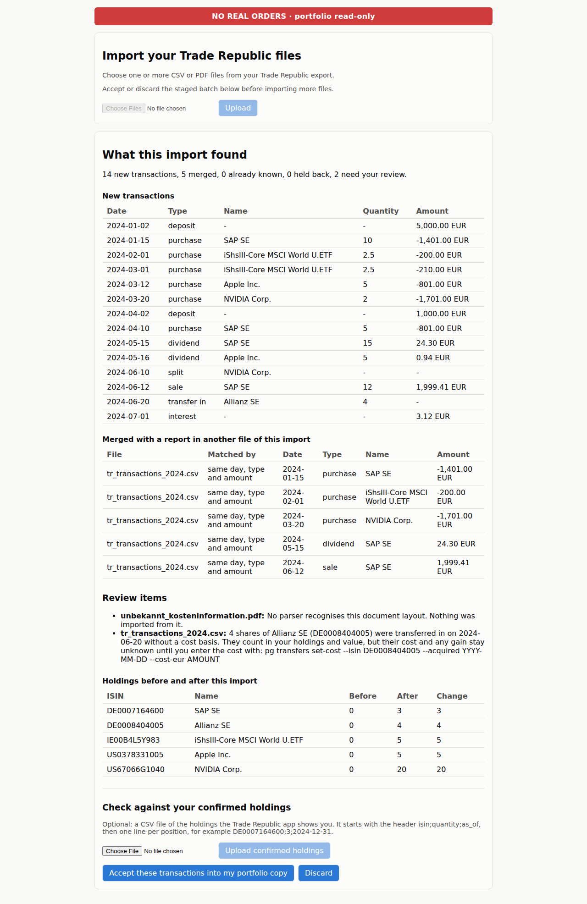
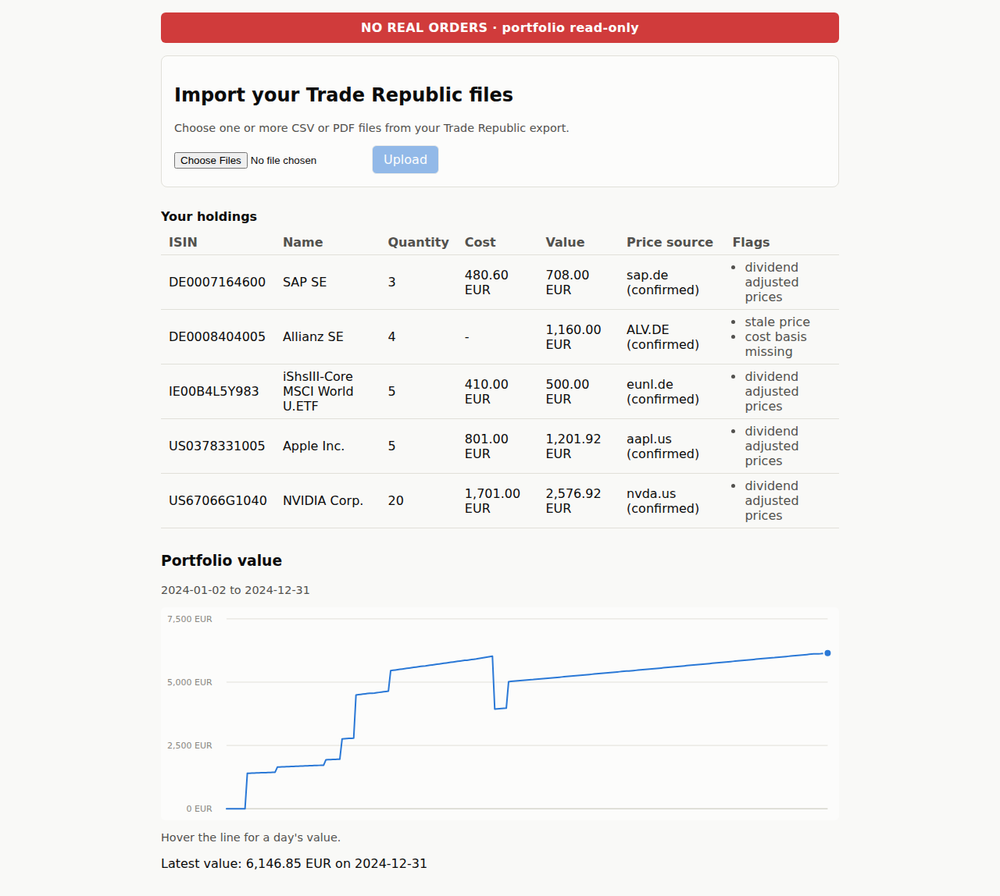

# Phase P0 user acceptance test script

This is your test script for phase P0 of the Playground app. You run the app on your own Mac, with
your own Trade Republic files, and you decide whether it does what phase P0 promised. You use the
app through one command, `pg`, which you type in the Terminal, and through a small page in your
browser.

The promise: you import your Trade Republic exports and check that the app rebuilt your holdings
correctly. You accept them. Then you see a daily value of your portfolio in euros (EUR), with the
cost of what you own worked out the way German tax law does it.

Three things to know before you start.

- **The app never places, routes or automates an order.** It holds no Trade Republic login and no
  password. Your real portfolio is read-only: the app learns about it only from files you export
  yourself.
- **Your files stay on your Mac.** The app itself sends out only requests for public prices and
  exchange rates (a symbol and a range of dates, never your name, account or holdings), and one
  optional lookup of a single ISIN (the code that identifies a security) at OpenFIGI, a free public
  lookup service. That lookup happens only when you type `pg instruments suggest`. Step 14 says
  exactly what is sent.
- **Expect to find problems.** This is the first time the app meets real Trade Republic files. We
  built its readers from public samples and made-up files. A file the app cannot read is not a
  failed test. It is what the test is for. What matters is that the app tells you, puts the file
  in its review queue (a waiting list for anything it is unsure about), and never guesses.

Plan for two to three hours. Most of it goes on downloading your files and comparing numbers.

## Words used in this guide

- **Terminal**: the Mac app where you type commands. Open it from Applications, then Utilities.
  Each grey box below is one or more commands to type or paste, then press Return.
- **CSV file**: a plain text table, one row per line. Numbers and Excel can open it.
- **PDF document**: a Trade Republic document such as a trade confirmation or an account statement.
- **ISIN** (International Securities Identification Number): the 12-character code that identifies
  a security, for example `DE0007164600` for SAP. It is the key the app uses for every instrument.
- **Lot**: one purchase (or one transfer in) of a security, with its own quantity, date and cost.
  A sale uses up lots. A **transfer in** is shares moved into your Trade Republic depot from
  another broker.
- **FIFO** (first in, first out): the rule German tax law uses for cost basis. A sale uses up the
  oldest lot first. **Cost basis** is what your shares cost you, fees included. A **realised gain**
  is what a sale brought in, after fees, minus the cost of the shares it used up. Here it is always
  before tax.
- **Layout**: the way a kind of document is arranged. The app has one small reader for each layout
  it knows. A document in a layout it does not know is never guessed at.
- **Review queue**: a list of documents, rows and conflicts the app could not handle with
  certainty. Nothing in it is guessed or dropped. Each item waits for you, unless a later file
  removes the problem.
- **Diff**: the summary of an import, shown before you accept it: new transactions, ones already
  known, changes to your holdings and any review items.
- **Batch**: the files you import in one go. **Staged** means a batch has been read and is waiting
  for your decision. **Accept** means you tell the app to take a staged batch into its copy of your
  portfolio. Nothing changes in that copy until you accept. Your real portfolio at Trade Republic is
  never touched.
- **Held back**: a transaction that is stored but kept out of your holdings and value until the
  review item about it is settled.
- **Reconcile**: compare the holdings the app rebuilt with the holdings you read in the Trade
  Republic app.
- **Close**: the price at the end of a trading day.
- **ECB rate**: the daily euro exchange rate published by the European Central Bank. It says how
  many units of a foreign currency one euro buys: 1.0800 USD per EUR means 1 EUR is 1.08 USD.
- **ETF**: a fund that trades on an exchange like a share. Many ETFs follow an index.
- **Split**: a company changes the number of its shares, for example 10 new for 1 old. The number of
  shares you hold and the price of each change by the same factor, so your value does not.
- **Benchmark**: an index you compare your portfolio with. Here: MSCI World (in EUR) and the
  S&P 500.
- **Flag**: a note the app puts on a value when something about it needs your attention, for
  example an old price. Appendix B lists them.
- **Data folder**: the folder where the app keeps its database, a copy of every file you import,
  and the price history it fetches. In this guide it is `~/pg-private/data`.

## What phase P0 delivers

1. **Import** of your Trade Republic files: one CSV layout, ten PDF layouts, and a small format
   for typing in anything the readers cannot handle. Step 6 lists them.
2. **A review queue.** Anything unclear waits for you. Nothing is guessed and nothing is dropped.
3. **A check against the Trade Republic app.** You type in the holdings the app shows you. The
   import is compared with them before anything is accepted.
4. **FIFO lots and realised gains** (before tax), with fees in the cost, partial sales, splits and
   shares moved in from another broker.
5. **A daily value of your portfolio in EUR**, from daily closing prices and ECB rates. Where data
   is missing or old, the app flags the value instead of failing.
6. **Two benchmark series, stored**: MSCI World in EUR and the S&P 500 in USD and in EUR.
7. **The command line (`pg`) and a small import page** in your browser, with a red **NO REAL
   ORDERS** badge.

What P0 does not do yet: returns over time, a comparison with the benchmarks, explanations of why
your portfolio moved, cash balances, tax reports, news. Those come later. See "Known limitations".

## At a glance

| Part | Steps | What you do | Time |
|---|---|---|---|
| A. Get ready | 1 to 4 | Install the tools, get the app, run its self-check, try the sample portfolio | 30 min |
| B. Your files | 5 to 7 | Export from Trade Republic, learn what the app can read | 30 min |
| C. Import and check | 8 to 12 | Import, work the review queue, reconcile, accept | 30 min |
| D. Prices and value | 13 to 17 | Map instruments, fetch prices, check holdings, cost and value, see the benchmarks | 30 min |
| E. More checks | 18 to 23 | Import again, the page, timing, reminder, privacy | 20 min |

The sign-off checklist, the known limitations and how to report a problem come after step 23.

Run every command from the `playground` folder you create in step 2, in the same Terminal window,
unless a step says otherwise. Replace anything in angle brackets, brackets included, with your own
value. A line that starts with `#` in a grey box is part of a file, never a command.

## Part A. Get ready

### 1. Install the tools

You need:

- A Mac. An Apple silicon Mac (M1 or newer) is the setup we expect to work. See the note on Intel
  Macs below.
- The **Terminal** app.
- **Homebrew**, the Mac package manager (see brew.sh). Type `brew --version`: if it prints a
  version, you have it.
- **git**. Type `git --version`. If git is missing, macOS offers to install it. Say yes.
- **uv**, a tool that sets up Python and the app's libraries for you.
- **Node**, the tool that builds the import page. You need it only for the page (step 19) and the
  optional browser test (step 23). Steps 1 to 18 work without it.

```bash
brew install uv
brew install node
```

Skip the second line if you do not want to try the import page yet. You can install Node later.

You do not have to install Python. The app needs Python 3.11 or newer. The first `uv sync` in step
2 downloads Python 3.13 into uv's own folder and uses it for this project only. It does not touch
the Python that macOS or Homebrew use.

Plan for about 1 GB of free disk space.

**Intel Macs.** We could only test on Linux. One library the PDF reader needs (`cryptography`) has
no ready-made download for Intel Macs in the version we locked. On an Intel Mac, `uv sync` may try
to build it and stop with an error that mentions Rust. If that happens, run `brew install rust` and
repeat step 2. We have not tested this. If it still fails, report it (see "Report a problem").

### 2. Get the app and run its self-check

```bash
git clone --branch claude/stock-trading-bot-research-c5ygze https://github.com/MLHaoChang/Test.git playground
cd playground
uv sync --locked
./scripts/check.sh
```

- If you already have a copy of the repository, run `git checkout
  claude/stock-trading-bot-research-c5ygze` and `git pull` inside it instead of the first two lines.
- If GitHub asks you to sign in, use the account that owns the repository.
- If this branch has been merged into the main branch since, leave out `--branch` and the branch
  name.

`playground` is now the folder you run every command from. If you close the Terminal, open it
again and run `cd playground` (add the path to where you cloned it). From now on, commands start
with `uv run pg`. `uv run` runs the app inside the setup that `uv sync` built, so nothing else on
your Mac is touched.

`check.sh` checks the code formatting and types, then runs about 1,600 tests. The tests run with
the network switched off and never read your own files. It takes a few minutes.

You should see `=== All checks passed ===` at the end. If not, stop here and report it. Nothing
after this point can be trusted until this step is clean.

### 3. Make a private folder for your files

```bash
mkdir -p ~/pg-private/exports ~/pg-private/held-out ~/pg-private/share ~/pg-private/data
export PG_DATA_DIR=~/pg-private/data
echo $PG_DATA_DIR
```

The last line must print the path of your data folder. Here is what each folder is for:

- `exports`: your Trade Republic files, as you download them (step 5).
- `held-out`: one document you keep aside for the timing check (step 7).
- `share`: text you have checked and are happy to send us (see "Report a problem"). Nothing else
  ever leaves your Mac.
- `data`: where the app keeps its database, a copy of every file you import, and the price
  history.

`PG_DATA_DIR` tells every `pg` command which data folder to use. It lasts only for this Terminal
window. If you open a new window, run the `export` line again. Nothing inside `~/pg-private` is
inside the repository, so nothing there can be committed by accident.

### 4. Try the sample portfolio (optional, 5 minutes)

The repository holds an invented portfolio: made-up Trade Republic files that the tests use. Run
it first. It shows you what a good run looks like, and it proves the app works on your Mac before
your own files come into play. It reads recorded price files instead of the network, and it keeps
its data in its own folder, `~/pg-private/rehearsal`, so it never mixes with your real data.

The block below sets the app's clock to 31 December 2024, the day the sample portfolio is about.
The clock setting ends with the block. Paste all of it at once.

```bash
(
export PG_TODAY=2024-12-31
export PG_DATA_DIR=~/pg-private/rehearsal
uv run pg init
uv run pg import tests/fixtures/golden/inputs/tr_transactions_2024.csv tests/fixtures/golden/inputs/pdf
uv run pg reconcile latest --confirmed tests/fixtures/golden/inputs/confirmed_holdings_2024-12-31.csv --as-of 2024-12-31
uv run pg accept latest
uv run pg transfers set-cost --isin DE0008404005 --acquired 2020-03-02 --cost-eur 800.00
uv run pg instruments map --file tests/fixtures/golden/inputs/instrument_mapping.csv
uv run pg --http-replay tests/fixtures/http prices fetch --from 2024-01-01 --to 2024-12-31
uv run pg prices import-file tests/fixtures/golden/inputs/manual_prices_allianz.csv
uv run pg --http-replay tests/fixtures/http fx fetch
uv run pg holdings
)
```

Look for these lines in the output:

```text
  14 new transactions
  5 merged with a report in another file of this import
  2 new items need your review
Your confirmed holdings: 5 of 5 match
Total value 6146.85 EUR, cost basis 4192.60 EUR, complete.
```

- The two review items are on purpose. One is a cost information sheet that no reader knows (it
  lands in the review queue, as an unknown document should). The other asks for the cost of 4
  shares moved in from another broker. The block enters that cost, which closes the second item.
- The flags `stale_price` and `dividend_adjusted_prices` are normal here. Appendix B explains them.
- Steps 8 to 17 do the same things with your own files. Refer back to this run whenever a result
  looks strange.

If any of this fails, stop and report it. You can paste the block again at any time: a second run
finds every file already imported and changes nothing.

## Part B. Your files

### 5. Export your files from Trade Republic

We could not look inside a real Trade Republic account while building the app, so the names below
are the ones we know. Trade Republic changes its app often. If a menu has another name, look for
the words Dokumente, Postfach, Export or Kontoauszug. Use the app on your phone or the web version,
whichever you find easier.

**The transaction export (a CSV file).** Open your profile in the Trade Republic app and look for
an option to export your transactions. It gives you one CSV file with a row for each transaction.
Choose the longest period on offer. If the download is a `.zip` file, double-click it to unpack it.

**The PDF documents.** Trade Republic keeps a PDF for each trade, dividend, tax booking and interest
payment, and it sends account statements. They are in the documents area of your profile. Download
at least:

- the trade confirmations for every purchase and sale (in German: Wertpapierabrechnung),
- the savings plan executions (Sparplanausführung), if you have savings plans,
- the dividend and fund distribution notes (Dividende, Ausschüttung),
- the tax notes (Steuerkorrektur, Vorabpauschale) and the interest statements (Zinsen),
- any split notices (Split),
- your account statements (Kontoauszug or Umsatzübersicht). They add nothing to your holdings, but
  they prove nothing is missing: every line on a statement should match a transaction the app
  knows.

You do not need the cost information sheets (Kosteninformation) that Trade Republic sends before an
order, or the yearly tax report. They are not bookings.

Put everything in `~/pg-private/exports`, in one flat folder, not in subfolders. The app reads every
PDF and CSV file directly in the folder and leaves out the rest. If you used your phone, send the
files to your Mac with AirDrop or iCloud Drive, then move them into the folder in Finder. Keep them
out of Downloads, Documents and Desktop: macOS may ask Terminal for permission to read those, and
you do not need the trouble.

Check the folder from the Terminal:

```bash
ls ~/pg-private/exports
```

**Which files matter most.** The CSV lists every transaction, so it is the best single source, but
it is also the file we know least about (step 6). If the app cannot read it, your PDFs alone
can still rebuild your holdings, as long as every purchase, sale, savings plan, split and transfer
in has a document. Account statements alone cannot: they give no quantities.

### 6. What the app can read today

**PDF documents.** The app recognises a document by the bank's name at the top, the title and the
column names printed under it. It has one reader for each layout:

| Title on the document | What it is |
|---|---|
| WERTPAPIERABRECHNUNG, price column KURS | Trade confirmation for a purchase or sale, older layout |
| WERTPAPIERABRECHNUNG, price column PREIS, times marked "Europe/Berlin" | Trade confirmation, newer layout |
| WERTPAPIERABRECHNUNG SPARPLAN | Savings plan execution |
| SECURITIES SETTLEMENT | Trade confirmation in English |
| DIVIDENDE or AUSSCHÜTTUNG | Dividend or fund distribution, with taxes and the exchange rate for foreign ones |
| STEUERKORREKTUR or VORABPAUSCHALE | Tax correction or advance lump sum tax |
| ABRECHNUNG ZINSEN | Interest statement |
| SPLIT | Stock split |
| KONTOAUSZUG, columns BUCHUNGSTAG / WERTSTELLUNG | Account statement, older layout |
| UMSATZÜBERSICHT | Account statement, newer layout |

Two more kinds are recognised but not turned into transactions: exchange and subscription notices
(UMTAUSCH, BEZUG). Each becomes a review item of kind `corporate_action` with the text shown.

An account statement line has a date, a type, an ISIN and an amount, and nothing else. A purchase
or sale known only from a statement line is held back until another file gives its quantity.

**The CSV export.** One CSV layout is built in. It has semicolons between columns, a comma for
decimals, dates like `15.01.2024`, and exactly these column names in this order:

```text
Datum;Uhrzeit;Typ;ISIN;Name;Anzahl;Kurs;Betrag;Gebühren;Steuern;Währung;Wechselkurs;Referenz
```

The row types it knows are Kauf, Sparplan, Verkauf, Dividende, Ausschüttung, Zinsen, Einzahlung,
Auszahlung, Steuer, Gebühr, Depotübertrag eingehend, Depotübertrag ausgehend and Split. We wrote
this layout from common German bank exports. **We have not seen a real Trade Republic export.** If
your file has other column names, the app refuses the whole file, imports nothing from it, and
raises an `unknown_csv_header` review item. Expect this on your first try. It is a normal result
of this test, not a mistake of yours. Step 9 says what to send us.

**Your own files.** Two small formats let you fill gaps yourself: a manual transaction file
(Appendix C) for anything no reader can handle, and a manual price file (step 14) for an
instrument no price source covers. A third, the confirmed holdings file, is what you type in step
10.

**Everything else.** A document that no reader recognises, a cost information sheet for example,
lands in the review queue as an `unknown_layout` item, with its text shown. The app imports
nothing from it and tells you so. Shares moved in from another broker (Depotübertrag) have no PDF
reader yet: they arrive through the CSV export or a manual transaction file.

### 7. Set one document aside

Move your newest PDF (a trade confirmation, a dividend note or a savings plan document) out of
`exports` into `~/pg-private/held-out`. Take the newest one, so that no other document depends on
it: without it, a later sale of the same shares would look too big. Do not import it now. You
upload it on its own in step 20, for the timing check.

## Part C. Import and check

### 8. Import

```bash
uv run pg init
uv run pg import ~/pg-private/exports
```

`pg init` creates the data folder and a portfolio called "Trade Republic". `pg import` reads every
PDF and CSV file directly in the folder, in name order, and stages them as one batch. For hundreds
of files, expect seconds, not minutes. **Nothing in your portfolio changes until you accept in
step 11.**

Here is the sample portfolio's output, cut down. Yours has the same shape:

```text
Import batch 1: staged, not accepted yet.
Files: 10 (0 already imported, skipped)
  2024-01-15_kauf_sap.pdf (trade confirmation): read, 1 transaction
  tr_transactions_2024.csv (Trade Republic CSV export): read, 11 transactions
  unbekannt_kosteninformation.pdf: not read, see the review items
Transactions read: 19
  14 new transactions
  5 merged with a report in another file of this import
  0 already known from earlier imports
  0 held back (kept out of your holdings until the review items are settled)
Review: 2 new items need your review, 0 will close
Holdings on 2024-12-31 (before -> after):
  DE0007164600 SAP SE: 0 -> 3
```

How to read it:

- Each file is either "read", with the number of transactions in it, or "not read, see the review
  items". Every file that is not read has a review item (step 9).
- "New" transactions are ones the app did not know. "Merged" means two files reported the same
  transaction, for example a PDF and a CSV row, and the app kept it once. Merged is good news: two
  files agree. "Already known" means an earlier import had it.
- "Held back" means the transaction is stored but kept out of your holdings and value until you
  settle its review item. Examples: a purchase known only from an account statement line (no
  quantity), a CSV row whose amounts do not add up, a transaction without a booking amount.
- The holdings list at the end shows what accept would do to your holdings. Step 10 checks it.

Only one batch can wait at a time. If a command says "Import batch N is staged and not accepted
yet", run `uv run pg accept N` or `uv run pg discard N` first. Discarding removes the batch and
everything it raised. Your files are not touched.

### 9. Work through the review queue

```bash
uv run pg review list
uv run pg review show <id>
```

`<id>` is the number in square brackets at the start of a line of `review list`. A line looks like
this:

```text
[1] unknown_layout (open) unbekannt_kosteninformation.pdf: No parser recognises this document layout. Nothing was imported from it.
```

**`pg review show` prints the whole text of the document, including your name and address.** It
stays in your Terminal. Do not paste it anywhere.

Appendix A lists every kind of item, what it means and what to do. For each open item, do one of
three things:

1. **Fix it**, the way Appendix A says.
2. **Dismiss it**, if you can say why it does not matter, for example a cost information sheet
   that is not a booking. A dismissal cannot be undone.

   ```bash
   uv run pg review dismiss <id> --reason "cost information sheet, not a booking"
   ```

3. **Leave it open and write it down** as a finding. Most items about a document or a CSV file the
   app cannot read end up here: fixing them means we add a reader (see "Report a problem").

For every item of kind `unknown_layout` or `unknown_csv_header`, prepare text you can send us. This
writes the text of item `<id>` with your name, address, IBAN, depot and order numbers masked:

```bash
uv run pg review export <id> --anonymise --out ~/pg-private/share/item-<id>.txt
```

Then check the file yourself, as "Report a problem" explains, before you send it anywhere.

### 10. Reconcile with the Trade Republic app

This is the most important check in the whole test. Open the Trade Republic app and read what you
hold **today**: one number per position. Type them into a file yourself. Do not copy the
quantities from the import summary: a check against the app's own arithmetic proves nothing.

Create the file with its first two lines:

```bash
cat > ~/pg-private/confirmed.csv <<'EOF'
# decimal=,
isin;quantity;as_of
EOF
```

Then open it in TextEdit (`open -e ~/pg-private/confirmed.csv`; the file must stay plain text) and
add one line for each position: its ISIN, the quantity, and today's date as YYYY-MM-DD, separated
by semicolons. For example, this says you hold 3 SAP shares and 0.4534 shares of an ETF:

```text
DE0007164600;3;2025-03-01
IE00B4L5Y983;0,4534;2025-03-01
```

The ISINs are in the import summary from step 8 and in the position details of the Trade Republic
app. The first line of the file, `# decimal=,`, says that you write fractions with a decimal comma,
as the app shows them. If you write a decimal point instead, change it to `# decimal=.`. The
command `date +%Y-%m-%d` prints today's date.

```bash
uv run pg reconcile latest --confirmed ~/pg-private/confirmed.csv --as-of $(date +%Y-%m-%d)
```

The end of the output looks like this (from the sample portfolio):

```text
Your confirmed holdings: 5 of 5 match
  DE0007164600 SAP SE: computed 3, yours 3 on 2024-12-31: match
  US67066G1040 NVIDIA Corp.: computed 20, yours 20 on 2024-12-31: match
```

Every line should say `match`. Each other line is a finding. Here is what the words mean:

| Result | Meaning |
|---|---|
| match | The app and you agree. |
| mismatch | Both have the position, with different quantities. |
| missing in confirmed | The import has this ISIN, but your file does not list it. Either you no longer hold it (a sale the import missed) or you left it out. |
| missing in import | Your file lists it, but the import found no transaction for it. A document is missing or was not read. |

Before you call a difference a finding, look for the usual causes. A document you did not export.
A file the app could not read (step 9). Shares you moved in from another broker, which no PDF
reader covers. A corporate action such as an exchange. A trade made after you exported your files
(export and read the app on the same day, and do not trade in between). `uv run pg transactions`
lists every transaction the import found, with the files that report it. If a whole transaction is
missing and you can read it off your own documents, Appendix C shows how to add it by hand.

Add `--strict` if you want the command to end with exit status 3 whenever a holding differs. You
do not need it when you run the command by hand.

### 11. Accept

Accept when every difference from step 10 has an explanation: a file the app could not read, or a
document you did not export. You are not testing whether the app can already read everything. You
are testing that it tells you what it could not read. A portfolio that is incomplete for a known
reason is fine for the rest of this test. Write the gap down as a finding.

If a difference has no explanation, do not accept. Run `uv run pg discard latest`, report what you
saw, and import again after the fix.

```bash
uv run pg accept latest
```

You should see a line like `Accepted import batch 1: 14 transactions, 0 held back, 0 released.`
followed by lines about the lots and the value series. **Right after your first accept, the value
shows `0.00 EUR` and `incomplete`. That is expected.** No instrument has a price source yet. Step
13 fixes it.

Accept copies the staged transactions into your portfolio copy and rebuilds your lots and the value
series. Your Trade Republic account is never touched. There is no undo. To start over, point the
app at a new data folder and repeat from step 8. Nothing else is needed, and your exports stay as
they are:

```bash
export PG_DATA_DIR=~/pg-private/data2
```

### 12. Enter the cost of shares moved in

Shares you moved in from another broker (a "transfer in") arrive without a cost. No Trade Republic
document says what you paid. The app counts the shares in your holdings and value, but their cost
and any gain stay unknown until you type the cost in from your own records.

```bash
uv run pg transfers list
uv run pg transfers set-cost --isin <ISIN> --acquired <YYYY-MM-DD> --cost-eur <AMOUNT>
```

`--acquired` is the day you originally bought the shares. FIFO uses it to put the shares in the
right place in the queue, as German tax rules do. `--cost-eur` is what all the shares in that
transfer cost you in total, in EUR, with a dot for decimals: `800.00`, not `800,00`. If you moved
in the same ISIN more than once, the command asks you to add `--txn <number>`, using the number in
square brackets from `pg transfers list`.

If `pg transfers list` says `No transfers in.`, you have none. Go on.

## Part D. Prices, value and benchmarks

### 13. Map your instruments to price sources

The app never guesses which price series belongs to which security. You tell it once for each
ISIN. Until you do, the instrument is `unmapped`, and it is left out of the value. Prices come from
Stooq, a free price website, or from a file you supply yourself.

```bash
uv run pg instruments list
```

Each line shows one instrument, for example `DE0007164600 SAP SE: unmapped`. For each one that is
unmapped, ask OpenFIGI for its listings, then map it:

```bash
uv run pg instruments suggest <ISIN>
uv run pg instruments map <ISIN> --source stooq --symbol <SYMBOL> --currency <CURRENCY>
```

`suggest` prints what OpenFIGI knows, and stores nothing:

```text
SAP on GY: SAP SE (Common Stock), possible Stooq symbol sap.de
This is a suggestion, not applied. Map it yourself: pg instruments map ISIN --source ... --symbol ... --currency ...
```

The symbol is the one Stooq uses. The currency is the one the symbol is quoted in:

| Where the security trades | Symbol looks like | Currency |
|---|---|---|
| Xetra, the German exchange | `sap.de`, `eunl.de` | `EUR` |
| US stocks and ETFs | `aapl.us` | `USD` |
| London | `xxxx.uk` | Usually `GBX` (pence), sometimes `GBP`. Check against the app. |

`--source` is `stooq`, or `manual` if you will supply the prices yourself (step 14). The currency is
a three-letter code. The app refuses one it cannot convert to EUR. With more than a handful of
instruments, a file is quicker. Create a text file like the one below, then run
`uv run pg instruments map --file ~/pg-private/mapping.csv`:

```text
isin;data_source;data_symbol;currency;note
DE0007164600;stooq;sap.de;EUR;
US0378331005;stooq;aapl.us;USD;
DE0008404005;manual;ALV.DE;EUR;no Stooq data
```

`suggest` sends that one ISIN to OpenFIGI, and only when you run it. An ISIN names a security, not
you. No other command sends an ISIN anywhere. Prices and rates are asked for by symbol and date
only. Every mapping change is logged: `uv run pg instruments history <ISIN>` shows it.

Run `uv run pg instruments list` again. No line should say `unmapped`.

### 14. Fetch prices, exchange rates and benchmarks

This is where the app first fetches data from the internet: prices, rates and benchmarks.

```bash
uv run pg prices fetch --from 2019-01-01
uv run pg fx fetch
uv run pg benchmarks fetch --from 2019-01-01
```

Use 1 January of the year of your first purchase, or earlier, instead of 2019.

What these commands send:

- `prices fetch`: one request per symbol to Stooq (stooq.com), with the symbol and the first and
  last date.
- `fx fetch`: one request to the European Central Bank (ecb.europa.eu) for its public file of
  reference rates, which holds every rate since 1999.
- `benchmarks fetch`: the same as `prices fetch`, for the two benchmark symbols (`eunl.de` and
  `^spx`).

Nothing about you goes out: no name, no account, no holdings, no amounts and no ISINs.

Each command prints one line per symbol:

```text
DE0007164600 (sap.de): 254 daily closes stored.
DE0008404005 (ALV.DE): priced from your own price file, not fetched (pg prices import-file)
Stored 512 ECB rates.
msci_world_eur: 254 daily closes stored.
sp500: 252 daily closes stored.
```

Real runs show more closes, about 250 for each year. If a source cannot be reached (no network, a
firewall or proxy that refuses, no answer in time), or answers with something that is not price
data, the command says so in one sentence per symbol, still fetches the others, and ends with exit
status 1. That is a number a command leaves behind: 0 means it worked. Check your connection and
run it again. `echo $?` prints the exit status of the last command.

**If Stooq has no data for an instrument** (a European listing is the most likely case), the line
says so. Download its daily closes from any source you trust and write them into a manual price
file. It has semicolons, dots for decimals and ISO dates:

```text
date;data_symbol;close;currency;adjustment
2025-02-28;ALV.DE;338.10;EUR;raw
2025-03-03;ALV.DE;340.25;EUR;raw
```

`adjustment` says what the closes are corrected for: `raw` (as quoted on the day), `split`
(adjusted for splits) or `split_dividend` (adjusted for splits and dividends). The app refuses a
file with a wrong header, a bad number or a date twice for one symbol, and names the line. Map the
ISIN with `--source manual --symbol ALV.DE`, then load the file:

```bash
uv run pg prices import-file ~/pg-private/prices.csv
```

**Optional, and useful to us:** save one real answer from Stooq, market data only:

```bash
uv run pg --http-record ~/pg-private/http prices fetch --isin <ISIN> --from 2024-06-01 --to 2024-06-20
```

This writes what Stooq sent into `~/pg-private/http`. Open the files in TextEdit: they hold prices
and nothing about you. Send them if you like (see "Report a problem"). We use them to model our
tests on the real format and to confirm what the closes are adjusted for.

### 15. Check holdings, cost and value

```bash
uv run pg holdings
uv run pg lots
uv run pg value --csv ~/pg-private/value.csv
```

`holdings` prints one line for each position. This is the sample portfolio's:

```text
DE0007164600 SAP SE: 3 shares, cost 480.60 EUR, value 708.00 EUR (close 236.00 EUR on 2024-12-30). Flags: dividend_adjusted_prices
```

`value` works out one value for each weekday, from your first transaction to today, stores the
series, writes it to the CSV file, and lists every flag. Appendix B says what each flag means.

**Compare with the Trade Republic app.** Fill in a small table, one row for each of three positions
(more if you like):

| Position | Value in the app | Value in `pg holdings` | Difference |
|---|---|---|---|
| | | | |
| | | | |
| | | | |

- The app shows a price from the moment you look. The app you are testing uses the last daily
  close. Expect a difference of about 1%, more on a day when markets move a lot. For a fair
  comparison, look at the app after the market has closed, and compare the securities only. The
  app's total may include cash, and P0 leaves cash out.
- A position that is off by much more than that usually means the wrong symbol or currency in step
  13. Fix the mapping and run `uv run pg value` again.
- **Cost basis.** For two positions, add up what you paid, fees included, from your own purchase
  documents, and compare with the `cost` in `pg holdings`. Only the lots still open count.
- **FIFO.** `pg lots` lists your lots and your sales. Pick one sale. The realised gain is the
  proceeds after fees, minus the cost of the oldest lots, which the sale used up first. It is
  before tax. Work it out from your own documents and compare it with the app.

  Here is the worked example from the sample portfolio. SAP was bought as 10 shares for 1,401.00
  EUR and later as 5 shares for 801.00 EUR. 12 shares were sold for 2,100.00 EUR, with a fee of
  1.00 EUR. The sale used up the first lot (1,401.00 EUR) and 2 of the 5 shares in the second lot
  (801.00 x 2 / 5 = 320.40 EUR). The cost was 1,721.40 EUR, the proceeds after the fee 2,099.00
  EUR, and the gain 377.60 EUR. `pg lots` shows it in two lines, one for each lot used:

  ```text
  Disposals:
    DE0007164600 SAP SE: sale on 2024-06-12, 10 shares, realised 348.17 EUR
    DE0007164600 SAP SE: sale on 2024-06-12, 2 shares, realised 29.43 EUR
  ```

  348.17 and 29.43 add up to 377.60.

### 16. See your value next to the two benchmarks

The two benchmarks are:

- **MSCI World in EUR.** The app uses the price of the iShares Core MSCI World ETF on Xetra
  (symbol `eunl.de`). An ETF follows the index, but it is not the index, so its price will not
  match the published index level.
- **S&P 500.** The index, in US dollars, and the same series converted to EUR with each day's ECB
  rate.

Save your value and both benchmarks to files. `--json` makes a command print its result as JSON, a
plain text format for data. Use the date you gave `--from` in step 14, and today's date after
`--to`:

```bash
uv run pg value --json > ~/pg-private/value.json
uv run pg benchmarks series msci_world_eur --from 2019-01-01 --to $(date +%Y-%m-%d) --json > ~/pg-private/msci_world.json
uv run pg benchmarks series sp500 --currency EUR --from 2019-01-01 --to $(date +%Y-%m-%d) --json > ~/pg-private/sp500_eur.json
```

Then put them side by side in one file. The command below is a small Python script that uses only
what Python already has. It writes `~/pg-private/value-and-benchmarks.csv`, with your value in EUR
and each benchmark scaled to 100 on the first day both have data:

```bash
uv run python - <<'PY'
import csv
import json
from bisect import bisect_right
from pathlib import Path

folder = Path.home() / "pg-private"
value = json.loads((folder / "value.json").read_text())["series"]


def load(name):
    points = json.loads((folder / name).read_text())["points"]
    return [p["date"] for p in points], [float(p["value"]) for p in points]


def as_of(series, day):
    """The last value dated on or before the day, or None."""
    dates, values = series
    i = bisect_right(dates, day)
    return values[i - 1] if i else None


msci, sp500 = load("msci_world.json"), load("sp500_eur.json")
if not value or not msci[0] or not sp500[0]:
    raise SystemExit("A series is empty. Run steps 14 and 15 first.")
start = max(value[0]["date"], msci[0][0], sp500[0][0])
base_msci, base_sp500 = as_of(msci, start), as_of(sp500, start)
out_path = folder / "value-and-benchmarks.csv"
with open(out_path, "w", newline="") as out:
    writer = csv.writer(out, delimiter=";")
    writer.writerow(["date", "your_value_eur", "msci_world_start_100", "sp500_eur_start_100"])
    for row in value:
        day = row["date"]
        if day < start:
            m = s = ""
        else:
            m = f"{100 * as_of(msci, day) / base_msci:.2f}"
            s = f"{100 * as_of(sp500, day) / base_sp500:.2f}"
        writer.writerow([day, row["value_eur"], m, s])
print(f"Wrote {out_path}. The two benchmark columns start at 100 on {start}.")
PY
```

Open the file in Numbers, select the three value columns, and insert a line chart. The file uses
semicolons and dots for decimals. If Numbers shows the numbers as text, choose File, then Open, and
set the separator to semicolon when it asks.

Now check the benchmarks themselves. Pick two weekdays that were not holidays, print the points
for them, and compare with a source you trust. The S&P 500 in USD should match its published close.
The ETF should match the ETF's own price history on Xetra. Use the same date twice to see one day:

```bash
uv run pg benchmarks series sp500 --from <YYYY-MM-DD> --to <YYYY-MM-DD> --json
uv run pg benchmarks series msci_world_eur --from <YYYY-MM-DD> --to <YYYY-MM-DD> --json
```

**What this shows, and what it does not.** It shows that the benchmark data is there, covers your
years, and looks right. It does not measure how well you did. Your value line moves when you
deposit, withdraw, buy or sell, so the gap between your line and a benchmark is not your
performance. Time-weighted returns, which take deposits and withdrawals out, come in the next
phase.

### 17. Check a split

If you hold, or once held, a security that split, check that the value does not jump on the split
day. A split changes the number of shares and the price by the same factor, so your value should
stay about the same. NVIDIA's 10-for-1 split on 10 June 2024 is an example. Print your holdings for
the day before and the day after the split:

```bash
uv run pg holdings --as-of 2024-06-07
uv run pg holdings --as-of 2024-06-11
```

Look at the value of that one position. It must not change by anything like the split factor. If it
does, report it, with the ISIN and the two values.

The sample portfolio shows how it should look. NVIDIA is worth 2,054.70 EUR on 7 June (2 shares)
and 2,061.78 EUR on 11 June (20 shares). For a day before the split, the line says `priced as 20
shares after later splits`. The price series is already corrected for the split, so the app counts
your old shares on the new basis. That is why the value does not jump. You can print the sample's
lines yourself:

```bash
PG_DATA_DIR=~/pg-private/rehearsal uv run pg holdings --as-of 2024-06-07
PG_DATA_DIR=~/pg-private/rehearsal uv run pg holdings --as-of 2024-06-11
```

If a split happened after your newest export, import its document before you trust that position's
value. Until then the value is off by the split factor. The value output flags this as
`price_basis_mismatch`, but only for a security you traded in the last 365 days. An old holding you
have not touched can miss a split without any flag.

If you have no security that split, skip this step.

## Part E. More checks

### 18. Import everything again

```bash
uv run pg import ~/pg-private/exports
```

You should see `Files: N (N already imported, skipped)` and `0 new transactions`. Importing the
same files twice must add nothing: the app compares what is inside a file, not its name. Then drop
the empty batch:

```bash
uv run pg discard latest
```

Optional: copy one PDF in `exports` under a new name, import again, and check that the copy is
skipped as already imported. Delete the copy afterwards.

This is also how you will update the portfolio from now on. Export again, import, read the diff,
reconcile, accept. A fresh CSV export that covers days you already imported matches the
transactions you have and adds only what is new.

### 19. The import page

```bash
(cd web && npm ci && npm run build)
uv run pg serve
```

`npm ci` installs the page's tools and `npm run build` builds the page. Both need Node (step 1),
and the first run takes a minute or two. `pg serve` keeps running in this Terminal window, so leave
it running. It answers only on your own Mac (`127.0.0.1`): nobody else on your network can reach
it. Open **http://127.0.0.1:8765** in your browser. Use the same Terminal window as before, or run
the `export PG_DATA_DIR=...` line of step 3 again first. Otherwise the page shows an empty
portfolio.

Check that:

1. A red badge at the top of the page says **NO REAL ORDERS · portfolio read-only**.
2. The holdings table shows the positions you accepted in step 11, with quantity, cost, value in
   EUR, the price source and any flags. It matches `pg holdings`.
3. The value chart runs from your first transaction to the last weekday. Hover the line to read
   the value of a day.
4. Upload a file you already imported, for example one PDF from `exports`. The page shows the diff
   with `0 new transactions`. Click **Discard**. Nothing changes.
5. Nothing on the page offers to place an order, and nothing asks for a Trade Republic login.

This is the sample portfolio's diff and its holdings with the value chart. Yours shows your own
numbers:





### 20. Timing check

The design promises that a newly accepted document shows up in your value within about a minute.
This check needs your instruments mapped and today's prices fetched (steps 13 and 14).

With the page open, note the time. Then choose the document from `~/pg-private/held-out` (step 7),
click **Upload**, read the diff, click **Accept these transactions into my portfolio copy**, and
wait for the value chart to appear again. Write down how long it took, from the click on Upload to
the chart. It must be under one minute, even with a quick read of the diff.

If your CSV already contained that document's transaction, the diff says the transaction is
already known and the chart looks the same. The time you measure is still right: it is the time
the app takes to accept a batch and rebuild your value.

Stop the page with Control-C in its Terminal window when you are done.

### 21. Reminder check

The app reminds you to import again 30 days after your last import. The clock setting below
works for one command only. Never export it.

```bash
uv run pg status
```

Read the line `Last import: ...`. This step assumes it says today's date. If not, add 30 and 31
days to that date by hand and use those dates in the two commands below. Then:

```bash
PG_TODAY=$(date -v+31d +%Y-%m-%d) uv run pg status
PG_TODAY=$(date -v+30d +%Y-%m-%d) uv run pg status
```

With the first command, `pg status` must show a line that starts `Reminder: Your last import was 31
days ago, more than 30.` With the second, it must show `Your last import was 30 days ago.` and no
reminder.

### 22. Privacy check

```bash
git status
ls data
ls ~/pg-private/data
```

`git status` must say `nothing to commit, working tree clean`. `ls data` may say that there is no
such file or directory. That is fine. If it lists anything, tell us. Your real files and the
database the app builds from them are kept in `~/pg-private`, never in the repository.

`~/pg-private/data` holds three things: the registry (the database), `uploads` (a copy of every
file you imported, so review items can be reopened) and `lake` (prices and rates). **The copies in
`uploads` are your original documents, with your name on them. Never send the data folder to
anyone.**

### 23. Optional: the automated browser test

This runs the same page in a browser that a script clicks through, instead of you. It starts its
own copy of the app on the sample portfolio and does not use your data. It downloads a browser
(about 150 MB) the first time. Skip it if you like.

```bash
(cd web && npx playwright install chromium && npx playwright test)
```

You should see `3 passed`.

## Sign-off checklist

Tick each line once it holds. Anything you cannot tick becomes a finding: we turn it into a test
file and a fix before the next phase starts.

**Set-up**

- [ ] `./scripts/check.sh` passed on my Mac (step 2).
- [ ] The sample portfolio ended with `5 of 5 match` and `Total value 6146.85 EUR` (step 4).

**Import and reconcile**

- [ ] Every file I gave the app was read, or has a review item that says why not (steps 8 and 9).
- [ ] I understand every open review item: what it is and what would close it (step 9).
- [ ] Each position matches the Trade Republic app, or I can explain each difference (step 10).
- [ ] Every transaction that `pg transactions` lists comes from a file of mine. Nothing was made up.

**Cost, value and benchmarks**

- [ ] The cost basis of two positions matches my own purchase documents (step 15).
- [ ] The realised gain of one sale matches my own FIFO calculation (step 15).
- [ ] The value of each position I compared is within about 1% of the app (step 15).
- [ ] Every instrument is valued, or its flag says why not, and I understand the flag (steps 14 and
  15).
- [ ] The value does not jump on a split day (step 17), or I have no split.
- [ ] Both benchmark series cover my years and match a public source on two days (step 16).

**Repeat, page, timing**

- [ ] Importing everything again showed `0 new transactions` (step 18).
- [ ] The page works: badge, holdings, chart, upload with a diff, discard (step 19).
- [ ] The value chart was back within one minute of clicking Upload (step 20). Time it took:
  __________
- [ ] The reminder shows at 31 days and not at 30 (step 21).

**Safety and privacy**

- [ ] The badge says **NO REAL ORDERS · portfolio read-only**. Nothing offered to place an order
  or asked for a Trade Republic login.
- [ ] `git status` is clean, and my files are only under `~/pg-private` (step 22).

**Result** (tick one):

- [ ] Accept phase P0.
- [ ] Accept phase P0 with the findings I listed.
- [ ] Do not accept.

When you have finished, send us the ticked list, the time from step 20 and your findings, one
line each. Add any files you prepared as "Report a problem" explains.

## Known limitations

- **Only files.** The app does not connect to Trade Republic and cannot download anything for you.
  To update it, export again and import again.
- **The real layouts are unconfirmed.** We built the CSV layout and the PDF readers from
  made-up files and public samples. Expect some of your files to land in the review queue. Each
  new layout needs a small change on our side.
- **Securities only.** The value leaves out cash. Deposits, withdrawals, interest and dividends
  are imported and stored, but the value line covers your securities, so it will differ from the
  total in the Trade Republic app.
- **No returns yet.** P0 gives no time-weighted or money-weighted return, no comparison with the
  benchmarks, and no explanation of why your portfolio moved. The benchmark series are stored, and
  that is all.
- **Daily closes only.** There is one value for each weekday, from the last close on or before that
  day. Exchange holidays are not skipped: the value uses the last close. Stooq is a free source
  that we could not reach from our build machine. Its data format, its symbols and what its closes
  are adjusted for are assumptions this test has to confirm.
- **Splits only.** Mergers, spin-offs, subscription rights and exchanges go to the review queue and
  are not converted.
- **A split after your last import** makes that position's value wrong by the split factor. The
  app flags it only for a security you traded in the last 365 days. Import split documents before
  you trust a value.
- **Shares moved in** need the cost you type in (step 12). Until then, their cost and gain are
  unknown.
- **Tax.** Withheld taxes are stored for each transaction. The app makes no tax report, does not
  offset losses, does not track your tax-free allowance, and shows gains before tax. Its FIFO
  figures are a working figure to compare with your own records. They are not tax advice. The tax
  documents from Trade Republic are what count.
- **One portfolio, one person, one Mac.** The page, and the interface behind it (the API), answer
  only on your Mac. There is no login and no sync between devices.
- **No undo.** A dismissed review item stays dismissed, and an accepted batch stays accepted. To
  start over, use a new data folder.
- **One import at a time.** Accept or discard a staged batch before you import the next.
- **Files are read once.** After we add a reader, files that no reader recognised before are
  tried again when you import them again. Files that were read before are not read again. If a
  fix changes how a file you already imported is read, start over in a new data folder.
- **Small known defects.** A PDF with no text (a scan) gets the same message as an unknown layout.
  On the import page, a held-back transaction also appears in the "New transactions" table without
  a mark. Some internal words still show in command output, such as the kinds of review items and
  the flags. The value chart cannot be read with the keyboard, and the browser logs a missing
  icon. The phase report lists them.
- **Untested on macOS.** We built and tested the app on Linux. This test is its first run on a Mac.

## Report a problem

Write down four things first: the step number, the command you typed, what you expected, and what
you saw. Copy the text of the message.

**You may send us:**

- Your notes and the text of error messages. Read them first. File names in the output can carry
  your name if you renamed your files.
- The output of `uv run pg --version` and the model and chip of your Mac.
- For an unknown PDF layout: the text file from `pg review export <id> --anonymise` (step 9), after
  you have checked it as described below.
- For an unknown CSV layout: only the first line of the CSV file, which holds the column names. Do
  not send the rows unless you have replaced every date and amount with made-up ones. Open the
  exported text file, keep the first line, and delete the rest.
- For a price or mapping problem: the ISIN, the symbol you tried and the message.
- For a mismatch in step 10: the ISIN, the quantity in the app, the quantity from `pg`, and the
  lines of `uv run pg transactions` for that ISIN, if you are happy to share them.
- Optional: the files from `--http-record` (step 14). They hold prices only.

**Never send:**

- Your original PDF or CSV files.
- Anything from the data folder (`~/pg-private/data`): the database, `uploads` and the rest.
- Screenshots that show your name, address, IBAN, depot number or balances.
- The text printed by `pg review show`: it is not masked.

**Check every file before you send it.** Put it in `~/pg-private/share`, open it in TextEdit and
use Find (Command-F) to look for your family name, your first name, your street, your town and
postcode, `DE` followed by digits (an IBAN), and your depot number. The masks `[name]`,
`[address]`, `[iban]`, `[depot]` and `[order]` show what the app already hid. It masks only these
five things, and it is a first pass, not a guarantee. It does not hide ISINs, dates, amounts or
quantities. If you do not want to share those, replace them with made-up values. We need the
layout: the labels and the order of the lines. Only files in `share` ever leave your Mac.

**What happens next.** We add your layout as a test file with made-up numbers, change or add a
reader until it passes, and tell you to import again.

**Common trouble**

- `command not found`, or no `pyproject.toml`: you are not in the `playground` folder. Run `cd`
  to it.
- `There is no portfolio in ... yet`, or a portfolio that is empty although you imported: the app is
  looking in the wrong data folder, because `PG_DATA_DIR` is not set in this window. The message
  names the folder it used. Run the `export` line of step 3.
- `Import batch N is staged and not accepted yet`: run `uv run pg accept N` or `uv run pg discard
  N`.
- Dates in the output look like 2024: `PG_TODAY` is set in your Terminal. `echo $PG_TODAY` must
  print nothing. If it prints a date, run `unset PG_TODAY`.

## Appendix A. Review items: what they mean and what to do

Run `uv run pg review list` to see the open ones, and `uv run pg review list --status all` to see
every item, including those the app closed by itself when a later file removed the problem.

| Kind | What it means | What to do |
|---|---|---|
| `unknown_layout` | A PDF that no reader recognises: a cost information sheet, a yearly report, or a new Trade Republic layout. Nothing was imported from it. | If it is not a booking, dismiss it and say why. If it is a booking, export its anonymised text (step 9) and send it to us. Until we add a reader, you can add the transaction with a manual file (Appendix C). |
| `ambiguous_layout` | More than one reader claims the same PDF. Nothing was imported from it. | Send us the anonymised text. |
| `unknown_csv_header` | A CSV file whose column names match no known layout. Nothing was imported from it. | Send us the first line of the file (see "Report a problem"). |
| `unparsed_row` | One row of a CSV file, or one line of a statement, could not be read: an unknown row type, or a number or date that is not valid. The other rows were imported. | Send us that row with the numbers changed. Or add the transaction with a manual file. |
| `invalid_isin` | An ISIN in a file fails the check-digit test. Usually a typing error. | Correct it in a manual file. If the ISIN is in a Trade Republic document, tell us. |
| `missing_field` | A transaction lacks something the app needs. Either the quantity of a purchase or sale known only from an account statement, or the booking amount. It is held back. | Import the document or CSV row that has the missing piece. If the amount is what is missing, import a document or a manual row that has it, then dismiss this item. |
| `amounts_do_not_add_up` | Quantity times price plus fees does not give the booked amount, beyond rounding. The transaction is held back. | Check the document. If the document is right, tell us. Once you have checked the figures yourself, settle it with a manual row (Appendix C), or keep it as read with `uv run pg review resolve <id> --use-parsed`. |
| `field_conflict` | Two files disagree on a detail such as the quantity. The app keeps the value from the more detailed file (a manual file, then a PDF document, then the CSV export, then an account statement) and names both values. | Check your document. If the kept value is wrong, correct it with a manual row. |
| `possible_duplicate` | A transaction looks like one you already have, but the dates differ by a day or more. It is held back until you decide. | If it is the same transaction: `uv run pg review resolve <id> --merge`. If it is a second, different one, for example two savings plan executions: `uv run pg review resolve <id> --keep-both`. |
| `missing_cost_basis` | Shares moved in from another broker have no cost. | Step 12. |
| `oversell` | A sale is larger than the shares the app knows you held. Usually an earlier purchase or transfer in is missing. | Import the missing document, or add the earlier transaction with a manual file. The item closes by itself once the numbers work. |
| `split_unclear` | A split whose ratio the app cannot work out cleanly: nothing was held before it, or the numbers are not a clean ratio. | Look for a missing earlier purchase. Tell us if the holdings before the split were right. |
| `corporate_action` | An exchange or subscription notice. It is not converted. | Check your holdings. If the action changed them, add the effect with a manual file. |

## Appendix B. Flags: what they mean

A flag is a note on a value. `pg value` lists every flag with its dates, and `pg holdings` shows
the flags of each position. A day is **complete** when every holding could be valued.

| Flag | What it means | What to do |
|---|---|---|
| `unmapped` | No price source is mapped for this instrument, so it is left out of the value and the day is incomplete. | Step 13. |
| `missing_price` | No close is stored on or before the day, so the holding is left out of that day. | Fetch prices, or load a manual price file (step 14). |
| `stale_price` | The close used is more than 5 days older than the day valued. It is still used. | Fetch newer closes. For a manual price file, load a newer one. |
| `missing_fx` | No ECB rate is stored on or before the day for a foreign currency, so the holding is left out. | `uv run pg fx fetch`. |
| `stale_fx` | The ECB rate used is more than 5 days old. It is still used. | `uv run pg fx fetch`. |
| `dividend_adjusted_prices` | The price source corrects past closes for splits and dividends, so values before a dividend are slightly understated. Information only. | Nothing. |
| `cost_basis_missing` | An open lot has no cost, so the cost basis is unknown. | Step 12. |
| `near_split_raw_prices` | The closes are not adjusted for splits, and a split was booked within 3 weekdays of this day. The value can be off by the split factor. | Check the value around that day. |
| `price_basis_mismatch` | The price of your last trade differs from the stored close by more than a factor of 1.4. A split may be missing from your imports. | Import the split document, then check the value again (step 17). |

## Appendix C. Adding a transaction by hand

If a document cannot be read and you can read its figures off your own records, you can type the
transaction into a manual transaction file. It has the highest say: where it describes a
transaction that another file also reports, its figures win. The app does not check its amounts,
because you typed them on purpose, but the diff shows every row before you accept.

The file has semicolons between columns, dots for decimals, and this first line:

```text
date;time;type;isin;quantity;price;currency;amount_eur;fees_eur;tax_eur;note
```

`type` is one of `buy`, `sell`, `dividend`, `interest`, `fee`, `tax`, `deposit`, `withdrawal`,
`split`, `transfer_in` and `transfer_out`. `time` may stay empty. `amount_eur` is the money that
moved on your cash account: negative for a purchase, positive for a sale, a dividend or a deposit.
For a split, `quantity` is the new total number of shares. For a transfer in, `date` is the day the
shares arrived in your depot and there is no amount: give the cost with `pg transfers set-cost`.
These four rows show a purchase, an interest payment, a split and a transfer in:

```text
2024-01-15;10:05;buy;DE0007164600;10;140.00;EUR;-1401.00;1.00;;confirmed against the trade confirmation
2024-07-01;;interest;;;;;3.12;0;0;bank statement correction
2024-06-10;;split;US67066G1040;20;;EUR;;0;0;NVIDIA 10-for-1 split, new total
2024-06-20;;transfer_in;DE0008404005;4;;EUR;;;;moved in from my old broker
```

Save the file as `~/pg-private/manual.csv`, then import and accept it like any other file:

```bash
uv run pg import ~/pg-private/manual.csv
uv run pg reconcile latest --confirmed ~/pg-private/confirmed.csv --as-of $(date +%Y-%m-%d)
uv run pg accept latest
```
